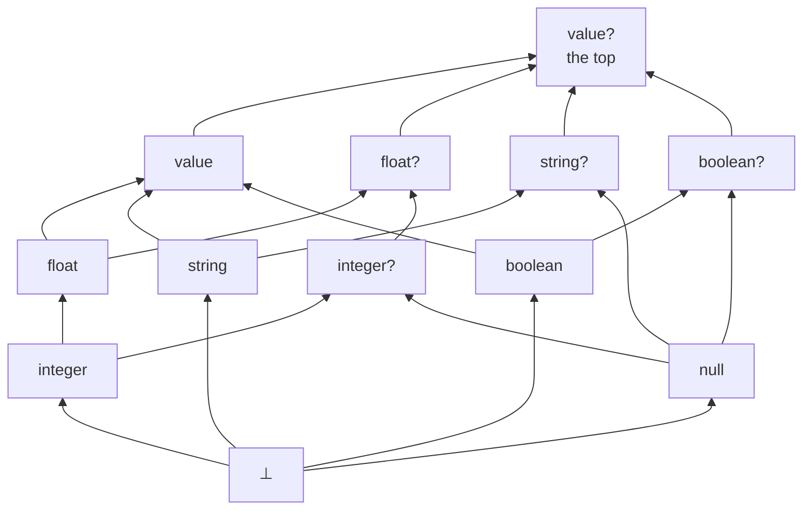

# Design notes: null as an ordinary value, undefinedness as partiality

Status: **all five stages built and green on `max/partial-expressions`** (§15.1;
stage 4 turned out to be an audit rather than a build, §15.24). Partiality,
the `null` type, the `value` accessors and the 60-test sweep are done on every
runnable backend, with the example suite green across all five backends. The
undefined-expression warning is in, as an opt-in
flag rather than the default measurement said it could not be (§15.14). **§15.18 audits this
document against the code and found seven unbuilt items; §15.19 through §15.24
close all seven, the last of them (§13's stage-4 deletions) by finding that
two-thirds of it was mistaken. §13 and §3.1 carry the corrections in place.
§15.25 closes three cross-backend divergences a second review found, all of them
one placement decision, and §15.26 closes the one shape that falsified §9.2 by
making the connectives strict at a `null`. §15.27 and §15.28 close the last four
code findings of that review: value construction guarded per part, the contract
check reading `not` rather than `!`, §9.4's promised `T?`-to-`value` lift, and
`concat`'s empty-group identity on Postgres. §15.29 is the branch's one
unsoundness, a double negation `refineFalse` eliminated after the orderings turned
strict, found by chasing a warning whose premise was stale. §15.30 records three
gaps left open, each a decision rather than an oversight: `X = null` composes with
any type deliberately, a null-only column does not survive a pass-through, and
`column-type.ts` is a reference implementation rather than the shipped
lattice, and a fourth, `meetTypes` rejecting `string? ⊓ integer?` where §2 and §3.1
promise the `null` type. §15.31 is a seven-way audit that found three more
unsoundnesses and six
more of §9.4's sites, and names what the three had in common: each lived in a file
that shared a premise this branch changed and was not opened by the change that
changed it. §15.32 is a fourth audit, angled by premise rather than by file for that
reason, which found four more unsoundnesses and applied §15.31's lesson to §15.31:
the emit sites were made to share one predicate and nobody re-audited the predicate.
It leaves five items open with reasons, and adds the three property-shaped tests
that make a fifth audit worth less. §2, §4.4, §5, §6, §9.4, §10 and §14 carry its
corrections in place.** This is the design
[partial-expressions.md](./partial-expressions.md) should have found and did not.
It supersedes that doc's recommendation: where that one concluded "keep NULL, at
most forbid it in columns", this one concludes "split NULL's two jobs apart, and
the objections to both halves dissolve".

The proposal in one paragraph. Today's NULL does two unrelated jobs: it is the
marker an undefined operation returns, and it is the value that missing data
carries. Give the second job to an ordinary value `null` with its own type, give
the first job to genuine partiality, and neither job needs the other's
machinery. Undefinedness stops being a value, so it stops needing a place in the
value domain, a position in the order, or a bit beside the type. `null` stops
being magic, so it stops needing three-valued comparison, a polymorphic literal
with no type, or `as_integer(null)` to write one down.

## 1 The rules

**Values.** The value domain gains `null` as an ordinary inhabitant, on a par
with `1`, `"a"` and `true`. Written as the literal `null`. Its type is `null`.

**Undefinedness.** An expression either denotes a value or is **undefined**.
Undefined is *not* a value: there is no `undefined` literal, no column can hold
it, and no variable can be bound to it. An operation is undefined when an operand
is undefined or when the operation has no result at those arguments: `1 / 0`,
`X % 0`, `sqrt(-1)`, `ln(0)`, integer overflow, a missing `value` key, a failed
`as_*` projection, a malformed `parse_json`.

**Where definedness is required.** Compositionally, per conjunct, which is what
makes this work:

| construct | holds when |
|---|---|
| atom `p(e₁ … eₙ)` | every `eᵢ` is defined **and** ⟨⟦e₁⟧ … ⟦eₙ⟧⟩ ∈ p |
| equality `e = f` | both defined and equal as values |
| filter `e` | `e` is defined and true |
| `not φ` | `φ` does not hold, for any reason including undefinedness |
| head | a tuple is derived only where every head expression is defined |

Stating it per conjunct rather than per rule is the detail that matters. An
earlier attempt (partial-expressions.md §2.3) said "a tuple is derived only when
every expression in the rule is defined", which is not compositional: it makes
`q() :- not p(1 / 0).` derive nothing, where these rules correctly derive `q()`,
because the undefined expression belongs to the negated subformula and its
failure is what `not` complements.

**Consequences the rules give for free.**

- `not (e = f)` holds when either side is undefined, so `e <> f` is not
  `not (e = f)`. Accepted; §4 shows the divergence is narrower than it sounds.
- `not (e = e)` holds exactly when `e` is undefined. The language gets a
  definedness test with no new syntax (§4.3).
- `p(1 / 0)` never holds and `not p(1 / 0)` always does, whatever `p` contains.

**Types.** The lattice gains `null` and the joins `T ⊔ null`, spelled `T?` (§3).
Types describe values, so **definedness is not a type-system notion at all**: an
expression of type `integer` denotes an integer wherever it is defined, and the
type says nothing about where that is. Type errors are static, domain errors are
runtime-partial, and the two stop being the same thing.

## 2 This answers the objection that killed a `null` type

null.md §7 records, at length and with instructions not to re-derive it, why
`null` cannot be a type:

> For `p(X), X = null` to keep working, `null` would have to be below every
> primitive. But then `string ⊓ integer` is inhabited by it, so a variable shared
> between a string column and an integer column stops being a type error and
> becomes a null-typed predicate that silently carries NULL rows.

The whole argument rests on that first premise, and this proposal removes it.
`null` is a **sibling** of the primitives, not a subtype of them, so:

> **Two of the four claims below did not survive building it, both recorded in
> §15.30. `X = null` is *not* a static error on a type that excludes null, and
> should not be: the guard is written defensively, on a column whose declaration
> the reader has not checked. And `string? ⊓ integer?` is a *rejection* rather than
> the `null` type, the meet seeing base types only. The other two hold, and they
> are the ones the section exists for: nothing was added below the primitives, so
> `string ⊓ integer` is still ⊥.**

- `string ⊓ integer` is still ⊥, still a static error, for the same reason as
  today. Nothing was added below the primitives.
- `string? ⊓ integer?` is `null`, which is **correct**, not a hole: a variable
  that must inhabit a nullable string column and a nullable integer column can
  only be null.

What made `null`-as-a-type look impossible was requiring `X = null` to type-check
for any `X`. It does not need to. `X = null` type-checks when `X`'s type has
`null` in it, which is what `?` means, and is a static error otherwise. That is
strictly better than today, where `X = null` is legal on any column and simply
never matches.

So the sibling placement is the missing move, and the verdict null.md §7 asks
nobody to reopen was correct about the design it considered and does not reach
this one.

## 3 The lattice

Add `null` as a fifth atom under `value` and close under join. `T?` is not a new
kind of type, it is a spelling of `T ⊔ null`.



Twelve elements, height five, so inference still terminates by the same argument
as today. Checks worth having done:

- `integer ⊔ null = integer?`, `integer? ⊓ float = integer`, `integer? ⊑ float?`.
- `integer ⊔ string = value`, as today: the join stays total and incompatible
  primitives still widen rather than erroring.

### 3.1 Two corrections from building it

The lattice is implemented in `core/src/column-type.ts` and its laws are a test
(`core/test/column-type.test.ts`, which checks commutativity, associativity and
monotonicity over all twelve elements). Two claims above did not survive that.

**`value` and `value?` are distinct, so the lattice has twelve elements.** An
earlier draft had eleven, with `value` as the top admitting a null, and recorded
the resulting `integer ⊔ string` as an accepted over-approximation. There is
nothing to accept: `(value, false)` is a real element, "any JSON shape, never
null", and it is exactly what that join yields. The imprecision was an artifact of
presenting the lattice flattened. So `?` means the same thing on every base type,
`value` stops being a special case, and §11.4's question dissolves: `value?` is an
ordinary type, worth writing when JSON data can carry a null, and neither a
synonym nor an error. That is the third answer this point has had and the first
one arrived at by construction rather than by argument.

**`undefined` cannot be the meet's identity.** `meetTypes` in `types.ts` returns
`b` for `meetTypes(undefined, b)`, treating ⊥ as the meet's unit, which
type-lattice.md describes as `undefined` wearing two hats. That is not a lattice:
it breaks associativity and makes `meet(a, b) ⊑ a` fail, both of which the law
test catches immediately. The units are genuinely two different elements. The
join's is ⊥ and the meet's is the top, `value?`, which is a real element and
already behaves as the unit, since a `value?` slot accepts whatever the other side
requires. Consequence for the wiring: **a variable solve seeds at `value?`, not at
⊥**, and "this variable was never constrained" has to be tracked by the caller
rather than read off the seed.

Two things this changes for the better.

**Better: nullness-tracking.md's product collapses into the base lattice.** That
doc's componentwise meet, componentwise join, `publishedNullness` beside
`publishedTypes`, and the nullness halves of `checkHeadAnnotations` and
`checkModuleBoundaries` all become the ordinary meet, join, published type and
type checks. The parallel structure the user objects to is not simplified, it is
deleted, and this is the proposal's largest structural win.

**This paragraph is wrong, and §15.24 records why.** It presupposes that
`columnTypes` holds pairs, which §6 measures as costing 146 comparison sites and
rejects, and §15.10 confirms is right about that variant. Keeping two maps means
there is no "ordinary meet" for the nullness half to fold into. What the paragraph
calls the largest structural win is available only at that price, and the two
things it names as parallel are not: the two fixed points are two phases with a
dependency between them, and the two `check` functions already do both halves in
one loop.

**Better: nullability stops being infectious.** nullness-tracking.md §7 declined
the Kotlin reading (requiring `?` where a column can be null) on cost:
"every rule head containing a division, a `to_*`, an `as_*`, or a `value`
accessor would need an annotation, which is most non-trivial programs". That cost
was entirely an artifact of division producing NULL. Under partiality it does not:
`X = A / B` derives no tuple where `B` is zero, so the column's type is `integer`,
not `integer?`. **Nullability now arises only from an actual `null`**, meaning the
literal, a `?`-declared input column, or JSON data. Across the corpus that is one
column (`examples/expr-eval`) and one example's literals
(`examples/relational-algebra`). So partiality is what makes a `null` type
affordable, and the two halves of this proposal are not independent: each pays for
the other.

**Better: nullness-tracking.md §7's reason 1 is answered outright.** That
objection was that a flattened lattice launders nullness away at
`integer ⊔ string?`, leaving two `value` columns to join with a plain `=` and drop
the null-to-null match. The pair cannot lose the bit, because the bit has its own
join: `integer ⊔ string?` is `value?` and stays null-aware, while
`integer ⊔ string` is `value` and joins plainly. Both are exact. §3.1 records that
this is why the twelfth element has to exist.

## 4 Comparison, equality and negation

### 4.1 `=` and `<>` are total on values; the orderings are strict

`=` compares values. `null = null` is true because it is the same value;
`null = 1` is false because they are different values. Nothing three-valued, no
`IS NOT DISTINCT FROM` in the semantics, and `X = null` is an ordinary test rather
than a special form. `<>` is its complement **on defined operands**.

The orderings need an order, and `null` is not in one. Under §5's recommended
position they accept a `T?` operand and are **undefined** at `null`.

Compare against today's table (null.md §5). Rows that change are marked:

| left | right | `=` | `<>` | `<` | `<=` |
|---|---|---|---|---|---|
| `5` | `5` | true | false | false | true |
| `5` | `6` | false | true | true | true |
| `5` | `null` | false | true | *undef* | *undef* |
| `null` | `null` | true | false | *undef* | *undef* |

**In filter position nothing changes at all.** Undefined does not hold and false
does not hold, so every row that survives today survives, and vice versa. Under
`not`, `5 < null` was false and is now undefined, and `not` holds of both. The
only genuine divergences are:

- `null <= null`, today true and now undefined. That deletes the wart null.md §5
  apologises for, where `<=` was "true only when both are" null.
- a comparison **bound to a variable**, since `C = (5 < X)` had a value and now
  derives nothing. Narrow (§4.4).

So this proposal is very nearly observationally conservative on comparison, which
is worth knowing for migration: the corpus's filters and negations do not move.

### 4.2 The `<>` divergence, priced

`e <> f` requires both sides defined; `not (e = f)` does not. The divergence needs
an **undefined operand**, so it cannot arise between variables or literals:
`X <> null` and `not (X = null)` are interchangeable, and that is the guard people
actually write. It takes a compound partial expression, `A <> 100 / B` against
`not (A = 100 / B)`, which no corpus program writes.

Recommend a warning on `<>` with a partial operand, naming `not (a = b)` as the
other reading. That is the whole mitigation and it should be on by default.

### 4.3 `not (e = e)` is a definedness test

It falls out of the rules and it is worth documenting rather than leaving for
someone to discover, because it answers the one diagnostic complaint against
partiality. `divs(Q) :- s(V), Q = 10 / V.` silently omits the rows where `V` is
zero, and

```prolog
?- s(V), not (10 / V = 10 / V).      # the rows divs lost
```

names them. Obscure as an idiom, and it has a readable spelling as an ordinary
builtin, `not defined(e)`, provided the polarity goes the right way round. §11.6
works it out: `undefined(e)` cannot be a builtin and `defined(e)` can, because
strictness works for the second and against the first.

### 4.4 `not` and `!` stop agreeing, and `&&` must stay non-strict

Two places where the third outcome persists rather than disappearing, and both
must be stated because "partiality removes three-valued logic" is not one of this
proposal's benefits.

**`not` against `!`.** A comparison is a first-class expression in Datamog:
`C = (A = 100 / B)` binds `C` to a boolean and stores it in a column (verified
today, `C` is `false` at `B = 0`). Under this proposal the expression is undefined
there, so the rule derives nothing, while `not (A = 100 / B)` holds. Formula-level
`not` complements failure; expression-level `!` propagates undefinedness. They
agree today and cannot afterwards. Programs that never put a comparison in
expression position do not notice, which is nearly all of them.

**The last sentence stopped being true when §15.26 made `!` strict at a `null`.**
Absence is no longer the only thing they disagree about, so no compound expression
is needed: over a `boolean?` variable, `not B` holds at `null` and `!B` has no
value. Any program with a nullable boolean notices.

**That distinction has an implementation consequence, and the implementation
currently goes the wrong way.** `post-process.ts` desugars a negated filter by
rewriting it into the other operator:

> Desugar negated filters (`not X = Y`) into `!(...)` over the same expression.
> Predicate-call literals are negated via `Literal.negated` and are left untouched
> here.

So today's `not` over a filter *is* `!`, which is sound precisely because
comparison is total and the two coincide. Under this proposal they do not, so the
rewrite silently gives `not` the wrong semantics on any filter with a partial
subexpression, and `not defined(e)` (§11.6) is the case where it matters most:
rewritten to `!defined(e)`, it is undefined exactly where it must hold. **Deleting
that rewrite is a prerequisite**, and a negated filter has to keep its `negated`
flag through to the backends, the way a negated atom already does.

**`&&` and `||` short-circuit over undefinedness.** `false && e` is `false` even
where `e` is undefined, and `true || e` is `true`. Required, not cosmetic: it is
what makes `X <> 0 && 10 / X > 0` bind a value rather than being undefined at the
case the guard exists to exclude, and it mirrors both SQL and today's table
(`null && false = false`). So the connectives remain non-strict in undefinedness
exactly as they are non-strict in NULL today. The absorbing boundary moved from
comparison outward to `not` and the connectives; it did not go away.

**The second half of that sentence did not survive, and §15.26 is why.** Staying
non-strict in NULL is what made a connective nullable *and* partial, which is the
one shape §9.2's storage reading cannot admit. They are now strict at a `null` and
non-strict only at their dominating operand, so `false && e` is still `false` and
`null && true` has no value. The guard idiom, which is the whole reason for the
non-strictness, is about undefinedness and is untouched.

## 5 The central decision: what may an operation take a `T?`?

The proposal does not say, and everything downstream turns on it. Three coherent
positions.

**Position 1, strict.** `T?` is not `T`. Any operation requiring `T` rejects `T?`
statically, comparisons included. Narrow with a guard first. Nulls can never
silently vanish, because nothing can be applied to one. Cost: `X < 5` on a
nullable column becomes an error.

**Position 2, permissive.** `T?` goes wherever `T` does; applying an operation to
`null` is undefined, so the row drops. Nothing to narrow, nothing breaks. Cost:
the `null` type is documentation, and nulls silently drop rows, which is the
failure mode the type was introduced to expose.

**Position 3, hybrid. Decided.** Comparisons accept `T?` and are strict at
null. Everything else, arithmetic, string operations, `sum`, `min`, `max`,
requires narrowing.

Position 3 is the one that follows the language's own grain. null.md §5 already
draws a line in this exact place, "NULL propagates through *operations* and is
absorbed by *comparisons*", and Position 3 draws it one notch differently:
comparisons *accept* null and fail, operations *reject* it statically. The
justification is what each construct is for. A comparison is a guard, and a guard
failing is it doing its job. An arithmetic operation is a computation, and a
computation silently contributing no row is the bug you wanted the type for.

It also makes the corpus migration nearly free, since a comparison on a nullable
column keeps working and arithmetic on one appears once. And it is what keeps §9's
storage story single-valued, which was not part of the case for it and is the
stronger reason: it is the rule that stops a `T?`-typed expression from ever being
undefined, so a SQL NULL in a `T?` context has exactly one reading.

**Narrowing.** Per rule, order-independent, over the body's conjuncts, which is
the shape `refineBody` already has and for the same stated reason: a body is a
conjunction with no control flow, so a guard written last narrows an atom written
first. What narrows `X : T?` to `T`:

| conjunct | because |
|---|---|
| `X <> null`, `null <> X`, `not (X = null)` | direct |
| `X = e` where `e : T` | the equality holds only on a `T` value |
| positive atom position whose column is `T` | the value came from there |
| `X < e`, `X <= e`, and the rest of the orderings | strict at null, so holding implies non-null |
| `X in [lo .. hi]` | same |
| `f₁ && f₂` | whatever either narrows |
| `f₁ \|\| f₂` | whatever both narrow |

This is `refineBody`'s table with `nonnull` replaced by "type minus `null`", and
one row deleted: `<=` and `>=` now narrow, where today they prove nothing because
they were true of two nulls. A narrowing that lands on ⊥ is a static error and one
that lands on `null` is legal and worth warning about, being a rule that can only
ever fire on nulls.

**The second half cannot happen, so no such warning exists.** A narrowing lands on
`null` only where two nullable columns of different base types meet, and
`meetTypes` *rejects* that pair rather than typing it `null` (§15.30). With no
`null`-typed narrowing to reach, there is nothing to warn about; the rejection also
carries the better diagnostic, naming both positions. Reinstate the warning only if
the exact meet is ever built.

## 6 Representation: do not extend `PrimitiveType` with nullable twins

> **The heading was "do not extend `PrimitiveType`" and §15.10 reversed it.**
> `PrimitiveType` is now
> `'boolean' | 'float' | 'integer' | 'null' | 'string' | 'value'`: `null` shipped
> as a sixth **atom**, which cost one compile error, not the 146 this section
> prices. What is rejected is the *ten-member* union of nullable twins
> (`integer`, `integer?`, …), and that rejection stands. Two further claims below
> did not survive either, and carry their corrections in place.

The tempting implementation is to make `PrimitiveType` a ten-member union.
**Do not.** nullness-tracking.md §7 reasons 2 and 4 priced this and the price is
unchanged: `PrimitiveType` is compared against a literal string at **146 sites
across 25 files** outside tests, from `sqlTypeFor` and `liftToJsonIfNeeded` to
`coerceJsonColumns`, the loaders and both dialects. TypeScript reports the
exhaustive switches and says nothing about
`decl.columns.filter((c) => c.type === "value")`, which would quietly stop seeing
nullable `value` columns.

The saving observation is that **the semantics this proposal wants does not
require that representation.** nullness-tracking.md §7 already establishes that
the ten-element lattice is order-isomorphic to the product of the five-element
base lattice and the two-element nullness lattice. So keep the pair. What changes
is not the shape of the representation but what the second component *means*:

| | today | this proposal |
|---|---|---|
| the bit | SQL NULL may appear in this column | `null` is in this type's value set |
| set by | a `?` declaration, or any partial operation in a head | a `?` declaration, or an actual `null` |
| computed by | `nullness.ts`, a second fixed point beside inference | type inference, since it is part of the type |

**The last row is wrong, and §15.24 measured it.** Nullness cannot be computed by
inference: `mayBeNull` needs the overloads `validateTypes` resolves, and
validation needs converged types, so passing `inferNullness` an empty overload map
breaks 21 of 276 example runs. It is a phase *after* inference, not a component of
it. The other two rows hold.

And one element changes meaning rather than being added. nullness-tracking.md §7
reason 3 dismissed `(⊥, nullable)` as junk, "a nullness bit on an uninhabited type
denotes nothing". Under this proposal it is exactly the `null` type: the empty
base set plus `null`. So the product needs no new elements at all, only the
reinterpretation of the one it already had and called junk.

**Also not what shipped.** `null` is a sibling atom, so the product gained a
member and kept the junk element rather than repurposing it;
`column-type.ts`'s header records the choice. The point survives as an argument
that the pair *could* carry the type without new elements, not as a description of
the code.

Practical consequence: `columnTypes` and `columnNullness` can stay two maps or
become one map of pairs. Merging them is a mechanical refactor with no semantic
content, worth doing for clarity, and not on the critical path.

**"No semantic content" is wrong too**, and §15.30 says why: an exact
`string? ⊓ integer?` needs the pair at all 146 comparison sites or a joint fixed
point over both maps, so merging them changes what `meetTypes` can answer. The
merge is still not on the critical path.

## 7 Aggregates

- **Empty group. Decided (§11.5).** An aggregate folds a monoid, so over an empty
  group it returns that monoid's identity where one exists in the domain and is
  undefined where none does:

  | aggregate | folds with | empty group | today |
  |---|---|---|---|
  | `count(*)`, `count(e)` | `+` | `0` | `0`, unchanged |
  | `sum(e)` | `+` | `0` | `null` |
  | `concat(e)` | `++` | `""` | `null` |
  | `list(e)` | append | `[]` | `null` |
  | `min(e)`, `max(e)` | none in the domain | undefined, no tuple | `null` |
  | `avg(e)` | none, being `0 / 0` | undefined, no tuple | `null` |

  `count` is the one that does not move, which is worth stating because it is the
  aggregate people reach for when asking about this corner. Everything else drops
  a `null` it could not have stored anyway.

  This removes null.md §8's complaint that an empty `list` yields `null` rather
  than `[]`, and it is the same rule as the non-empty case rather than a special
  one: a group of rows whose arguments are all undefined has no contributions
  either, so `sum` is `0` there too and `min` is undefined there too. Nothing
  special-cases emptiness.

  **The accepted cost is about `count`, though its value is unchanged.** A head
  mixing `count(*)` with `min(V)` derives nothing over empty input, because one
  undefined head expression withholds the whole tuple, so the count becomes
  unobservable and the rule has to be split. That is a change in a corner spec
  §2.7 pins, and it is the price of the row being all-or-nothing.

  `isGroupingArg` and `hasGroupingColumns` survive untouched: they still answer
  "is this rule ungrouped", and the table above decides only what goes in the row.
  Worth saying because that function has been wrong twice
  (nullness-tracking.md §6) and this change does not reopen it.
- **Undefined argument.** A row whose aggregate argument is undefined contributes
  to no aggregate that mentions it and still counts for `count(*)`. Unchanged from
  today's NULL filtering, but it needs saying, since the natural reading of "the
  body must hold" would drop the row from every aggregate in the head.
- **The emit has an ordering trap, which is §9's collision again.** SQL's `SUM`
  returns NULL over no rows, and the integer domain guard returns NULL on
  overflow. Under this proposal those must go opposite ways, `0` and undefined, so
  **coalesce first and guard second**: `COALESCE(SUM(x), 0)` supplies the identity,
  then the domain check on that result withholds the tuple on overflow. Reversed,
  an overflow would silently become `0`. The same shape applies to `concat`
  (`COALESCE(..., '')`) and to Postgres `JSONB_AGG` (`COALESCE(..., '[]'::jsonb)`).

  SQLite goes the other way and gets a deletion: `JSON_GROUP_ARRAY` already
  returns `'[]'` over an empty group, and the dialect currently wraps it in
  `NULLIF(..., '[]')` specifically to turn that into NULL. That wrapper is
  today's behaviour implemented on purpose, so it simply goes.
- **`sum`, `avg`, `min`, `max` on `T?`** are static errors under Position 3.
  Narrowing works naturally inside an aggregate rule, since the guard is a body
  conjunct: `q(sum(X)) :- p(X), X <> null.` type-checks.
- **`count(e)` counts every row where `e` is defined, including where it is
  `null`. Decided**, on consistency: `count` counts values, and `null` is one, so
  skipping it would be special-casing the value this proposal exists to
  de-special-case. Three consequences to carry, none of them fatal but all needing
  a spec note. It diverges from SQL's `COUNT(col)` and from today. It makes
  `count(X)` equal `count(*)` for any variable, so the shorter spelling is always
  the better one and `count(X)` becomes a smell. And the old behaviour is awkward
  to recover, because Datamog has no filtered-aggregate syntax: a `X <> null`
  guard drops the row from the group entirely, which also changes `count(*)`
  beside it, so a rule wanting both counts has to be split. That last one is the
  real cost, and a filtered aggregate is the general fix if it ever bites.
- **`list`** collects defined values including nulls, so `length(list(V))` finally
  equals the count of defined `V`. Its sort key needs a position for `null`; put
  it first, and say so, since the aggregate's determinism is specified.
- **Grouping and dedup** treat `null` as the value it is, so nulls group together
  and deduplicate. Already true today and now true for a simpler reason.

## 8 JSON gains something it cannot express today

Today a JSON `null` leaf collapses to SQL NULL on read (spec §2.9), so an absent
key and a present-but-null key are indistinguishable, and `type_of` on a JSON null
returns NULL rather than `"null"`. null.md §8 records that as accepted rather than
liked.

Verified on `native`, over `{"k": null}`, `{}` and `{"k": 7}`:

```prolog
lookup(Id, X)  :- doc(Id, J), X = J["k"].              # today: null, null, 7
shape(Id, T)   :- doc(Id, J), T = type_of(J["k"]).     # today: null, null, "number"
present(Id)    :- doc(Id, J), X = J["k"], X = X.       # today: all three rows
```

Rows 1 and 2 are identical in all three, so the language cannot currently see the
difference between a field that is absent and a field whose value is null.

This proposal separates them:

| `J` | `X = J["k"]` | `type_of(J["k"])` | `X = X` |
|---|---|---|---|
| `{"k": null}` | defined, `X` is `null` | `"null"` | holds |
| `{}` | undefined, no tuple | undefined, no tuple | fails |

So `type_of(null)` is `"null"`, spec §2.9's collapse is deleted, a program can
distinguish "no such field" from "field present, value null", and §4.3's
definedness test does the distinguishing without new syntax. Real JSON makes that
distinction constantly and Datamog currently cannot see it.

## 9 Storage, and the two spellings of null

The one genuinely awkward consequence, and it needs stating plainly because it is
where the design meets SQL.

### 9.1 The problem

SQL has one NULL. This proposal gives it two jobs to distinguish:

- **undefined**, where the row must be dropped;
- **the `null` value**, where the row must be kept with `null` in the column.

Today there is nothing to distinguish, because both are the same thing. That
conflation is what the proposal removes, so the translator now has to decide,
for every SQL expression that can produce a NULL, which of the two it means.

### 9.2 The static type decides, and for four types it decides cleanly

| type | can be undefined? | can be `null`? | so a SQL NULL means |
|---|---|---|---|
| `integer`, `float`, `string`, `boolean` | yes (`A / B`, overflow, `as_integer`) | no, `null` is not in the type | undefined, so filter the row |
| `integer?`, `string?`, … | **no** | yes | the `null` value, so keep the row |
| `value` | yes (`J["k"]` on `{}`) | yes (`J["k"]` on `{"k":null}`) | ambiguous, see §9.3 |

The second row is the one worth checking rather than assuming, and it holds only
because of §5's hybrid position. Which expressions have type `T?`? A variable
bound from a `T?` column, and the literal `null`. Both are always defined.
Anything that could be undefined is a partial *operation*, and every partial
operation on a `T?` operand is a static error under Position 3. So under the
hybrid rule **no `T?`-typed expression can be undefined**, and the ambiguity
never arises. Note what this means: §5 is not only a usability decision, it is
what keeps the storage story single-valued. Position 2 would reopen it, since
`X + 1` on an `integer?` would be an `integer?`-typed expression that is
undefined at null.

### 9.3 `value` is the exception, and the collision is already in the code

A `value`-typed expression can be both nullable and partial, so one marker cannot
carry both readings. `value` therefore spells `null` the JSON way, JSONB `null` on
Postgres and the canonical text `null` on SQLite, and a SQL NULL in a
`value`-typed expression means undefined.

Two things checked rather than assumed, and both are good news for the cost:

**The canonical encoding already distinguishes them.** `canonicalizeJson` in
`engine/src/json-canonical.ts` renders a JS `null` as the text `"null"`, so the
`value` representation already has a spelling for JSON null that is not SQL NULL.
No storage format changes.

**The collision is present today, worked around, with a comment saying so.** The
SQLite `list` aggregate filters on the *raw* argument rather than the lifted one:

> The `FILTER` tests the *original* `argSql` (not `valueSql`) so SQL-NULL inputs
> are skipped. `json_quote(NULL)` returns the text `'null'` (not SQL NULL), which
> would otherwise pass the filter and emit a JSON `null` entry for what was really
> an absent value.

That is exactly the two meanings colliding. Under this proposal the workaround
becomes type-conditional instead of unconditional: for a nullable argument a JSON
`null` entry in the array is precisely right, and for a non-nullable one a SQL NULL
still means undefined and is still skipped.

**And spec §2.9's collapse is not a decision to delete, it is accessor behaviour
to change.** `jsonSubscript` on SQLite iterates the receiver with `json_each` and
matches the key: a missing key yields no matching row, and a key whose value is
JSON null yields a matching row whose `value` is SQL NULL. Both arrive downstream
as SQL NULL, which is the collapse. The fix is available inside that one function,
because `json_each` also exposes a `type` column that the dialect already uses
elsewhere for exactly this kind of shape recovery. So the work is a change to the
accessor emit, not a redesign.

### 9.4 So the concrete work is five places plus one lift

> **Five is wrong, twice over. §15.31 counted at least eleven, and a fourth audit
> (§15.32) enumerated 48 sites in the translator and the three dialects that emit a
> comparison, a lift, a guard, a `FILTER`, a `COALESCE` or a `CAST`.** Of those,
> four consult no predicate at all and are correct only because Position 3 forbids
> the case that would break them, and two consult the syntactic proxy
> `$type === "Variable"` because `termToSql` has no rule context. The list below is
> the work this section foresaw, not the work there was.

Every site that today reads "this is SQL NULL" has to ask the expression's type
first. There are five:

1. the head filter that drops undefined tuples (§1);
2. the `list` and `concat` aggregate `FILTER` clauses (§9.3);
3. the `value` accessors, subscript and slice (§9.3);
4. `defined`'s emit (§11.6), which asks whether a NULL in that position would mean
   undefined and answers `TRUE` where it would not. **§15.23 corrects the shape:
   `IS NOT NULL` is wrong, because it returns `FALSE` on an undefined argument
   where `defined` must be true-or-undefined and never false. What ships is a
   `CASE` with no `ELSE`, so an undefined argument leaves NULL;**
5. the aggregate emits (§7), where `SUM` over no rows and an overflowing `SUM` are
   both SQL NULL and must go opposite ways, so the identity `COALESCE` goes inside
   the domain guard rather than outside it.

Plus one new conversion: **lifting `T?` to `value` maps SQL NULL to JSON null**, a
new case in `liftToJsonIfNeeded` where today there is none.

Five sites is the honest measure of §9's awkwardness, and the shape is the same at
every one: a SQL NULL means undefined unless the static type says otherwise.

- **The Postgres join cost survives for genuinely nullable columns.** A join on a
  `T?` column must match null to null, so it lowers to `IS NOT DISTINCT FROM` and
  null.md §6's quadratic-plan warning still applies there. What disappears is the
  *analysis*: the translator reads the column's type instead of consulting a
  separate nullness fixed point. And since §3 makes nullability rare, the warning
  now applies to a handful of columns a program declares deliberately rather than
  to anything downstream of a division.

## 10 Refinement contracts

Three changes, all in the right direction, and one is the payoff
partial-expressions.md §3.8 identified.

**A derived tuple witnesses its own definedness.** A head expression that is
undefined derives no tuple, so `def(head expressions)` joins the hypotheses. The
overflow guard stops falsifying plausible invariants. Of the five failures
refinement-annotations.md tabulates, `cyk-parser`'s `I < K`, `fibonacci`'s
`Curr <= Next` and `refinements`' `S < F` are all pure overflow artifacts and
would discharge; `slot`'s `S < E` and `population-query`'s `D >= 0` still fail,
correctly, being claims about input data. Residual 8 of that doc calls the domain
guard "the single largest reason a plausible invariant does not discharge", and
this removes it for every computed term.

**A variable's null bit comes from its type, not from an analysis.** Today every
free variable gets a `$null` companion Bool unless `nullness.ts` prunes it, and
`obligations.ts` records that without the pruning "every counterexample was an
artifact". Under this proposal an `integer`-typed variable structurally has no
null case, and an `integer?`-typed one does. Since §3 makes the latter rare,
almost no variable carries a companion, and the encoder loses its dependency on
`nullness.ts`.

**The last clause did not happen, and it matters.** `obligations.ts` still reads
`typed.nullness.nonNullVars`: the type supplies the base answer, but the bit that
prunes a companion is the *per-rule refinement*, so the same `integer?` column
carries a companion in one rule and not in another that guards it. The encoder's
soundness therefore still rests on `nullness.ts` being sound, which is how
`has_key`'s wrong `strict` bit reached `--verify` (§15.32).

**Comparison encodings simplify in the common case.** For non-nullable operands
`<` is `(< l r)` rather than today's guarded pair. For nullable operands it is
today's shape. Definedness conditions on compound terms remain, because overflow
and division still exist, and they are syntactic.

## 11 Decisions

All settled. Each is recorded with what it costs, so a reversal has something to argue against.

1. **Position 3, the hybrid (§5).** Comparisons take a `T?` and are strict at
   null; everything else needs narrowing. This turned out to carry more weight
   than its own section claimed, being also what keeps §9.2's storage reading
   single-valued.
2. **`count(e)` counts nulls (§7).** On consistency, accepting the SQL divergence
   and the split-rule cost.

3. **`object` and `array` are not types, and this proposal does not want them
   to be.** The framing said `null` sits under `value` "on a par with `string`,
   `object`, etc.", but `PrimitiveType` is exactly
   `'string' | 'integer' | 'float' | 'boolean' | 'value'`: `value` covers every
   JSON shape and there is no `object`. Decomposing it is genuinely orthogonal,
   and the ordering runs one way only, which is the part worth recording:

   - **Adding `null` first, shapes later, is additive.** Shapes arrive as further
     atoms under `value`, `?` applies to them uniformly, and §6's pair
     representation makes that free, since `?` is a bit rather than a member.
     Nothing in §3, §5 or §9 has to move.
   - **Shapes first would buy the null design nothing**, and §9.3 in particular is
     unaffected: a `value` accessor is both partial and null-valued whether or not
     its receiver's shape is typed.

   On whether they are worth it eventually, a caution rather than an answer.
   Shapes without *element* types buy very little: `J : array` does not give
   `J[0] : integer`, so `X = J[0] + 1` stays partial, and the only gain is turning
   `length`, `keys` and `values` from partial into total. The corpus does not ask:
   `keys`, `values` and `has_key` appear zero times across `examples/`, and only
   two example files declare a `value` column at all. The real prize is
   `array<integer>`, which is parametric types, a much larger language, and the
   natural home for it is
   [functional-sublanguage.md](./functional-sublanguage.md)'s deferred `data`
   declarations rather than a decomposition of `value`. That half is already
   deferred there, for corpus reasons and because its builders collide with proof
   terms.
4. **`value?` is an ordinary type, neither a synonym nor an error.** The question
   was posed on a false premise, that `value` must contain `null` and so `value?`
   adds nothing. Building the lattice showed `(value, false)` is a real and useful
   element (§3.1), so `?` means the same thing on every base type: `value` is any
   JSON shape but not null, `value?` admits one. No special case, nothing to
   learn, and the two earlier answers here were both attempts to paper over a
   presentation artifact.

   One migration consequence, small: a `value` column that can carry a JSON null
   must now say `value?`. The corpus declares two `value` columns in total.
5. **Empty-group identities (§7). Decided: take them.** An aggregate returns its
   monoid's identity over an empty group where the domain has one, and is
   undefined where it does not. `count` is unchanged at `0`; `sum`, `concat` and
   `list` move from `null` to `0`, `""` and `[]`; `min`, `max` and `avg` stop
   emitting a row. The accepted cost is that a head mixing `count(*)` with one of
   the last three derives nothing over empty input and has to be split.

   One further option, found and rejected: make the empty-group result `null`
   where the head position's declared type admits it and undefined otherwise,
   which would preserve today's answers under a `T?` annotation. Rejected because
   it makes an aggregate's value depend on an annotation, which contradicts the
   invariant that annotations never change results.
6. **A `defined(e)` builtin, and `not defined(e)` for the negative case.**
   Adopted, reversing this doc's earlier claim that no builtin could do the job.
   That claim was right about `undefined(e)` and wrong to generalise: the polarity
   decides it.

   Builtins are strict in undefinedness, so a call on an undefined argument is
   itself undefined. Put the interesting case on the *true* side and strictness
   defeats you, since `undefined(1 / 0)` would be undefined where it must be true.
   Put it on the *failing* side and strictness does the work:

   | `e` | `defined(e)` | holds? | `not defined(e)` |
   |---|---|---|---|
   | defined | `true` | yes | fails |
   | undefined | undefined, by strictness | no | **holds** |

   Undefined and false both fail to hold in condition position, so `defined(e)` is
   equivalent to `e = e` as a condition, exactly as intended, and `not` inverts it
   with no special form. A grammar change becomes a registry entry.

   Three riders, none fatal, all needing to be written down before anyone builds
   it.

   - **It depends on §4.4's rewrite being deleted.** `not defined(e)` desugared to
     `!defined(e)` is undefined where it must hold. This is the motivating case for
     that deletion.
   - **It must not go through the `value` lift.** The tempting registry shape is
     `type_of`'s, one overload on `value`, since everything lifts into it. That
     breaks here: `json_quote(NULL)` returns the *text* `'null'` rather than SQL
     NULL (the SQLite dialect says so, in the comment explaining why the `list`
     aggregate filters its raw argument), so lifting an undefined `integer` would
     hand `defined` something that looks defined. So either give it one overload
     per family at the nullable top (`integer?`, `float?`, `string?`, `boolean?`,
     `value`), so a nullable and a non-nullable argument both resolve without
     lifting, or add a wildcard parameter to the registry. The first needs no new
     machinery and follows `abs`'s two-overload shape.
   - **`defined(X)` on a bare variable is constantly true, and it is not
     `X <> null`.** A variable always denotes a value, null included. This is where
     the proposal's central distinction turns into a usability hazard, because the
     two readings are one keystroke apart and only one of them is ever what a
     reader means on a variable. Warn on it, and say the difference in the spec
     next to both.

   One property to document rather than fix: `defined(e)` is true-or-undefined and
   never false, so `C = defined(e)` cannot bind `false`. That is not a defect of
   the builtin, it is what `e = e` already does, and the way to get a storable
   boolean is the two rules that make the case analysis explicit.

   The static undefined-expression warning still catches the common case before
   the run; this is for after it.

## 12 The `?` operators, declined

The proposal floats `+?` such that `null +? x` is `null`, if they pull their
weight. They do not.

**No demand.** Null-propagating arithmetic is used today on *undefined* values,
which become partiality and need nothing. On genuine nulls the corpus has one
`integer?` column and one example's literals. There is no program that wants to
add one to a possibly-absent number and get a possibly-absent number.

**High cost.** A shadow copy of the operator table, an overload for every
combination of nullable operand positions, and a translator emit plus an
interpreter implementation for each. It also reintroduces implicit propagation,
which is the thing this proposal is removing, one operator at a time.

**A smaller general answer exists.** Datamog has no `coalesce`, which is the
operation people actually want: `Y = coalesce(X, 0) + 1`. One builtin, two
overloads, and it composes with everything rather than doubling the operator
table. Where a genuine `null` output is wanted, two rules express it, and the
second rule is the case analysis that today's implicit propagation hides. Add
`coalesce` if and when a program wants one; decline `+?`.

## 13 What survives of `nullness.ts`

**This section was written before the code existed and is the least accurate part
of this document. §15.24 is the audit; the annotations below are its verdicts.**

- **`inferNullness`'s cross-predicate fixed point: deleted.** Column nullability
  is part of the column's type, so `inferTypes` computes it. This is the parallel
  analysis the proposal is meant to remove and it goes in full.
  **Not possible, and measured: 21 of 276 example runs break** if nullness runs
  without the overloads `validateTypes` resolves, and validation needs converged
  types. The two loops cannot be one loop.
- **`computePublishedNullness`: deleted**, folded into `computePublishedTypes`,
  and with it the nullness halves of `checkHeadAnnotations` and
  `checkModuleBoundaries`.
  **Partly done, and the rest was already done.** The two published computations
  cannot be one call, for the ordering reason above, but they were the same walk
  over the same annotations and now share it (`headAnnotations`). The two `check`
  functions never had parallel halves: each does both in one loop, side by side.
- **`refineBody` and friends: kept, repurposed** as the type narrowing Position 3
  needs (§5). It stops answering "is this variable non-null" and starts answering
  "what is this variable's type in this rule", which is the same fixed point over
  the same conjuncts.
  **Kept, and it already serves Position 3** (§15.22 reads it directly). Restating
  its answer as a type rather than a bit would be vocabulary, not machinery.
- **`mayBeNull`: split.** Its "can this expression produce a NULL" question
  becomes two: "is `null` in this expression's type", answered by inference, and
  "can this expression be undefined", answered syntactically from the operators it
  contains. **Done** (§15.16, and `partiality.ts` is the second half).
- **`isUngroupedAggregate`: deleted**, §7's identities replacing the rule it
  encoded. **Done** (§15.16).
- **`nullness-diagnostics.ts`**: the nullable-filter warning is replaced by an
  undefined-expression warning, and the complementary-ordering and negated-ordering
  warnings survive restated about undefinedness. All three currently fire nowhere
  in the corpus.
  **Wrong about the replacement.** All three survive alongside the new one, and
  nullable-filter still earns its keep: a `boolean?` column in filter position
  drops its row on a null, which is about a value and not about absence. The file
  now holds six, `constant-defined` (§15.23) and `partial-inequality` (§15.20)
  having joined since.

So the deletion is not primarily a line count, it is one of two fixed points and
one of two parallel type-like structures. **The first half of that claim does not
hold**: the two fixed points are two phases with a real dependency between them,
not one structure duplicated. What is true is the rest: there is no longer a
difference in kind between what a column carries and what a variable carries,
because `null` is a value and undefinedness is not, and that is the answer to the
objection that prompted the proposal.

## 14 What it still costs

Nothing here is fatal, and none of it is hidden.

1. **Silent absence.** `divs(Q) :- s(V), Q = 10 / V.` loses its `V = 0` row with
   nothing in the output to say so, where today a visible `null` appears. This is
   unchanged from partial-expressions.md §5.2 and remains the strongest objection
   for a teaching implementation. Mitigations: the static
   undefined-expression warning, which arrives before the run rather than as a
   null in a table afterwards, and §4.3's definedness test for after it.
2. **`<>` is not `not (=)`** (§4.2), and `!` is not `not` (§4.4). The first does
   narrow to a compound partial expression. **The second does not, and this
   understated it**: once §15.26 made `!` strict at a `null`, a bare `boolean?`
   variable separates them, `not B` holding where `!B` has no value. So the
   divergence reaches any program with a nullable boolean, not only one that puts a
   comparison in expression position. The spec carried the same understatement in
   three places (§15.32).
3. **Two spellings of null in storage** (§9), and a new lift between them.
4. **The Postgres join cost** persists for declared-nullable columns (§9), though
   the analysis to avoid it does not.
5. **`count(e)`** (§7, §11.2).
6. **The sweep.** Smaller than partial-expressions.md's, because §6 keeps the
   representation and §4.1 keeps filter and negation behaviour, but not small:
   spec §2.6, §2.7, §2.9, §5.3, §5.4, §5.5 and §5.10; `null.md` and
   `nullness-tracking.md` become historical; `values.ts` gains an `UNDEF` sentinel
   distinct from the `null` value; walkthrough 06 and 14; and the examples with
   nulls in `expected.json` (`json-events`, `parse-json`,
   `primitive-conversions`). **Three, not four: `relational-algebra`'s eight nulls
   are genuine `integer?` outer-join nulls and its file is untouched, as the
   closing paragraph below and §15.3's "the three examples" both say.**

Against that, two costs of the alternatives disappear. `examples/relational-algebra`
keeps its outer join, `left_join(X, null)` being an ordinary tuple with an
`integer?` column, where both today's `?` bit and Axis 1 make it awkward or
impossible. And holey input data needs no new discipline: `age: integer?` means
what a reader expects, and Position 3 makes the program say where it handles the
hole.

## 15 Verdict

Adopt this in preference to both today's design and partial-expressions.md's
Axis 1, subject to §11.

It is cleaner than today because NULL's two jobs stop sharing machinery: one
becomes a value with a type, the other becomes partiality, and the second fixed
point, the parallel published structure and the three-valued comparison table all
go with the conflation. It is cleaner than Axis 1 because there is no difference
in kind between a column and a variable, which was the objection that prompted
it. It is cheaper than it looks because §6 keeps the representation the last
attempt priced and rejected, §3 makes nullability rare enough for the strict
reading to be affordable, and §4.1 leaves filters and negations where they are.

### 15.1 Build order, as revised while building

An earlier draft put "the lattice and inference" first, as one self-contained
stage. The lattice is; the inference is not, and the two have to be separated.
Nullability under this design is "only an actual `null`", which is true only once
a division stops producing one. Wiring inference before partiality would mean an
analysis disagreeing with the runtime it describes. Meanwhile §6 already settles
that merging `columnTypes` and `columnNullness` into one map is a clarity
refactor rather than a prerequisite, so there is no large representation change
to do first either.

The order. Every stage below has landed; the notes on each say how, and stage 4
turned out to be an audit rather than a build (§15.24).

1. **The lattice, as pure functions.** Done: `core/src/column-type.ts`, with its
   laws as a test. §3.1 records the two corrections that test forced.
2. **Split `not` from `!`.** Done. §4.4's rewrite deletion, which is a
   prerequisite for §11.6 and is self-contained: it changes behaviour only where
   a NULL reaches boolean position, and all four runnable backends agree.
3. **Partiality, the `null` type, the aggregate identities and the sweep, as one
   change.** Done. Attempted as separate stages twice; §15.2 and §15.3 record why
   they will not separate. The local `<>` rewrite landed in §15.3 and the sweep
   finished in §15.9, sixty tests rather than seventy-two.
4. **§13's deletions**, unlocked rather than risky by that point. Audited instead
   of built: §15.24 found one buildable, three already true, one impossible and the
   replacement a bad idea, and annotated §13 in place.
5. Then the rest of the spec. Done, with the second audit's findings in §15.25
   through §15.30.

### 15.2 Why partiality and the `null` type cannot land separately

Stage 3 was attempted as partiality alone, with the `null` type deferred to a
later stage. The attempt is preserved on `max/partial-expressions-stage3-wip`,
and it establishes two things.

**`as_integer(null)` becomes undefined, which is correct and removes the only way
to write a typed null.** `null` is not an integer, so the projection fails, so the
expression has no value and the tuple is withheld. That is exactly what the
opening paragraph of this doc promises, `null` no longer needing
`as_integer(null)` to write it down. But the plain `null` literal cannot replace
it until the `null` type exists, because inference reports "cannot infer type of
column 2" for `p(V, null)` today. So partiality alone leaves a program with no way
to put a null in a column at all, and the two stages have to arrive together.
Verified: `padded(V, N) :- s(V), N = as_integer(null).` derives three rows on
native and none on sqlite with the guards in place.

**The guards have to go in at every site at once, or the backends disagree.** With
the translator guarding head arguments *and* binding equalities while the
interpreters guarded only head arguments, `divs(Q) :- s(V), Q = 10 / V.` kept the
`V = 0` row on native and dropped it on sqlite. The interpreters' binding
equality is a planner step rather than a head projection, so it is a separate
site, and every such site has to be covered before any of them is observable.

**And the sweep is not small.** 35 tests pin "a partial operation yields NULL in
the output", across `engine/test/executor.test.ts`, the native and seminaive
suites and the module-boundary tests. Each becomes "the row is withheld", which is
mechanical but has to be done as one piece, alongside the `expected.json` of the
examples that carry a null and the spec sections §14 item 6 lists.

So the honest shape of the remaining work is one change of roughly that size, not
four small ones. Nothing found here disputes the design; the two backends behaved
exactly as their halves of it were built to.

### 15.3 Second attempt: what now works, and the two things left

The WIP branch was carried further. Both of §15.2's disagreements are closed, and
two new findings replace them.

**Closed.** The `null` type is in: a bare `null` head argument types, so
`padded(V, null) :- s(V).` derives three rows with a null on native and on sqlite
alike. Its base component is empty and a `PrimitiveType[]` has no spelling for
that, so inference records the position and resolves it after every rule has
contributed; which base carries the nulls is unobservable, nothing else being
stored there. And the interpreters now guard binding equalities as well as head
arguments, via a `defined` planner step rather than a flag on the step that uses
the value. That indirection is forced: at runtime the `null` value and an
undefined are the same JS `null`, so which one a NULL is has to be decided
statically, and the planner knows while the evaluator does not.

**Left, one: `<>` needs a local rewrite, not a rule-level guard.** A `defined`
step withholds the whole row, which is right for a head argument and wrong for a
comparison operand under a negation. `V <> 10 / V` must not hold at `V = 0`, and
`not (V = 10 / V)` must hold there, so hoisting a guard to rule level gets the
second one wrong. The fix is to rewrite the comparison locally as
`(cmp) && <operands defined>`, which sits *inside* whatever negation encloses it
and so gives both the right answer. Not yet done, and it is the flagship
divergence of §4.2, so it is not optional.

**Closed since, and this is the design working end to end.** The `<>` rewrite is
in, on both backends, with `s = {0, 1, 3}`:

```prolog
ne(V)    :- s(V), V <> 10 / V.        # {1}
negeq(V) :- s(V), not (V = 10 / V).   # {0, 1}
```

`V = 0` is absent from the first and present in the second, which is §4.2's
divergence, observable and identical on native and sqlite. And a real null still
compares, a variable being defined: `nulleq(V, null)` derives three rows and
`N = null` matches all of them. So undefined suppresses and null compares, which
is the whole proposal in two lines of output.

The placement was the difficulty, exactly as predicted above. It also produced a
simplification worth keeping: `canBeUndefined` lost its `owner` parameter, because
definedness never depends on the enclosing rule, where nullness does for the
ungrouped-aggregate case. That is what lets `termToSql` and `evalTerm` ask the
question at the point they emit a comparison, which is where the answer has to be
applied.

**Left, one: the test sweep is entangled with the aggregate decisions.** The
count reached 72 once the interpreter guards joined the translator's, and is now
about 60: the three examples carrying a null in their expected output regenerate
by deletion, 49 lines of it, every line a row whose expression had no value.

The rest are not mechanical, for two reasons. `count(X) ignores NULL arguments`
builds its nulls with `Y = X / 0`, which under partiality derives nothing at all,
so its replacement has to assert §11.2's decision that `count` counts nulls using
a genuine null. And a test named "divide-by-zero returns NULL" that asserts an
empty result is worse than no test, so each needs a new name and comment as well
as a new expectation. Roughly sixty of those, plus the spec sections §14 item 6
lists.

So the sweep cannot precede the aggregate work, and §15.1's remaining stages
collapse further: partiality, the `null` type, the aggregate identities and the
sweep are one change.

### 15.4 The sweep, started: two kinds of test, and a fourth prerequisite

Eight of the sixty are done and they divide cleanly, in a way worth following for
the rest.

**Five were not about partiality at all.** Their subject is null-aware equality,
null-to-null joins, atom matching against a `null` literal: none of which this
proposal changes. They used `Y = 1 / X` only as a convenient way to make a null.
Swap the source to the literal and **every expectation stands unaltered**, since
`nullable(0, null). nullable(1, 1). nullable(2, 0).` is exactly what `Y = 1 / X`
used to yield for `t = {0, 1, 2}`. That those tests survive untouched is itself
evidence for the design: the null half of the language is undisturbed, and only
the undefined half moved.

**Three asserted that a partial operation yields NULL.** Renamed to say the row is
withheld, with a comment recording what replaced what. Leaving the old name on a
test that now asserts an empty result would be worse than deleting it.

**Then the accessor tests stopped, on §8.** Verified:

```prolog
data(J) :- J = {"s": "hi", "n": null}.
present(T) :- data(J), T = type_of(J["n"]).    # no rows
absent(T)  :- data(J), T = type_of(J["zz"]).   # no rows
```

§8 requires the first to be a defined `"null"` and only the second to withhold.
The guard cannot tell them apart, because the runtime hands both back as SQL NULL,
which is §9.3's collision arriving in the accessors. Distinguishing them needs the
`json_each` type column in the dialects and its interpreter counterpart.

So **§8 is a prerequisite for the rest of the sweep**, not a later polish, and
that is the fourth thing this change has absorbed. The order inside it is now:
§8's accessors, then §7's aggregate identities, then the remaining fifty-two
tests, then the spec.

### 15.5 §8 on the interpreter: the marker the static approach was avoiding

The accessor settled a question the earlier stages had managed to duck.
`J["k"]` on a missing key and on `{"k": null}` both come back as JS `null`, so no
static test can separate them: the interpreter needs **two markers**. `undefined`
is now "no value" and `null` stays the null value, with
`EvalResult = Value | undefined` as the type that says so. That is
partial-expressions.md §4.2's prediction, arriving four stages later than it
expected.

Verified on `native`: a missing key withholds the row, a present-but-null key
derives one carrying `null`, and `type_of(J["n"])` is the string `"null"`, which
`"t=" + type_of(J["n"])` confirms rather than the table renderer, which prints a
string unquoted and so shows both as `null`.

Three things worth recording.

**Changing the signature and letting the compiler find the boundary turned a
feared hundred edits into about twenty five.** Counting `return null` sites
suggested the former; widening `evalTerm`'s return type and reading the errors
gave the latter, all of them real. Worth remembering the next time a change looks
too diffuse to attempt.

**The marker makes the static test redundant in the interpreter.** With
`undefined` observable at runtime there is nothing to predict, so
`undefinablePositions` is deleted and the projection simply checks its tuple. That
is both simpler and more precise than the static guard, which over-approximated.
The translator keeps its static guards, SQL having only one NULL and so no way to
ask the question at runtime. So the two backends reach the same semantics by
different means, which is exactly what §9's table describes.

**`type_of` needed to stop propagating null, and the registry already said so.**
`Overload.nulls.strict` exists precisely to distinguish a builtin that propagates
a null from one that answers for it, and `type_of` is the second kind. The blanket
short-circuit in `evalCall` became a per-overload one; no new machinery.

52 failures down to 36. Four of the remainder are the example suite's
cross-backend check correctly catching that the interpreters now have §8 and the
SQL dialects do not, which is the next piece of work rather than a defect.

### 15.6 §8 on every backend, and the rule for when a runtime marker may replace a static one

The example suite is green across native, seminaive, sqlite and sqljs: 276 pass,
0 fail. That is the cross-backend canary agreeing on partiality and on
absent-versus-null for the first time since this change began.

**The SQL half was much smaller than the interpreter half.** sqlite collapsed a
JSON null leaf in one line of `jsonScalarAsCanonical` and one arm of `jsonTypeOf`;
Postgres did it in `NULLIF(x, 'null'::jsonb)` at four sites plus its own
`jsonTypeOf`. Both now keep the leaf, which is what frees SQL NULL in a
`value`-typed expression to mean undefined, as §9.3 reserves it. sqljs shares
sqlite's dialect and came along for nothing. Postgres is unverified locally, no
`DATABASE_URL`, but the changes are the exact analogue of sqlite's.

**One regression on the way, and it yields a rule worth keeping.** Deleting the
static head check (§15.5) was premature: the *parsing* builtins still returned
`null` on failure, so a failed `to_float` looked like a legitimate null and its row
survived. The example suite caught it. Twenty one failure returns in `values.ts`
now yield the absence marker. So:

> A runtime marker may replace a static test only once **every** partial operation
> produces the marker. Until then the static test is still carrying the cases the
> runtime cannot see, and removing it silently keeps rows that should go.

**And one misclassification, which located a line.** Arithmetic, concatenation and
the bitwise operators still *propagate* the null value, per spec §5.4, and
converting that site along with the genuine failures broke four unrelated test
blocks. It is not a failure case: under §5's hybrid position, arithmetic on a
nullable operand is a static *type* error, so the right answer is to reject the
program rather than invent a runtime one. That those four blocks went green
together on reverting it is decent evidence the line sits where §5 says.

The sweep stands at 40 remaining, and it is now purely a sweep: no prerequisites
left.

### 15.7 Sweeping: the collapse was in more places than the accessors

Down to 32. Most of the sweep is mechanical, and two things in it are not.

**A rule that mixes a good column with a bad one has to be split, not
re-expected.** One undefined head expression withholds the whole tuple, so after
the change such a rule can only ever assert emptiness, and it stops checking the
good column it was written for. `integer arithmetic and conversion` was checking a
safe result beside three overflows; `primitive values embed` was checking five
sound conversions beside a wrong-shape `length`. Split per position, both check
what they were written to check. Blanket-replacing the expectation with `[]` would
have kept the suite green while quietly deleting its content, which is the failure
mode to watch for in the remaining tests.

**The JSON-null collapse was in two more places, neither an accessor.**
`parse_json` excluded a top-level null explicitly, `AND json_type(j) <> 'null'` on
sqlite and its jsonb twin on Postgres, so `parse_json("null")` withheld its row
where the interpreter derived one carrying null. And Postgres's `has_key` had an
extra arm answering NULL for a JSON null receiver where sqlite and the interpreter
both answered false: a Postgres-only divergence that predates this work and that
only surfaced once the accessors stopped hiding it.

The lesson for the rest of the sweep is that "the collapse lives in the accessors"
was too narrow. It lives anywhere a dialect had to decide what a JSON null means,
and grepping for `'null'` in each dialect is the way to find the rest.

### 15.8 The interpreter suites are green, and two gaps remain named

Down to 23. The native evaluator suite passes in full and the seminaive one
follows it, sharing `values.ts`.

**The literal-null-source pattern carried all four NULL-semantics blocks with
their expectations completely unchanged.** That is the fifth time, and it is worth
trusting rather than re-deriving each time: a test whose subject is null-aware
equality, a null-to-null join, atom matching against a `null`, or an all-null
aggregate group was never about partiality. Reseeding it from the literal is the
whole edit.

**A grep lesson.** Three stragglers in `values.ts` expressed failure as a ternary
rather than `return null`, so a line-based conversion missed them: `sqrt`, `ln`,
`exp` and the `as_*` / `to_*` projections. `? null` has to be grepped alongside
`return null`.

**Two corrections to earlier work in this same change**, both found by the suite.
A regex batch had wrongly emptied `ungrouped aggregate over empty body`, which
still emits its row: `sum` over no contributions is NULL until §7's identities
land, and that test is about the row existing rather than about the value. And
`computed atom arg matching a NULL column` had to be reseeded, which improved it:
it now asserts both halves of the distinction, that matching a null works and
matching an undefined never does.

Two gaps are now named rather than latent, and both are implementation rather than
sweep:

1. **A bare `null` still does not ground a variable.** `Y = null` is rejected by
   the safety check, because the `null` type reaches head positions (§15.2's
   `nullOnly` path) but not `inferTermType`. §2 requires the binding form to work.
   Until it does, a null has to be written in a head position.
2. **`count(e)` still skips nulls**, which is today's SQL-inherited behaviour and
   the opposite of §11.2's decision. Implementing it needs a **type-directed
   emit**: after this change SQL cannot tell an undefined argument from a
   null-valued one inside `COUNT(e)` without consulting the argument's declared
   type. That is §9's collision reaching the aggregates, and it is the last
   substantive implementation piece.

### 15.9 The sweep, finished

All sixty are done and the suite is green: 1803 pass, 0 fail, with the example
suite green across native, seminaive, sqlite and sqljs. The whole of stage 3 is
one commit, because §15.2 through §15.4 established it could not be split.

Two shapes accounted for nearly all of it, and knowing them in advance would have
halved the work:

1. **A test that used a partial operation merely as a null source** gets reseeded
   from the literal, and its expectations stand unchanged. This held every time,
   for every such test, on both interpreters and both SQL dialects. Those tests
   were never about partiality.
2. **A rule mixing a sound column with a failing one** gets split per position,
   because one undefined head expression withholds the whole tuple and the rule
   would otherwise only ever assert emptiness. Re-expecting instead of splitting
   keeps the suite green while deleting the check.

Three findings from the tail of it.

**One test turned out to be §10's payoff.** "NULL in a constrained position is a
violation" built its NULL from an integer overflow. Under partiality no tuple is
derived, so a contract over the tuples that exist has nothing to violate, and the
same fact is what makes the static obligation discharge. It now asserts that, plus
a second case so it cannot be read as the check having gone quiet.

**The diagnostics snapshot earned its keep.** It reported exactly one program
changing verdict, `q(null).` typing where it used to be rejected, and told me to
delete and regenerate if that was intended. Precisely the right amount of
friction for a semantic change this wide.

**The last failure traced back to gap 1, via a cross-backend divergence.**
`has_key(null, "x")` leaves the overload unresolved, because a bare `null` is
still untyped, so `canBeUndefined` takes its conservative branch and the
translator guards where the interpreter, reading the runtime marker, does not:
sqlite withheld the row, native kept it. So the static and runtime tests must
agree *exactly*, not merely be sound in the same direction, and an
over-approximating static guard is a divergence rather than a safe imprecision.
That case is dropped from the test with the reason recorded; closing gap 1 closes
it too.

### 15.10 The `null` type, and a mis-priced measurement

Gap 1 is closed: a bare `null` grounds a variable and types a column.

**§6's rejection of extending `PrimitiveType` was mis-scoped, and the number that
made it convincing was measuring the wrong change.** 146 comparison sites do break
if the union gains a nullable twin per primitive. But that is not what §3
describes. §3 adds `null` as a **sibling atom** and keeps `T?` as the pair, base
plus bit. Adding that one atom costs **one** compile error, in `SQL_TYPE_MAP`.

The lesson is about how the measurement was taken rather than about types: "extend
`PrimitiveType`" was priced as one option when it was two, and the cheap one was
what the design had actually asked for. Worth re-reading a rejection when the
thing being rejected turns out to be a family.

The base lattice treats the new atom as carrying no base constraint, so
`null ⊔ integer` is `integer` and the null half stays with `inferNullness`. §3's
precise meet, `string? ⊓ integer?` being the null type, still wants the pair at
every meet site and is not attempted.

**Three consequences, all of them the design arriving rather than being added.**

`null + 1`, `abs(null)`, `null[0]` and a null range bound are now **type errors**.
That is §5's hybrid position at its far end: a nullable operand wants narrowing,
and a statically null one can never be narrowed, so rejecting it is the whole of
the rule there. Fourteen diagnostics-snapshot verdicts move, every one that way.

It **retires the unresolved-overload branch** that made `canBeUndefined`
conservative and split the backends in §15.9. That divergence was a symptom of
gap 1 rather than a separate problem, and closing the gap closed it.

And a **`value` parameter accepts null as one of the shapes it holds**, so the
interpreter stops propagating a null into one. Without that, sqlite lifted the
null to a JSON null and let the function answer while the interpreter
short-circuited: `has_key(null, "x")` was false on one and null on the other.
Consequently `as_boolean(null)` and `length(null)` now fail rather than yielding a
null, which is right, a null being neither a boolean nor a thing with a length.

That leaves §11.2's `count` and §7's aggregate identities.

### 15.11 The aggregate identities, and the half that needs HAVING

§7 splits cleanly in two, and only one half needs new machinery.

**Landed: the identities.** `sum` folds with 0, `concat` with the empty string,
`list` with `[]`, `count` already did. Agreed on all four runnable backends. This
retires null.md §8's complaint that an empty `list` yields `null` rather than `[]`,
and on sqlite the change is a *deletion*: `JSON_GROUP_ARRAY` already returns
`'[]'` and the `NULLIF(..., '[]')` wrapper existed to turn that into NULL on
purpose.

`integerSum` had to be restructured rather than wrapped, which is §9.4's fifth
site arriving exactly as predicted. SUM over no rows and an overflowing SUM are
both SQL NULL and now have to go opposite ways, 0 and undefined, so the empty case
is tested first and the domain guard sees only the coalesced result. A COALESCE
around the whole thing would have turned overflow into 0.

**Landed since: the no-identity cases, via HAVING.** `avg`, `min` and `max` have
no identity in the domain, and an integer `sum` can leave it, so a group with no
defined contributions leaves them without a value and the tuple is withheld. An
aggregate cannot appear in `WHERE`, so the translator emits `HAVING` beside its
`GROUP BY`; `canBeUndefined` answers for an aggregate term, and the assembly point
already had `HAVING` in `CLAUSE_STARTS`.

It was briefly left as NULL on every backend rather than changed on the
interpreters alone, and that interim is the part worth keeping. Changing the
interpreters first would have been two lines and would have split the backends,
and §15.6's rule is that a divergence is worse than an incompleteness. That
reasoning came up three times in this change and held every time.

Verified together on sqlite and native: an empty group gives `sum` 0 and withholds
`min` and `avg`, and a grouped query withholds only the group whose contributions
are all null. The second half is what HAVING buys over a rule-level guard, and it
matches what the interpreters' per-group projection already did.

### 15.12 `count`, and a type-directed emit that needed no types

§11.2 said `count` counting nulls would need a type-directed emit, since SQL cannot
tell an undefined argument from a null-valued one inside `COUNT(e)` without the
argument's declared type. It needs neither the type nor the nullness bit.

`COUNT(col)` skips NULLs, which is the wrong rule for a null and the right one for
an undefined. So the only question is which of those a NULL in that position would
be, and `canBeUndefined` already answers exactly that:

| argument | emit | why |
|---|---|---|
| cannot be undefined | `COUNT(*)` | a NULL there is the null value, so count it |
| can be undefined | `COUNT(col)` | NULL-skipping *is* "contributes nothing" |

For a non-nullable argument the two agree, there being no NULLs either way, so no
case is left over. The lesson is the same shape as §15.10's: a requirement stated
in terms of types turned out to be a requirement about definedness, which was
already computed.

One detail worth keeping for whoever writes the spec: the partial expression has
to sit *inside* the aggregate for this to be observable. Binding it first attracts
the rule-level definedness guard, and by the time the aggregate runs the undefined
rows are already gone, so `COUNT(*)` is right again. `count(10 / X)` and
`Z = 10 / X, count(Z)` therefore agree, which they should, but for different
reasons at each layer.

### 15.13 The docs, and the one thing still owed

Spec and prose are done, in two commits. The spec's §5.4 is renamed
"Partiality and NULL" and reorganised around the split; §5.3's "Expression
totality" becomes "Expression partiality", since the claim it made is the one
this change reverses; §5.1 gains `null` as a sixth type; §1.5, §2.6, §2.7 and
§2.9 follow.

Two things are worth recording rather than left in the diff.

**`examples/primitive-conversions` needed more than regeneration**, which is what
§14.1 predicted. Its whole point was showing what a failed conversion yields, and
the answer is now "no row". Its header now asks the reader to look for what is
*missing*, says why that is the design's one real cost, and gives the query that
names the rejected inputs, `not (to_integer(R) = to_integer(R))`, verified
identical on sqlite and native before being documented. §4.3's idiom turns out to
earn its keep as a teaching device rather than only as a debugging one.

**Nullness inference is coarser than the value model**, and both spec §5.4 and
nullness-tracking.md said so. It still counted a partial operation as a source of
nullness, so a rule that divides was inferred nullable even though division yields
no value rather than a `null`. That over-approximated in the safe direction: it
could require a `?` nothing needs, never omit one that is needed. §15.16 tightens
it.

### 15.14 The undefined-expression warning, and why it is opt-in

Built. It reports at exactly the sites the translator guards, head arguments and
the sides of an equality, naming the offending expression. Not filters, whose job
is to remove rows and whose NULL-drops `nullable-filter` already covers. One per
rule, since a rule that divides twice has one problem rather than two.

**§14.1 assumed this would be on by default, and measuring it says otherwise.**
Across `examples/` it fires **192 times in 29 of the 80 examples**; narrowed to
head arguments alone, still 60. That is not a corpus full of bugs. A program
writing `Y = 10 / X` usually knows `X` can be zero and wants those rows gone, and
one writing `to_integer(S)` is asking a question whose whole point is that it can
fail. Partiality is pervasive and mostly deliberate, so warning about all of it is
the array-bounds-warning mistake: technically accurate, and trained away within a
day.

So it follows `--warn-finiteness`: off unless asked for, rejected in REPL mode,
and available for the case where it is worth its volume, which is someone puzzled
by missing rows. That is the inverse of how §6 imagined it, and the inversion is
the point: this warning is a **debugging tool**, not a lint.

The playground and embed pass no options and stay quiet, which is right. 192
warnings in a teaching playground would be worse than none.

A note on what this does *not* fix. §14.1's cost is real and remains: the default
experience is still a row that is quietly absent. The warning moves the discovery
from "read the output and count" to "run it again with a flag", which is better
but is not the same as loud.

### 15.15 Nothing owed

Every item in this document is built, spec'd and tested. The one loose thread is
recorded above rather than in a list: nullness *inference* is coarser than the
value model (§15.13), which over-approximates safely and would be a small,
self-contained tightening. §15.16 does it.

**That claim was wrong, and §15.18 is the audit that says so.** Seven items are
unbuilt, four of them stated in this document as decided. None is a defect in what
shipped; the error was writing "nothing owed" from the state of the test suite
rather than from a pass over the proposal.

Two caveats to keep in view. The corpus cannot argue for this, because it barely uses
nulls at all, so the case rests on the design being simpler to explain rather than
on a program that gets better. And §14.1 is a real regression for a teaching
language, paid in exchange for a language that no longer needs a section
explaining why its NULL is not the billion-dollar mistake.

### 15.16 The tightening, and the one thing it uncovered

Done, and it is a smaller change than the note predicted: one function. `mayBeNull`
now splits **originating** a null from **propagating** one.

Originating, and this is the whole list: a `null` literal, a `?` extensional
column, a `value`-typed builtin result (`parse_json("null")` is the case), and a
`value` accessor reaching a JSON `null` leaf. Propagating, and nothing more:
arithmetic, the bitwise operators, the connectives, string concatenation, every
other builtin, and both `Slice` bounds. A NULL comes out of `X / Y` only because
one went in.

Propagation still has to be there, and the reason is worth recording: §5's hybrid
position is only half enforced. A *statically* `null` operand to `+` is a type
error, but a `T?` one is not, because overload resolution reads the base type and
ignores the nullness bit. So `X + 1` with `X : integer?` type-checks and still
yields a null.

**Two things fell out that were not obviously part of it.**

`AggregateCall` collapsed to `false`. §7's identities had already made every
aggregate non-null, without that being noticed here: `count`, `sum`, `concat` and
`list` fold monoids, and `avg`, `min` and `max` have no identity and withhold the
row rather than emit a null one. That deleted `isUngroupedAggregate` and with it
the last reason nullness cared whether a head argument groups, which was the
subtlest thing in the old analysis and the source of two of its bugs. Verified on
all five backends with an all-null group as well as an empty one: `min`/`max`
withhold, `sum` gives 0, `list` gives `[]`, and `count` counts the null row.

The tests it moved are the interesting part of the diff, because most of them had
to be *re-sourced* rather than re-expected: a test that wanted a nullable column
said `X = A / B`, and there is now no such thing, so it says `input predicate
p(a: integer?)` instead. That is the change stated in one sentence. Nineteen tests
across nullness, head annotations, obligations, the translator and module
boundaries; three lost their subject entirely and were replaced by the opposite
assertion.

**And a gap that had nothing to do with the tightening.** Running the suite with
`DATABASE_URL` set turned up 10 failures in `backend/postgres/test`, a file this
branch had never touched: they assert the old NULL results for a failed
conversion, an overflow, a malformed `parse_json` and a collapsed JSON null. The
examples-on-Postgres block passes, so the backend agrees with the other four and
only its own unit tests are stale. Worth stating as the process lesson: a suite
that skips itself without a service is a suite that can rot for a whole branch
without anyone seeing it.

### 15.17 The Postgres suite, and the two bugs it was hiding

The 10 stale tests §15.16 turned up were not only stale. Two of them were sitting
on real Postgres bugs, both reachable only because `null` became a value.

**A bare `NULL` in a view's select list.** `i(X) :- X = null.` now grounds `X`,
which it could not do before, and the projection emitted `SELECT DISTINCT NULL AS
col1`. Postgres types that column `unknown` and then refuses to select from the
view: "could not determine polymorphic type because input has type unknown".
`castIntegerForDialect` already existed to give a head column its storage type and
was already called at all four projection sites, so it became `castHeadColumn` and
took the `null` type too. Casting a NULL is free.

**`to_jsonb` of the same untyped NULL**, which fails the same way, being
polymorphic over `anyelement`. The Postgres `toJson` now answers the `null` type
with `'null'::jsonb` and never reads the operand, which is both the fix and the
right answer.

**And one divergence, found by looking rather than by a test.** `to_json(null)`
gave the text `"null"` on native and SQLite and SQL NULL on Postgres, because
`jsonStringify` still opened with `CASE WHEN jsonb_typeof(j) = 'null' THEN NULL`.
That is the last of the §8 collapses, and it survived the sweep in §15.7 because
nothing exercised it: the collapse used to be *correct*, so no test failed when
the surrounding ones were rewritten. Deleted, and the three backends now agree.

The rewrites themselves follow the pattern the rest of the branch used, with one
addition worth copying. A test whose whole subject was "this does not raise" can
no longer prove it by the value in the row, because there is no row. So each such
test gained a companion rule that does derive one: `[]` alone would also be what a
silently-broken query returns, where `[]` beside a sound row can only mean the
guard fired. `guarded conversions`, `math overflow guards` and the subscript
regression all needed it, the last using a backwards slice, since the negative
length is the half of the SUBSTR guard still reachable.

### 15.18 Audit against the proposal

A pass over every section of this document against the code, prompted by asking
whether §15.15's "nothing owed" was true. It was not. What shipped is coherent and
green on five backends; what follows is the gap between it and the text above.

**Built and re-verified in this pass.** The rules of §1 at every conjunct; §4.2's
flagship divergence (`V <> 10 / V` gives `{1}` where `not (V = 10 / V)` gives
`{0, 1}`); §4.3's definedness test; §4.4's rewrite deletion and the non-strict
connectives; §3's twelve-element lattice with its laws; §6's pair representation;
§7's empty-group identities on all five backends, including the accepted cost that
`count(*)` beside `min(V)` derives nothing over empty input, and the rule that an
undefined argument contributes to no aggregate mentioning it while still counting
for `count(*)` (`sum(10 / X)` over `{1, 0, 2}` is 15 with a count of 3); §11.2's
`count` counting nulls; §8's absent-versus-null distinction; §9's two spellings;
§11.3 and §11.4; §12's decline; §15.16's tightening.

**Not built, and stated above as decided.**

1. **§4.1's strict orderings.** The orderings are still *total*: `null <= null` is
   true, and `C = (A <= B)` binds `false` at a null operand rather than deriving
   nothing. Those are precisely the two divergences §4.1 names as the only genuine
   ones, so neither shipped. Spec §5.1 documents what was built, so spec and code
   agree and only this document dissents. It is a coherent variant rather than a
   bug, and the conservative one: §4.1 itself observes that filter position is
   unaffected either way. Consequences, all consistent: §5's narrowing table row
   for `<=` and `>=` does not apply, and `nullness.ts` correctly cites the old rule
   where it declines to narrow on them. **Built in §15.21**, and it made three
   things smaller rather than larger.
2. **§5's Position 3, half enforced.** A *statically* `null` operand is a type
   error (§15.10) but a `T?` one is not, since overload resolution reads the base
   type and ignores the bit. So `X + 1`, `sum(X)` and `min(X)` on an `integer?`
   all type-check. §15.16 records the half already. Worth adding: §9.2's storage
   reading survives it, because arithmetic *propagates* the null (`null + 1` is
   `null`, verified) rather than being undefined at it, so a `T?`-typed expression
   is still never undefined. §9.2 gets the right answer for the wrong reason.
   **Built in §15.22**, once the first half landed with §15.21 and made the second
   worth having.
3. **§7's `list` still skips nulls.** `list(V)` over `{null, 3, 2}` is `[2, 3]`,
   where §7 promises nulls included and a null-first sort key, and §9.3 promises
   the `FILTER` becomes type-conditional instead of unconditional. This one has a
   visible inconsistency inside the shipped behaviour: `count(V)` counts the null
   and `length(list(V))` does not, so the two disagree where §7 says they finally
   agree. The narrowest of the seven to close. **Built: the filter is now
   conditional on `canBeUndefined`, exactly as `count`'s emit is, and a null sorts
   first on all five backends.**
4. **§11.6's `defined(e)` builtin.** Decided and unbuilt, along with its rider
   warning on `defined(X)` for a bare variable. The capability is not missing,
   `not (e = e)` works and `examples/primitive-conversions` documents it; what is
   missing is the readable spelling. **Built in §15.23.**

**Not built, and stated above as a recommendation.**

5. **§4.2's warning on `<>` with a partial operand**, which that section calls the
   whole mitigation for the divergence and says should be on by default. There are
   four diagnostic codes and this is not one of them. **Built in §15.20**, and on
   by default: unlike the undefined-expression warning it measures quiet.
6. **§10's refinement payoff.** "A derived tuple witnesses its own definedness, so
   `def(head expressions)` joins the hypotheses" is not implemented, so the
   overflow artifacts §10 predicts would go have not gone: `fibonacci`'s
   `Curr <= Next` and `refinements`' `S < F` both still fail, each counterexample
   still turning on the `$null` companion of an overflowing term. §10's two
   negative predictions hold, `slot`'s `S < E` and `population-query`'s `D >= 0`
   failing correctly. Its third case is moot: `cyk-parser` declares no contracts
   now. This is the largest of the seven and the one with a user-visible payoff.
   **Built in §15.19.**
7. **§13's deletions**, which §15.1 schedules as stage 4 and never reached.
   `mayBeNull`'s split and `isUngroupedAggregate`'s deletion are done; the
   cross-predicate `inferNullness` fixed point, `computePublishedNullness`, and
   `refineBody`'s repurposing as type narrowing are not, and the nullable-filter
   warning was not replaced but survives alongside the new one, which is right:
   a `boolean?` column in filter position still drops its row on a null. §15.10
   records the meet half as not attempted, and §6 calls the merge a clarity
   refactor off the critical path, so this is deferred rather than forgotten. What
   it costs is the claim in §3.1 that the parallel structure is "not simplified, it
   is deleted", which remains the proposal's largest unrealised win.
   **Settled in §15.24: one part built, the rest either already true or
   impossible, and §13 and §3.1 corrected to say so.**

**The pattern across the seven** is worth more than the list. Six are additive
polish on a semantics that is already in place, and every one of them was
described in a section written before the code existed. What actually shipped
diverges from the design in exactly one place that a user could observe, item 1,
and that divergence is toward today's behaviour rather than away from it.

### 15.19 §10's payoff, and the field the encoder was missing

Built, and it discharges what §10 predicted. `fibonacci` goes 3/4 to **4/4** and
`refinements`' `padded`'s `S < F` proves; `slot`'s `S < E`,
`padded`'s `F > 0` and `population-query`'s `D >= 0` still fail, correctly, being
claims about input data. §10's third case is moot rather than confirmed:
`cyk-parser` declares no contracts now.

**The whole change is one field on `Term`.** The encoder carried `{ v, isNull }`
and used `isNull` for both of NULL's old jobs, so an overflowing `X + 1` was
modelled as *null-valued* and every ordering over it was false. `Term` now carries
`def` beside `isNull`, and the two questions separate exactly as they do in the
language: arithmetic and division propagate nullness and originate none, while
leaving the integer domain and dividing by zero move `def`.

Then §10's sentence becomes one loop. A derived tuple witnesses its own
definedness, so `def` of every head expression joins the hypotheses. Body
conjuncts got the same treatment, an equality or filter holding only where its
operands have values, which strengthens the hypotheses correctly.

**The soundness rule this needs, stated because it is easy to get backwards.**
`def` is only ever *asserted*, never assumed false. So a computed `def` must be
implied by the thing being asserted and never stronger than it: too weak loses a
hypothesis and only makes the goal harder, too strong proves things that are
false. Which is why `&&` and `||` return `DEFINED` and claim nothing: `false && e`
has a value where `e` does not, so "the conjunction is defined" does not give
"both sides are". Comparison, being strict, does give it.

**Where the domain guard falls now differs by position**, and that is the whole
reason it stopped being fatal. On a computed head term it is a hypothesis, the
term having no value meaning no tuple. On a *free variable* it is still a
constraint, for refinement-annotations.md residual 8's original reason: an
unbounded SMT `Int` is falsified with a value no column can hold.
`examples/binary-search` still discharges 14/14, which is the check that the
second half was left alone.

Two pieces of prose were saying the old thing and are now the best short
statement of the new one. `examples/fibonacci`'s header explained why
`Curr <= Next` was not a theorem; it now explains why it is one, and that no
strengthening of the invariant could have saved it under the old reading.
`examples/population-query`'s explained a counterexample it no longer produces:
the zero divisor is gone from it and a negative population is what remains, which
is a better teaching case, being a bound the program really has not stated.

### 15.20 The `<>` warning, and a measurement that went the other way

Built, as `partial-inequality`, and **on by default**, which is what §4.2 asked
for and what §15.14 had made me expect to have to argue against.

The measurement decided it, the same one that inverted §15.14: across the 76
single-file examples it fires **once**. The undefined-expression warning fires 192
times in 29 examples. Same corpus, same kind of check, three orders of magnitude
apart, and the reason is that partiality is pervasive while *writing `<>` over
something partial* is rare. Worth keeping as the general lesson: "is this warning
noisy" is a question about the corpus, not about the check, and the answer is not
predictable from how fundamental the underlying phenomenon is.

**The one hit is a true positive and stayed.** `examples/symbolic-differentiation`
writes `E["kind"] = "var", E["name"] <> "x"`, and `E["name"]` has no value on a var
node missing its `name`, so such a node gets no derivative where
`not (E["name"] = "x")` would give it zero. Dropping a malformed node is what that
program wants, so the operator is right and the example now says so in a comment
rather than being rewritten to silence the warning. A warning that is read and
answered is doing its job; one that is silenced by rewriting a correct program is
not.

Scope, and why it is narrow enough to be default-on. Only `<>` warns, never `=`,
which has no competing reading, and never the orderings, whose own two warnings
are about nulls rather than absence. It walks into `&&` and `||`, and `!=` warns
too, being the same operator normalised.

### 15.21 The strict orderings, which deleted more code than they added

Built. `null <= null` has no value, and an ordering bound to a variable derives
nothing at a null. Those are the two divergences §4.1 names, and they are now the
whole of what a user can observe about this change: **six tests moved out of
1894**, which is the measurement §4.1 predicted when it called itself "very nearly
observationally conservative".

**Every site got shorter, and one lesson is in why.** A strict ordering is what SQL
already does, so the translator's `totalOrderingSql` is now a bare
`(l op r)` and `cannotBeNull` is deleted with it: the wrappers existed only to
paper over SQL's three-valued answer with a two-valued one. The interpreter drops a
branch. The obligation encoder drops the `bothNull` disjunct from `<=` and `>=`.
And `refineBody` merges four cases into one. Making a language *more* partial made
its implementation smaller, because the partiality was already in the substrate and
the code was fighting it.

**What each position does with the resulting NULL was already right**, which is why
so little moved. A WHERE conjunct drops the row. A negated filter reads it as "did
not hold" through the `NOT COALESCE(..., FALSE)` it already had. A binding position
withholds the row through the definedness guard, `canBeUndefined` now answering
true for an ordering: no nullness bit is in scope there, so the answer is
conservative, which costs an `IS NOT NULL` that is a no-op on non-null operands.

**Two things had to move together with it, and one was a bug I would not have
found otherwise.** `refineBody` narrows on `<=` and `>=` now, which is the
precision win §5's table promised. And the obligation goal had to become
`def(formula) ∧ formula`: with the non-null condition moved out of the ordering's
*value* and into its *definedness*, a goal asserting only the value stopped
mentioning nullness at all, so a contract `_: Y > X` over a nullable `Y` would have
been discharged. A refinement holds only where it has a value, exactly as a body
conjunct does; that is now stated in one place and the encoder's three positions
for definedness (hypothesis on a head term, constraint on a free variable, goal on
a refinement) are written down in its header.

**One more implementation of comparison agreed to the old rule**, `compareOp` in
`values.ts`, exported and called by nothing but its own tests. A second answer to a
question the language answers once is a drift trap whether or not anything calls
it, so it moved too.

### 15.22 Position 3's second half, and the corpus correcting its scope

Built: arithmetic, negation, the bitwise operators, string concatenation, a
subscript or slice index, a range bound, a builtin with a primitive parameter, and
the aggregates `sum`, `avg`, `min`, `max` and `concat` all reject a nullable
operand. `core/src/nullable-operands.ts`, run from `inferTypes` at the first point
where both the types and the converged nullness exist.

**I nearly declined this one, and the reason I changed my mind is worth keeping.**
§5's own case for it is that "a computation silently contributing no row is the bug
you wanted the type for", and that case is void in what shipped: arithmetic
*propagates* the null, so `X + 1` on a null gives a visible null rather than a
missing row. Nothing is silent. What survives is §5's other reason, the one it
calls the stronger one and I had read as a bonus: it is what keeps a SQL NULL
single-valued. A `T?`-typed expression is never undefined, so a NULL in a `T?`
context means the null value and nothing else. Let arithmetic take a `T?` and `X +
1` becomes a `T?`-typed expression with no value at the top of the integer domain,
and §9.2's table stops being true. That reason is structural rather than
ergonomic, which is why it outlived the other.

It is also what unblocks §11.6. `defined(e)` has to decide, for a SQL NULL, which
of the two it is; the one shape it cannot answer is an operand that is both
nullable and partial, and Position 3 is exactly what makes that shape unwritable.
Two audit items, one rejection, and putting it at the operation rather than at
`defined` gives the better error message.

**The corpus corrected the rule's scope twice.** The first measurement rejected
**8 of 76 examples**, and neither cause was what the rule is for.

`value` operands were one. A proof-term argument desugars to a subscript of the
implicit `value` proof column, and a `value` subscript can reach a JSON null, so
the strict reading rejected every fold over an ADT: `list-ops` alone had 32.
The fix is not a carve-out but the rule's real scope. §9.3 already says a `value`
spells its null the JSON way, so a SQL NULL in a `value`-typed expression already
means undefined and there is *no ambiguity for this rule to protect*. §9.2's table
says as much in its third row and I had read past it. The check now looks only at
primitive-typed operands.

The second was a genuine imprecision in `mayBeNull`, and §15.16 put it there.
Propagating a null through every builtin is wrong for one whose parameter is
`value`: the null reaches the function and the function answers, so
`as_integer(null)` has no value and `type_of(null)` is `"null"`, and neither is a
null. The interpreter had this right already, skipping its short-circuit for a
`value` parameter (§15.10); the analysis had not been told. Fixed by reading the
overload's parameter types, and after both fixes the corpus rejects **nothing**.

The registry has a stale bit worth noting rather than fixing here: `as_integer` is
recorded `strict: true`, meaning "null in, null out", which stopped being true when
a failed projection became undefined rather than null. Nothing reads it for that
question any more, the parameter type answering better, but a reader would be
misled.

**One example did change**, and it changed for the better: the playground's Titanic
program averaged a `float?` age column, which now needs `Age <> null`. The
predicate was already called `known_age_by_survival`. The guard makes it say what
its name said.

### 15.23 `defined`, and a grammar objection that did not survive being asked about

Built, with §11.6's three riders. `defined(e)` is `true` where `e` has a value and
undefined where it does not, so `not defined(e)` is how you ask for the rows an
expression lost.

**Three of the four pieces needed no new machinery, which is the polarity argument
paying off.** The interpreter's implementation is `() => true`: `evalCall` is
already strict in the absence marker, so an undefined argument makes the call
undefined without anything saying so, and what is left to answer is the case where
there *is* a value. The registry entry is `ANSWERS_NULL`, one overload per base
type rather than a single `value` one, exactly as §11.6's second rider requires:
lifting a primitive would route an undefined `integer` through
`json_quote(NULL)`, whose result is the text `'null'` and therefore looks defined.
And Position 3 (§15.22) had already made the SQL emit decidable, `canBeUndefined`
answering what a NULL in that position would mean.

The one thing built for it is a `CASE` with no `ELSE`, so an undefined argument
leaves a SQL NULL rather than a `FALSE`. `defined` is true-or-undefined and never
false, and that has to hold on both sides or the two disagree in a binding
position.

**And the interesting part: the grammar objection was wrong.** A body element
shaped `name(args)` parses as an atom, so I first shipped `not (defined(e))` with
parentheses and an improved error message for the bare form, on the grounds that
the atom reading was forced. Asked whether `defined` could not simply be read as a
negated predicate call, the answer is yes, and better than the workaround: a
post-processing pass rewrites the body `Literal` into a `Filter` over the
`FunctionCall`, carrying `negated` across. Then `not defined(e)` *is* negation as
failure over the condition, which is the semantics §11.6 wanted, and nothing
downstream learns the built-in exists.

Worth recording as a habit rather than a fact about this feature: "the grammar
cannot express that" deserves a second look when the language already has a
desugaring pass, since the shape a user writes and the shape the analyzer sees do
not have to be the same. There was even a precedent in view — `object_entry` and
`array_element` are built-ins in atom position — and I read it as not applying
because those *generate* tuples where `defined` only tests. That difference is real
but it argues for a different lowering, not against lowering at all.

The rider warning is `constant-defined`: `defined(X)` on a bare variable is always
true, a variable being bound to a value and `null` being one. It is one keystroke
from `X <> null` and only one of those is ever meant on a variable.

One imprecision fell out of testing it. `defined(A)` on a nullable `A` drew a
spurious nullable-filter warning, because `mayBeNull` propagated through every
builtin. A non-strict overload answers for a null instead of passing it on, which
is what the registry's `strict` bit says and what §15.22's `value`-parameter rule
was a special case of. Both now read the registry.

### 15.24 Stage 4, audited rather than built

§13 promises five deletions and a replacement. One was buildable, three were
already true, one is impossible, and the replacement was a bad idea. §13 and §3.1
now say so; this records how each verdict was reached, because the pattern is the
same one §15.18 found and worth naming.

**Impossible, and measured rather than argued.** §13's headline is that
`inferNullness`'s cross-predicate fixed point should be deleted into `inferTypes`,
leaving one loop. It cannot be: `mayBeNull` reads each call's resolved overload, for
its `strict` bit and its parameter types, and overloads are resolved by
`validateTypes`, which needs converged base types. So nullness is a phase *after*
type inference, not a component of it.

The experiment: pass `inferNullness` an empty overload map and run the example
suite. **21 of 276 runs fail.** They fail for the reason §15.22 found — with no
overload, `mayBeNull` takes its conservative branch, every call looks nullable, and
Position 3 rejects every fold over a proof term. So the dependency is not
incidental plumbing that a refactor could route around; it is what the analysis
needs to be precise enough to be usable. Two minutes of experiment beat any amount
of reasoning about it, and I had been about to write the reasoning.

**Built: the one real duplication.** The two published contracts are each "copy the
inferred map, then widen it by every head annotation". They cannot be one *call*,
published types being needed by validation while published nullness cannot exist
until validation has run. But they were the same walk, and now share it as
`headAnnotations`, a generator over `(predicate, position, annotation)` in
`analyzer.ts`. Each published computation is six lines and neither restates the
traversal.

That is also the answer to the general shape of this item. What looked like
parallel structure was one shared traversal and two genuinely different phases; the
traversal was worth extracting and the phases were not worth merging.

**Already true, so nothing to do.** The nullness halves of `checkHeadAnnotations`
and `checkModuleBoundaries` were never parallel to the type halves: each function
does both in one loop, reading `argTypes[i]` once and checking the two components
side by side. §13 describes a duplication that the code never had. And `refineBody`
already serves Position 3's narrowing (§15.22 calls it directly); restating its
answer as "the variable's type in this rule" rather than "non-null" would rename
things without moving any.

**A bad idea, and this one is worth being explicit about, and the count is six
rather than five: §15.23 added `constant-defined` after this was written.** §13 has the
nullable-filter warning *replaced* by the undefined-expression warning. They are
about different things: a `boolean?` column in filter position drops its row
because of a value it holds, not because of a value it lacks. Replacing the first
with the second would have deleted a live check to make a sentence tidier. All six
warnings coexist (the count six lines above is the right one).

**And the paragraph that started it.** §3.1 calls this the proposal's "largest
structural win" and says the parallel structure "is not simplified, it is deleted".
That is true only if `columnTypes` holds pairs, which §6 priced at 146 comparison
sites and rejected and §15.10 confirms is right about that variant. With two maps
there is no ordinary meet for the nullness half to fold into, so the win was never
available at the price the document assumed it was. Recording that is the honest
end of stage 4: not deferred, not forgotten, but two-thirds mistaken and now
annotated in place so the next reader does not schedule it again.

### 15.25 The equality's definedness, and the three symptoms one placement caused

A review of this document against the code found three divergences, and they were
one line. §15.3 chose `(cmp) && <operands defined>` for the local rewrite, and
`partiality.ts` recorded the consequence as a decision: an equality "always
answers", being *false* at an undefined operand rather than undefined. False is a
value, so

- `C = (V = 10 / V)` bound one, keeping a row the interpreters withheld. The two
  backend families disagreed in binding position, which §15.9's rule forbids.
- `!` never saw an undefined to propagate, so §4.4's `not`-versus-`!` split was
  unobservable on SQL.
- The interpreters, which do return the absence marker there, reached
  `asBoolean` with it and aborted, on `!(e)` and on `-e` alike. After §15.21 a
  nullable column under `!` was enough; no partiality required.

The fix is a `CASE` with no `ELSE`, the shape §15.23 already used for `defined`.
An undefined operand leaves a SQL NULL, and every position already reads a NULL
correctly: a filter drops the row, a negated filter holds through its
`NOT COALESCE(..., FALSE)`, and a binding position withholds it through the
definedness guard. `canBeUndefined` then answers for an equality exactly as it
answers for an ordering, and the interpreters' unary operators become strict in
the marker.

§4.2's divergence is unaffected, which is the check that matters: the test still
sits inside the negation rather than being hoisted, so `V <> 10 / V` gives `{1}`
and `not (V = 10 / V)` gives `{0, 1}`, now agreeing on all four runnable backends
in binding and negated position alike.

The lesson is §15.9's own, missed here: the static and runtime tests must agree
*exactly*, not merely be sound in the same direction. "False rather than
undefined" was sound in the two positions the suite covered and wrong in the two
it did not, and the suite stayed green through both.

### 15.26 The connectives, and the last shape that made a SQL NULL ambiguous

§9.2's second row is the design's load-bearing claim: no `T?`-typed expression can
be undefined, so a NULL in one is the `null` value and the head filter can read
any other NULL as an absence. The same review found it false, and the
counterexample is the boolean connectives.

Three rules, each right on its own, combined into the hole. §4.4 requires `&&`
and `||` to be non-strict in undefinedness, so `nullable-operands.ts` exempts them
from Position 3. `mayBeNull` propagated a nullable operand through them, per
today's three-valued table. And `canBeUndefined` recursed into them, a partial
operand that dominance does not rescue leaving no value. So `A && (10 / B > 0)`
over a `boolean?` column was **nullable and partial at once**, and the head
filter's `IS NOT NULL` could not tell which reading its NULL had: it threw away the
`null && true` row that the interpreters kept.

**The fix is to make the connectives strict at a `null`,** which is §4.1's own
argument one construct further out. The orderings are strict because a null is not
in an order; the connectives are strict because a null is not a truth value. What
survives is dominance, which is what the guard idiom actually needs: `false && e`
is `false` and `true || e` is `true` whatever `e` is, undefined included. Only the
non-dominated cases move, from `null` to no value.

Three things worth recording.

**The invariant is restored by deleting a case rather than adding a rule.** A
connective's result is now non-nullable, so §9.2 row 2 is true again, and the two
rejected alternatives are worth naming: extending Position 3 to the connectives
would have rejected programs that behave correctly today, including filters, and
emitting a structural definedness test for a connective instead of `IS NOT NULL`
would have kept a second emitter in step with `canBeUndefined` forever.

**SQL needed no change at all, and the interpreter got smaller.** `TRUE AND NULL`
is already NULL, which is exactly "no value" once the head guard reads it that way,
so this landed as three lines in `values.ts` and two answers in the analyses. That
is §15.21's shape again: making the language more partial made the implementation
smaller, because SQL was already doing it and the interpreter was the one paying to
differ.

**The costs, both small and both real.** `C = !A` on a nullable `A` derives no row
where it used to bind a `null`, which is §14.1's silent absence in one more place;
it is the only shape a user can observe, since every other case either dominates or
drops the row anyway. And `canBeUndefined` now answers `true` for a connective
outright, no nullness bit being in scope there, exactly as it already did for an
ordering. That costs an `IS NOT NULL` that is a no-op over truth values, and two
false positives in the opt-in undefined-expression warning (`boolean-ops`'s
`A && I` and `knights-and-knaves`'s `!B`, both over non-nullable booleans), taking
it from 192 firings to 194. Being exact there would mean giving definedness a
nullness context, which is the coupling §15.3 removed on purpose.

The `nullable-filter` warning had to change its question to keep working: it asked
`mayBeNull` of the filter's *result*, which is now false for a connective over a
nullable operand, so it asks whether a null reaches a truth-value position instead.
Its subject is unchanged, and so is its firing set.

### 15.27 Value construction, and a contract that read `!` for `not`

Two more of the review's findings, both the same mistake as §15.25's and in places
the sweep had no reason to look.

**A construction gave a JSON `null` to a part that had no value.** `J = [1 / 0]`
derived `[null]` on both SQL dialects where the interpreters withheld the row, and
`--warn-undefined` flagged the expression in the very run that kept it. The cause
is that `json_array` and `json_object` never return NULL, so the enclosing
definedness guard asked whether a construction was NULL, got no, and kept the row;
the parts were emitted unguarded inside it. Construction is not strict in the null
*value*, `[null]` being a one-element array, so the fix is the same `CASE` with no
`ELSE` applied per part that can be undefined. It composes, a nested construction
answering for its own parts, and §8's distinction survives it: `[J["k"]]` over
`{"k": null}` is `[null]` and over `{}` is no row.

**The synthesised contract check used `!` where it needed `not`.** A refinement
holds of a tuple only where its proposition is *true*: §15.21 made the obligation
goal `def(formula) ∧ formula` for exactly that reason. The runtime check did not
agree, because `!` over a proposition with no value has no value either, so the
check derived no counterexample and the tuple passed in silence. `--verify`
reporting FAILED while the program ran clean is as clear a static/runtime
disagreement as this branch has produced.

It is now a negated filter, so negation as failure reports any tuple where the
proposition fails to hold, absence included. Nothing in the corpus moves, no
example's proposition lacking a value at a tuple it derives, and two things become
loud that were quiet: a partial proposition (`_: 10 / X > 1` at `X = 0`) and a
nullable operand inside one. The second is where §15.22's rule has a hole worth
naming: `findNullableOperands` skips synthesised statements, since the contract
check reproduces the head's expressions and would report them twice, so a
refinement is the one place a nullable operand still reaches an operation. Catching
it as a violation is the better error anyway, being about the tuple that broke the
claim rather than about the shape of the annotation.

Worth noting that this fix was unavailable until §4.4's rewrite deletion landed:
`not` and `!` were the same node, so there was no way to ask for the reading a
contract needs.

### 15.28 The lift §9.4 promised, and Postgres's missing identity

The last two of the review's code findings, both of them a site that the sweep
listed and nobody wrote.

**§9.4's "one new conversion" did not exist.** Lifting a `T?` into a `value` is the
one place where a SQL NULL has to change spelling, from the marker that means
undefined into a JSON null, and `liftToJsonIfNeeded` had no case for it. So an
`integer?` column joined into a `value` column arrived as an absence: `V = null`
matched on the interpreters and matched nothing on either SQL dialect, and the
program could not see a row it had stored.

The conversion is now a parameter on the lift, and choosing the right predicate for
it took two attempts. `!canBeUndefined(e)` is wrong, being true of a literal, which
earned a dead `CASE` and a failing translator test. The right question is
`mayBeNull(e)`, which is the same question §9.2's table asks: a NULL is the null
value exactly where the expression can be one. In a head or atom position the
nullness bit is in scope and the answer is exact; inside `termToSql` it is not, so
there the test is "is this operand a variable", a variable being the only lifted
operand that can be null and still be defined. That over-approximates into a `CASE`
that never fires on a non-nullable variable, which is the same trade every other
nullness-free site in the translator makes.

**Postgres never got `concat`'s empty-group identity.** §7 gave the four folding
aggregates their identities and §15.11 recorded them landing on four backends;
`STRING_AGG` has no `COALESCE`, where SQLite's arm does, so an empty group yields a
row holding NULL on Postgres and `""` everywhere else. `concat` cannot be
undefined, so no `HAVING` withholds the row either. One `COALESCE`, the exact
analogue of the arm beside it.

That is §15.16's process lesson arriving a second time: a suite that skips itself
without a service is a suite that rots. Both of this branch's Postgres findings were
found by reading rather than by running.

**Since verified by running.** A throwaway cluster is two commands
(`initdb` into `/tmp`, `pg_ctl` on a spare port), which is cheap enough that the
skip is no longer an excuse; the recipe is in `.claude/CLAUDE.md`. With
`DATABASE_URL` set the whole suite is **1925 pass, 66 skip, 0 fail**, against 1850
pass and 145 skip without it, so the 75 tests this branch could not run all pass:
17 in `backend/postgres/test` and 58 example runs. And every case from §15.25
through §15.29 was re-run on Postgres against native: the `<>`-versus-`not (=)`
divergence, `!` over a partial operand, a bound comparison, the connectives, the
strict orderings, the null-to-null join the unsound refinement had broken, value
construction with an undefined part and with a genuine null, the `T?` lift, `count`
and `list` over a null, the empty-group identities including the `concat` fix, the
contract violations, `defined`, and §8's absent-versus-null. Byte-identical
throughout. One wrinkle worth knowing for the next person: Postgres keeps views
between runs, so a sequence of scratch programs needs
`DROP SCHEMA public CASCADE; CREATE SCHEMA public;` between them, which is what the
examples suite already does per example.

### 15.29 An unsound refinement, found by fixing a warning

The one finding in this pass that nobody had reported, and the only unsoundness:
`refineBody` eliminated a double negation that the strict orderings had already
invalidated.

`refineFalse` handled a `!` operand by delegating to `refineTrue`, on the reason its
own header gave: "meaning-preserving because comparison is total, so `not` over one
is exact complementation". §15.21 ended that. `not (!(X < 2))` holds at a null `X`,
the ordering having no value there and `!` propagating the absence, so the null row
survives the conjunct while the analysis concluded `X < 2` and marked `X` non-null.

It was observable twice, both silently:

- the join lowered to a plain `=`, so `p(X), not (!(X < 2)), r(X)` lost the
  null-to-null match on both SQL dialects and kept it on the interpreters;
- Position 3 accepted `Y = X + 1` over that `X`, so a null propagated into a column
  typed `integer`, and the two backend families then disagreed about the row.

The fix is one arm: `refineFalse` proves nothing through a `!`. The asymmetry is the
thing to keep in view, since the two functions otherwise look like duals. `!e` being
*true* does imply `e` has a value and is false, so `refineTrue` may still flip. `!e`
*failing* does not imply `e` is true, because it may equally have no value, so
`refineFalse` may not. The `&&` and `||` arms of `refineFalse` survive for a reason
worth writing down: it only ever proves anything from an `=`-against-`null` test,
which is total, so no absence can arise inside one.

**Two neighbours of it, both left alone deliberately.** `partial-inequality` only
inspected a filter-rooted `<>`, so the operator was unwarned in a head argument, in
a binding equality and under a `!`, which are exactly the positions where the
divergence is least visible. It now walks all three, and the corpus count is
unchanged at one, so §4.2's "the whole mitigation" is true for the first time. And
the generated Langium artifacts were out of step with their source, which listed
`null` as a `PrimitiveType` while the generated parser did not, so the type had no
surface spelling. Regenerated: `b: null?` now parses, `b: null` parses and can hold
nothing, and the completion list still declines to offer either (`keywords.ts` says
why).

**How it was found is the reusable part.** I was correcting the
`nullable-negated-ordering` warning's text, which still cited the old "every
ordering is false at NULL" rule. Checking which spellings actually have a gap
(`not (X < 2)` keeps the null row, `!(X < 2)` now drops it, so only the first
warrants a warning) produced a test that said the nested case should warn and did
not. The missing warning was the refinement claiming the operand non-null. A
diagnostic whose premise is stale is worth chasing rather than editing, because the
premise is usually shared with an analysis.

### 15.30 Three gaps left open, and why each is a decision rather than an oversight

The end of the second audit. Each of these is a place where the code and this
document disagree, and where the document is the one that should move.

**§2's static error on `X = null` does not exist, and should not.** §2 argues that
`X = null` type-checking only where the type admits a null is "strictly better than
today, where `X = null` is legal on any column and simply never matches". What
shipped is today's behaviour: `types.ts` makes the `null` atom compose with every
type, and its comment says why. The guard the language recommends is `X <> null`,
and a reader writes it defensively, on a column they have not checked the
declaration of. Rejecting it on a non-nullable column would punish exactly the
habit the design wants. §2's other three claims stand; this one was a
generalisation from the lattice to the surface and it does not survive contact with
the idiom.

**A null-only column is typed `string`, and does not survive a pass-through.**
`p(X, null) :- s(X).` types column 2 by picking a base to carry the nulls, which is
unobservable in that predicate (§15.3) but not once another rule reads it:
`q(A, B) :- p(A, B).` reports "cannot infer type of column 2". A sibling rule
contributing a real type fixes it. Closing it properly means letting
the `null` type flow through inference as a type rather than as a marker resolved
late, which is the meet §15.10 declined to attempt. Recorded rather than fixed.

**A `?` annotation does not fix it, and this document said it did.** Tried both
ends, `q(A, B: integer?)` on the reader and `p(X, null: integer?)` on the producer:
both still report "cannot infer type of column 2". An annotation is checked against
what inference proved and never drives it (§2.3), so on a column inference could not
type there is nothing for it to be checked against. Only the sibling rule works.

**`meetTypes` rejects `string? ⊓ integer?`, where §2 and §3.1 promise the `null`
type.** The same root cause as the bullet above: the meet sees base types only, the
nullness bit living in a map a later pass computes, so an exact meet wants either
§6's pair at all 146 comparison sites or a joint fixed point over both. Left as a
rejection, which is also the better diagnostic: the error names both positions,
where typing the column `null` would need a second warning to say the rule can only
ever fire on null-to-null matches and derive a column of pure nulls. §5 already
calls that shape "worth warning about".

**`column-type.ts` is a reference implementation and now says so.** §3.1 reads as
though the shipped lattice is this file's; it is not, and the file's header carries
the correction. What runs is §6's pair of maps with `null` as a sibling atom, and
`types.ts` still lets `undefined` serve as the meet's unit, which the laws test in
this file would reject. The file earns its place as the specification of §3 in
executable form and as the starting point for a merge nobody has needed yet.

### 15.31 The third audit, and the premise the sweep did not follow

Seven parallel audits, run against a suite that was 1925 pass and 0 fail: the
runtime invariants on four backends, the static analyses, the translator and both
dialects, the docs, the refinements, Postgres on a real cluster, and the editor
surfaces. Around twenty findings, none of them covered by an existing test. Three
were unsound.

**Three unsoundnesses, and all three are the same mistake.** `hypotheses()` in
`obligations.ts` read `Literal.negated` and never `Filter.negated`, so once §4.4's
rewrite deletion made `not (X > 100)` a negated filter, the encoder asserted the
positive reading of every negated guard: `--verify` proved a contract that every
derived tuple broke. `&&` and `||` reported `def: DEFINED`, which the `Term.def`
contract licensed as the safe answer, and it is safe in a hypothesis and unsound in
the goal, which is `def ∧ v`. And `refineFalse` proved non-nullness from falsity
where negation as failure gives only "false or no value", which is §15.29's bug one
path over: its own stated reason, that an `=`-against-`null` test is total, holds
over values and not over absences.

The last one is the pattern named. All three files shared a premise this branch
changed, and none of them was opened by the change that changed it. `obligations.ts`
was not in commit `54982cc`'s diff; `translateFact` was not in the guard sweep;
`values.ts`'s `asNumber` call sites were not re-read when the marker they assert on
gained a second reading. **The sweep followed the files, where the premise had
followers the files did not name.** §15.15's "nothing owed" was corrected once by
§15.18 and this is the third time the same shape has come round, which is enough to
call it a property of the change rather than an accident of one pass.

**Every cross-backend divergence sat in §9.2's third row.** For the four primitive
types the static type decides what a SQL NULL means and the design is airtight. For
`value` it does not decide, so each emit site decides locally, and §9.4 counted five
such sites when there were at least eleven: the head filter and the aggregates it
named, plus a body equality, a positive atom argument, a negated atom argument, the
shared-variable join, a builtin's `value` parameter, `concat`'s filter, a nullable
`value` column's storage, and the canonical spelling of a numeric leaf. Four
different predicates were being consulted ad hoc (`cannotBeNullHere`,
`canBeUndefined`, `mayBeNull`, `nullIsValue`). "The static type decides" reads as a
rule and is really an obligation on every site that emits a comparison, and nobody
had enumerated them.

Two of those sites were right by accident and one was wrong by the same accident.
A numeric JSON leaf was canonicalised to a SQLite *numeric*, so a stored `value`
matched itself only through TEXT affinity, which a bare `CAST` carries and a `CASE`
does not: §15.28's own lift fix therefore broke the non-null match on the default
backend while fixing the null one. Making every scalar arm TEXT then exposed that an
atom argument compared a `value` against a primitive column with no lift at all,
matching only where a dialect coerced one side. Atom arguments now take the same
equality a repeated variable and a spelled-out `X = Y` get, which is the invariant
§1's atom rule wanted all along and which no site was actually sharing.

**Two structural changes so the classes cannot return.** `asNumber`, `asString` and
`asBoolean` take `Value` rather than `Value | undefined`, and a builtin receives
declared argument slots, so an absence reaching an assertion is a compile error; that
is what found the `round` site rather than a test. And the three position-independent
diagnostics share one `expressionPositions` walk, where `partial-inequality` had
been given three positions in §15.29 and its two neighbours had been left in one.

**One prediction of this document was wrong in the safe direction.** A refinement on
a maximal predicate did not compile, and the audit read that as hiding an
unsoundness, `contractHypothesis` being an induction on the derivation where a
maximal predicate looked like a greatest fixed point. It is not one:
parity-stratification.md §4.2 says the sigil only sets what the other side sees in
round 0, and `runParityStratum` rebuilds the maximal relations from ∅ every round,
so every tuple still has a finite derivation and the hypothesis is justified
unchanged. Verified with z3, 2/2. The one thing that would break it is §6.2's
deferred coinduction, which would have to refuse the hypothesis at a positive call
inside such a stratum.

**Recorded rather than fixed, each for a stated reason.** `avg` over an operand near
the top of the float domain: Postgres accumulates without overflowing and returns
the correct finite value where SQLite and the interpreters withhold, and matching
either way costs more than the corner is worth (postgres-alignment.md). A mutually
recursive SCC whose predicates disagree on a column type, which Postgres rejects
with a message carrying no source position; the better fix is an analyzer error and
it is not written. And bun:sqlite's parser overflows on a slice applied inline to a
`parse_json`, which was already true at 27 KB of generated SQL before this pass and
is 31 KB after, the definedness guards being the difference.

### 15.32 The fourth audit, and the premise that had one more follower

Seven parallel audits against a suite that was 1968 pass, 0 fail with a live
Postgres. Angled by **premise rather than by file**, since §15.31 diagnosed that as
why three unsoundnesses survived three passes: the runtime invariants on the
interpreters, the `value`-emit sites, the static analyses, the refinement encoder,
the untouched-but-premise-sharing files, the docs, and the proposal's own claims run
as programs. Around forty findings.

**§15.31's own lesson applied to §15.31.** It enumerated the eleven sites where a
`value`-typed emit decides what a SQL NULL means and got them consistent — and
nobody re-audited the predicate they now shared. Two audits working from opposite
ends, the SQL emit sites and the static analyses, arrived at the same two words:
`has_key` and `to_json` were registered `TOTAL`, hence `strict`, and neither is.
`has_key(null, k)` is `false` and `to_json(null)` is the text `"null"`, both values,
so a non-null result proves nothing about the argument. `strictVars` reads the bit
as exactly that proof. Three symptoms, one pair of bits: a null-to-null join dropped
on every SQL backend but kept by the interpreters, Position 3 bypassed so `A + 1` on
an `integer?` compiled, and a head annotation bypassed so a rule declared `string`
emitted a null. `--verify` inherited all of it, `obligations.ts` still reading
`nonNullVars` (§10's claim to the contrary is annotated in place).

The fix is `ANSWERS_NULL`, which already existed for `type_of` and `defined`. The
test is the property rather than the case: every `value`-parameter overload in the
registry, its `strict` bit checked against what the builtin does with a null. Only a
`value` parameter can receive one, Position 3 rejecting a nullable primitive before
the call, so that is where the bit has teeth.

**A refinement formula is not on the container tree, and two passes did not know.**
`extractRefinements` moves each formula off `head.args`, so a `streamAll` walk over
the program does not reach it. The encoder reads those formulas; the synthesised
`!-` reads a renamed clone. Two normalisations reached one and not the other, and
each made `--verify` discharge a contract the run reported violated: `!=` was
rewritten to `<>` only after the formula was detached, so the encoder's explicit
`!=` arm read the null-aware operator while the runtime threw `Unknown binary
operator`; and `rawText`, which tells `1` from `1.0`, was attached by a walk the
clone was inside and the original was not, so the encoder read `2.0` as the numeral
`2` and gave `/` the truncating sort. Alias rewriting now runs before anything is
detached, the `rawText` pass names the formulas through `refinementFormulas`, and the
encoder decides int-vs-float with `isFloatLiteral`. The test is one property over
seventeen constructs: a discharged obligation is never violated by the run.

**Nothing type-checked a constraint body.** `validateTypes` walked `queries`, and
the analyzer keeps constraints in a separate list so positional result alignment
holds. So `!- q(A), s(B), A > B.` compared an integer to a string and was accepted
where the same body written `?-` is a static error — and since a refinement lowers
to a synthesised constraint, no refinement formula was type-checked at all. That is
how `A != B` reached the backends to be read two ways, and a bare `_: A` reached the
encoder as ill-typed SMT. This is the enabling defect behind the paragraph above,
found by the same audit and worth separating: the spelling bug needed the type check
to be absent.

**The ⊤ marker outlived its stratum.** `runParityStratum` marks every maximal
relation ⊤ for round 0 and clears it in the `clearRelation` loop; the iteration cap
breaks out *before* that loop. A capped run then threw `positive atom read it at ⊤`,
or — worse — took the "⊤ holds of everything" branch on a negated read and answered
the **complement** of the truth, under nothing but the ordinary "result is
incomplete" warning, which reads as a subset. A `finally` covers every exit. Both
existing cap tests query a minimal predicate, which is why neither saw it; the two
added read a maximal one. The embed engine always passes `maxIterations`, so every
tutorial embed runs capped.

**`null` was not a literal to `isConstantLiteral`.** §1 makes it "an ordinary
inhabitant, on a par with `1`, `"a"` and `true`", and `analyzer.ts` enumerated the
other three. So a `null` head argument counted as a grouping column: the empty-group
row was lost on four backends and **Postgres aborted the program**, reading the
emitted bare `GROUP BY NULL` as an ordinal. spec §2.7 had the same enumeration.

**Postgres cannot lift a string literal into a `value`.** `to_jsonb` is polymorphic
over `anyelement` and a bare string literal is `unknown`, so `to_jsonb('x')` does
not compile where `to_jsonb(1)` does. §15.17 fixed exactly the `null` arm of this and
generalised from it wrongly. Every lift site was reachable with a string literal and
each aborted the whole program. The translator suite covered those sites by
asserting emitted *text*, which is how it survived: one assertion pinned SQL no
Postgres will compile. It now executes.

**Four more, each a premise with an unvisited follower.** `IncrementalSession`
applied two of the three result coercions, so a Postgres REPL result contradicted the
`types` reported in the same event and `datamog-magic`'s DataFrame got an object
dtype. The undefined-expression warning stated its rule as "the sites where a value
is used" and covered two of four, missing atom arguments and range bounds — filters
stay out, and the reason in place was half wrong: `nullable-filter` does *not* cover
them, firing on a null rather than an absence, but a filter genuinely tests rather
than uses, so an absence and a `false` are indistinguishable there.
`nullable-ordering-gap` read `mayBeNull` on its left operand only, so a partition
written `2 > X` against `2 <= X` was silent. And the spec still described `value` as
including `null`, promised a filter warning that does not exist, called
`as_integer("42")` an error, and said `not` and `!` agree "everywhere the operands
are variables or literals", which is precisely the counterexample.

**What the audit confirmed rather than changed.** Of 43 concrete behavioural claims
in this document, 41 hold on all five backends: §1's definedness table, §4.1's
comparison table, §5's thirteen nullable-operand rejections and its narrowing table,
§7's aggregate identities, §8's JSON table, §9.4's lift. Every `total` bit in the
registry is right. The `negated` reads are provably complete, only `Filter` and
`Literal` carrying the field. An independent re-derivation agreed with §15.31's
parity-stratification argument and verified it with z3. `elaborate` carries a `T?`
through module wiring correctly.

**The loader's empty cell, settled as a decision rather than a fix.**
`coerceColumnValue` mapped any whitespace-only cell to `null` for a nullable column,
coherent while NULL *meant* missing and a violation of `string ⊑ string?` now that
`null` is a value: `string?` rejected `""` and `" "`, which plain `string` accepts,
so the same CSV loaded differently through the two declarations. `string` is now
exempt at both spellings. The cost, taken with eyes open, is that no CSV cell puts a
`null` in a `string?` column: the format cannot distinguish a quoted `""` from a
bare one once `csv-parse` is done, so one reading has to lose, and the one that keeps
the lattice wins. JSONL and JSON carry a real `null`. The other types keep the rule,
no `integer` or `boolean` reading an empty cell.

**Two renderers and the schema, closed.** Mermaid and the playground mapped the
`null` value and the empty string both to `""`. In Mermaid that was a wrong graph
rather than a blank cell: both sanitise to the fallback node id `n`, so a row ending
in a `null` and one ending in `""` drew one node and the output asserted an edge that
does not exist — the same failure the function's own comment already describes for
compound values, one step further in. In the playground it disagreed with the CLI,
whose table shows `null` via `console.table`, so the walkthrough and the playground
described one program two ways. Both now render `null`. CSV keeps the blank
deliberately: the loader reads an empty cell back as a null, so the pair round-trips.
And `:schema` reported `integer` for a column declared `integer?`, dropping the half
of the type that decides what a NULL there means; `SchemaPredicate` now carries
`nullable` and both renderers spell it.

**Left open, and the numeric one is a project rather than a patch.** The spelling of
a numeric `value` leaf is decided locally at six sites and shared nowhere, and the
divergence is worse than the integral-float case the audit named. It is a **precision
loss**: SQLite renders a double with about 15 significant digits, so `0.1 + 0.2`
lifted into a `value` is `0.3` there and `0.30000000000000004` on the interpreters
and Postgres, observable through `to_json` and through array construction alike. Two
distinct doubles can therefore canonicalise to one text, which breaks
`jsonStringify`'s stated contract ("identical across every backend, safe as a hash /
dedup key") more severely than a spelling difference would.

It has no SQL-level fix, which is the part worth recording so nobody re-derives it.
`canonicalizeJson` uses JS's shortest-round-trip formatting, and SQLite's printf
cannot express that: `format('%!g', x)` is lossy in the same way `CAST` is, and
`format('%!.17g', x)` round-trips but is not shortest, giving `0.10000000000000001`
for `0.1`. Closing it needs a registered SQL function, which bun:sqlite can do and
the sql.js build cannot, or a different storage decision for a float inside a
`value`. Both are larger than this pass, and a partial fix covering only integral
floats would read as closed while the precision case still diverged. Pre-existing on
`main` and orthogonal to nullness, and the only item this audit leaves open.

**The result event, closed too.** `ResultEvent.types` carried the base type alone, so
the event could contradict itself: `types: ["integer"]` beside a row holding `null`.
The translator now reports nullability per *query* rather than per column declaration,
because a query is a body owner and the fixed point has already refined it, so
`?- p(X, Y), Y <> null.` reports `Y` non-nullable — the true answer for the rows
returned. Carried as a parallel `queryColumnNullable` map for the same reason §6 keeps
two maps: no consumer of the base type changes, and `result-coerce.ts` is untouched.
`datamog-magic` needed nothing, keeping events as plain dicts so a new field forwards
unchanged.

**One finding was in the tests rather than the code.** The `datamog-magic` REPL
fixture pointed `data_dir` at `/tmp`, and the CLI auto-loads `<predicate>.csv` from
there, so a stale `/tmp/s.csv` from an unrelated session failed the test that
declares `s` with an error reading as a chunking bug. `bun test` does not cover that
suite, which is how it sat unnoticed; it now gets a per-test directory.

**One open item turned out to have a deeper cause, and closing it found a third
defect.** The VS Code validator ran `findInfiniteRisks` alone behind a comment
claiming playground parity, so no nullness, polarity or contract warning reached the
editor. Adding the other three families would have looked like it worked: the
validator starts from the Langium-parsed AST rather than from `parseRaw`, so it ran
`postProcess` *without* the three passes `parseRaw` runs first, and was analysing a
shape no other consumer sees. A head annotation stayed an `AnnotatedHeadTerm` inside
`head.args`, so a declared head type was never checked and a refinement was never
extracted — meaning `findInertContracts` had nothing to find and would have stayed
silent behind a fix that looked complete. Both are closed.

**The lesson, restated because it held for a fourth time.** Every class here was
findable by a kind of test that did not exist: none asserted that a builtin's
`strict` bit matches its runtime, that `--verify` and the run agree on one program,
or that a parity stratum under a cap can be read on its maximal side. Three
property-shaped tests now do, and they are what makes a fifth audit worth less than
this one was.
