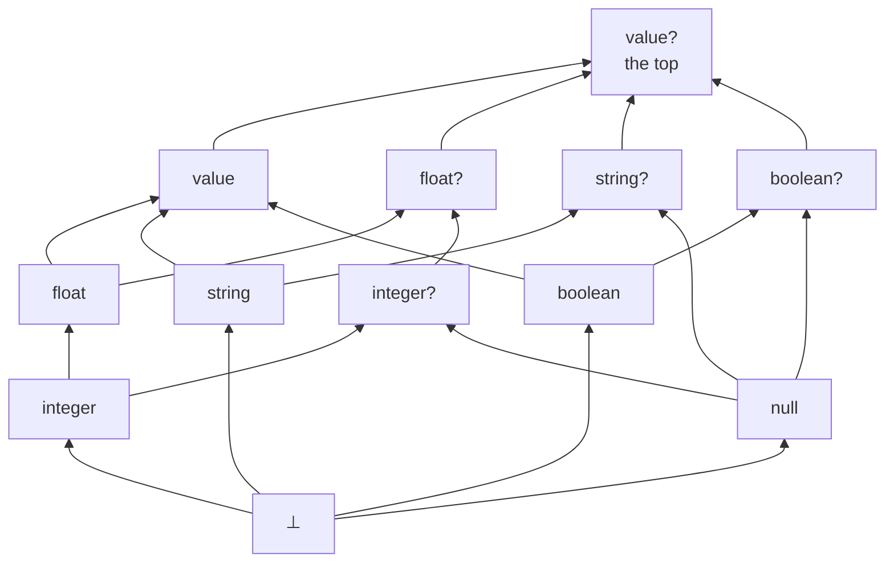

# Design notes: null as an ordinary value, undefinedness as partiality

Status: **stage 3 built and green on `max/partial-expressions`.** Partiality,
the `null` type, the `value` accessors and the 60-test sweep are done on every
runnable backend, with the example suite green across all four. Stages 1 and 2
(§15.1) landed earlier. Everything is built, spec'd and tested (§15.10 through
§15.15), including the undefined-expression warning, which measurement turned
into an opt-in flag rather than a default (§15.14). This is the design
[partial-expressions.md](./partial-expressions.md) should have found and did not.
It supersedes that doc's recommendation: where that one concluded "keep NULL, at
most forbid it in columns", this one concludes "split NULL's two jobs apart, and
the objections to both halves dissolve".

The proposal in one paragraph. Today's NULL does two unrelated jobs: it is the
marker an undefined operation returns, and it is the value that missing data
carries. Give the second job to an ordinary value `null` with its own type, give
the first job to genuine partiality, and neither job needs the other's
machinery. Undefinedness stops being a value, so it stops needing a place in the
value domain, a position in the order, or a bit beside the type. `null` stops
being magic, so it stops needing three-valued comparison, a polymorphic literal
with no type, or `as_integer(null)` to write one down.

## 1 The rules

**Values.** The value domain gains `null` as an ordinary inhabitant, on a par
with `1`, `"a"` and `true`. Written as the literal `null`. Its type is `null`.

**Undefinedness.** An expression either denotes a value or is **undefined**.
Undefined is *not* a value: there is no `undefined` literal, no column can hold
it, and no variable can be bound to it. An operation is undefined when an operand
is undefined or when the operation has no result at those arguments: `1 / 0`,
`X % 0`, `sqrt(-1)`, `ln(0)`, integer overflow, a missing `value` key, a failed
`as_*` projection, a malformed `parse_json`.

**Where definedness is required.** Compositionally, per conjunct, which is what
makes this work:

| construct | holds when |
|---|---|
| atom `p(e₁ … eₙ)` | every `eᵢ` is defined **and** ⟨⟦e₁⟧ … ⟦eₙ⟧⟩ ∈ p |
| equality `e = f` | both defined and equal as values |
| filter `e` | `e` is defined and true |
| `not φ` | `φ` does not hold, for any reason including undefinedness |
| head | a tuple is derived only where every head expression is defined |

Stating it per conjunct rather than per rule is the detail that matters. An
earlier attempt (partial-expressions.md §2.3) said "a tuple is derived only when
every expression in the rule is defined", which is not compositional: it makes
`q() :- not p(1 / 0).` derive nothing, where these rules correctly derive `q()`,
because the undefined expression belongs to the negated subformula and its
failure is what `not` complements.

**Consequences the rules give for free.**

- `not (e = f)` holds when either side is undefined, so `e <> f` is not
  `not (e = f)`. Accepted; §4 shows the divergence is narrower than it sounds.
- `not (e = e)` holds exactly when `e` is undefined. The language gets a
  definedness test with no new syntax (§4.3).
- `p(1 / 0)` never holds and `not p(1 / 0)` always does, whatever `p` contains.

**Types.** The lattice gains `null` and the joins `T ⊔ null`, spelled `T?` (§3).
Types describe values, so **definedness is not a type-system notion at all**: an
expression of type `integer` denotes an integer wherever it is defined, and the
type says nothing about where that is. Type errors are static, domain errors are
runtime-partial, and the two stop being the same thing.

## 2 This answers the objection that killed a `null` type

null.md §7 records, at length and with instructions not to re-derive it, why
`null` cannot be a type:

> For `p(X), X = null` to keep working, `null` would have to be below every
> primitive. But then `string ⊓ integer` is inhabited by it, so a variable shared
> between a string column and an integer column stops being a type error and
> becomes a null-typed predicate that silently carries NULL rows.

The whole argument rests on that first premise, and this proposal removes it.
`null` is a **sibling** of the primitives, not a subtype of them, so:

- `string ⊓ integer` is still ⊥, still a static error, for the same reason as
  today. Nothing was added below the primitives.
- `string? ⊓ integer?` is `null`, which is **correct**, not a hole: a variable
  that must inhabit a nullable string column and a nullable integer column can
  only be null.

What made `null`-as-a-type look impossible was requiring `X = null` to type-check
for any `X`. It does not need to. `X = null` type-checks when `X`'s type has
`null` in it, which is what `?` means, and is a static error otherwise. That is
strictly better than today, where `X = null` is legal on any column and simply
never matches.

So the sibling placement is the missing move, and the verdict null.md §7 asks
nobody to reopen was correct about the design it considered and does not reach
this one.

## 3 The lattice

Add `null` as a fifth atom under `value` and close under join. `T?` is not a new
kind of type, it is a spelling of `T ⊔ null`.



Twelve elements, height five, so inference still terminates by the same argument
as today. Checks worth having done:

- `integer ⊔ null = integer?`, `integer? ⊓ float = integer`, `integer? ⊑ float?`.
- `integer ⊔ string = value`, as today: the join stays total and incompatible
  primitives still widen rather than erroring.

### 3.1 Two corrections from building it

The lattice is implemented in `core/src/column-type.ts` and its laws are a test
(`core/test/column-type.test.ts`, which checks commutativity, associativity and
monotonicity over all twelve elements). Two claims above did not survive that.

**`value` and `value?` are distinct, so the lattice has twelve elements.** An
earlier draft had eleven, with `value` as the top admitting a null, and recorded
the resulting `integer ⊔ string` as an accepted over-approximation. There is
nothing to accept: `(value, false)` is a real element, "any JSON shape, never
null", and it is exactly what that join yields. The imprecision was an artifact of
presenting the lattice flattened. So `?` means the same thing on every base type,
`value` stops being a special case, and §11.4's question dissolves: `value?` is an
ordinary type, worth writing when JSON data can carry a null, and neither a
synonym nor an error. That is the third answer this point has had and the first
one arrived at by construction rather than by argument.

**`undefined` cannot be the meet's identity.** `meetTypes` in `types.ts` returns
`b` for `meetTypes(undefined, b)`, treating ⊥ as the meet's unit, which
type-lattice.md describes as `undefined` wearing two hats. That is not a lattice:
it breaks associativity and makes `meet(a, b) ⊑ a` fail, both of which the law
test catches immediately. The units are genuinely two different elements. The
join's is ⊥ and the meet's is the top, `value?`, which is a real element and
already behaves as the unit, since a `value?` slot accepts whatever the other side
requires. Consequence for the wiring: **a variable solve seeds at `value?`, not at
⊥**, and "this variable was never constrained" has to be tracked by the caller
rather than read off the seed.

Two things this changes for the better.

**Better: nullness-tracking.md's product collapses into the base lattice.** That
doc's componentwise meet, componentwise join, `publishedNullness` beside
`publishedTypes`, and the nullness halves of `checkHeadAnnotations` and
`checkModuleBoundaries` all become the ordinary meet, join, published type and
type checks. The parallel structure the user objects to is not simplified, it is
deleted, and this is the proposal's largest structural win.

**Better: nullability stops being infectious.** nullness-tracking.md §7 declined
the Kotlin reading (requiring `?` where a column can be null) on cost:
"every rule head containing a division, a `to_*`, an `as_*`, or a `value`
accessor would need an annotation, which is most non-trivial programs". That cost
was entirely an artifact of division producing NULL. Under partiality it does not:
`X = A / B` derives no tuple where `B` is zero, so the column's type is `integer`,
not `integer?`. **Nullability now arises only from an actual `null`**, meaning the
literal, a `?`-declared input column, or JSON data. Across the corpus that is one
column (`examples/expr-eval`) and one example's literals
(`examples/relational-algebra`). So partiality is what makes a `null` type
affordable, and the two halves of this proposal are not independent: each pays for
the other.

**Better: nullness-tracking.md §7's reason 1 is answered outright.** That
objection was that a flattened lattice launders nullness away at
`integer ⊔ string?`, leaving two `value` columns to join with a plain `=` and drop
the null-to-null match. The pair cannot lose the bit, because the bit has its own
join: `integer ⊔ string?` is `value?` and stays null-aware, while
`integer ⊔ string` is `value` and joins plainly. Both are exact. §3.1 records that
this is why the twelfth element has to exist.

## 4 Comparison, equality and negation

### 4.1 `=` and `<>` are total on values; the orderings are strict

`=` compares values. `null = null` is true because it is the same value;
`null = 1` is false because they are different values. Nothing three-valued, no
`IS NOT DISTINCT FROM` in the semantics, and `X = null` is an ordinary test rather
than a special form. `<>` is its complement **on defined operands**.

The orderings need an order, and `null` is not in one. Under §5's recommended
position they accept a `T?` operand and are **undefined** at `null`.

Compare against today's table (null.md §5). Rows that change are marked:

| left | right | `=` | `<>` | `<` | `<=` |
|---|---|---|---|---|---|
| `5` | `5` | true | false | false | true |
| `5` | `6` | false | true | true | true |
| `5` | `null` | false | true | *undef* | *undef* |
| `null` | `null` | true | false | *undef* | *undef* |

**In filter position nothing changes at all.** Undefined does not hold and false
does not hold, so every row that survives today survives, and vice versa. Under
`not`, `5 < null` was false and is now undefined, and `not` holds of both. The
only genuine divergences are:

- `null <= null`, today true and now undefined. That deletes the wart null.md §5
  apologises for, where `<=` was "true only when both are" null.
- a comparison **bound to a variable**, since `C = (5 < X)` had a value and now
  derives nothing. Narrow (§4.4).

So this proposal is very nearly observationally conservative on comparison, which
is worth knowing for migration: the corpus's filters and negations do not move.

### 4.2 The `<>` divergence, priced

`e <> f` requires both sides defined; `not (e = f)` does not. The divergence needs
an **undefined operand**, so it cannot arise between variables or literals:
`X <> null` and `not (X = null)` are interchangeable, and that is the guard people
actually write. It takes a compound partial expression, `A <> 100 / B` against
`not (A = 100 / B)`, which no corpus program writes.

Recommend a warning on `<>` with a partial operand, naming `not (a = b)` as the
other reading. That is the whole mitigation and it should be on by default.

### 4.3 `not (e = e)` is a definedness test

It falls out of the rules and it is worth documenting rather than leaving for
someone to discover, because it answers the one diagnostic complaint against
partiality. `divs(Q) :- s(V), Q = 10 / V.` silently omits the rows where `V` is
zero, and

```prolog
?- s(V), not (10 / V = 10 / V).      # the rows divs lost
```

names them. Obscure as an idiom, and it has a readable spelling as an ordinary
builtin, `not defined(e)`, provided the polarity goes the right way round. §11.6
works it out: `undefined(e)` cannot be a builtin and `defined(e)` can, because
strictness works for the second and against the first.

### 4.4 `not` and `!` stop agreeing, and `&&` must stay non-strict

Two places where the third outcome persists rather than disappearing, and both
must be stated because "partiality removes three-valued logic" is not one of this
proposal's benefits.

**`not` against `!`.** A comparison is a first-class expression in Datamog:
`C = (A = 100 / B)` binds `C` to a boolean and stores it in a column (verified
today, `C` is `false` at `B = 0`). Under this proposal the expression is undefined
there, so the rule derives nothing, while `not (A = 100 / B)` holds. Formula-level
`not` complements failure; expression-level `!` propagates undefinedness. They
agree today and cannot afterwards. Programs that never put a comparison in
expression position do not notice, which is nearly all of them.

**That distinction has an implementation consequence, and the implementation
currently goes the wrong way.** `post-process.ts` desugars a negated filter by
rewriting it into the other operator:

> Desugar negated filters (`not X = Y`) into `!(...)` over the same expression.
> Predicate-call literals are negated via `Literal.negated` and are left untouched
> here.

So today's `not` over a filter *is* `!`, which is sound precisely because
comparison is total and the two coincide. Under this proposal they do not, so the
rewrite silently gives `not` the wrong semantics on any filter with a partial
subexpression, and `not defined(e)` (§11.6) is the case where it matters most:
rewritten to `!defined(e)`, it is undefined exactly where it must hold. **Deleting
that rewrite is a prerequisite**, and a negated filter has to keep its `negated`
flag through to the backends, the way a negated atom already does.

**`&&` and `||` short-circuit over undefinedness.** `false && e` is `false` even
where `e` is undefined, and `true || e` is `true`. Required, not cosmetic: it is
what makes `X <> 0 && 10 / X > 0` bind a value rather than being undefined at the
case the guard exists to exclude, and it mirrors both SQL and today's table
(`null && false = false`). So the connectives remain non-strict in undefinedness
exactly as they are non-strict in NULL today. The absorbing boundary moved from
comparison outward to `not` and the connectives; it did not go away.

## 5 The central decision: what may an operation take a `T?`?

The proposal does not say, and everything downstream turns on it. Three coherent
positions.

**Position 1, strict.** `T?` is not `T`. Any operation requiring `T` rejects `T?`
statically, comparisons included. Narrow with a guard first. Nulls can never
silently vanish, because nothing can be applied to one. Cost: `X < 5` on a
nullable column becomes an error.

**Position 2, permissive.** `T?` goes wherever `T` does; applying an operation to
`null` is undefined, so the row drops. Nothing to narrow, nothing breaks. Cost:
the `null` type is documentation, and nulls silently drop rows, which is the
failure mode the type was introduced to expose.

**Position 3, hybrid. Decided.** Comparisons accept `T?` and are strict at
null. Everything else, arithmetic, string operations, `sum`, `min`, `max`,
requires narrowing.

Position 3 is the one that follows the language's own grain. null.md §5 already
draws a line in this exact place, "NULL propagates through *operations* and is
absorbed by *comparisons*", and Position 3 draws it one notch differently:
comparisons *accept* null and fail, operations *reject* it statically. The
justification is what each construct is for. A comparison is a guard, and a guard
failing is it doing its job. An arithmetic operation is a computation, and a
computation silently contributing no row is the bug you wanted the type for.

It also makes the corpus migration nearly free, since a comparison on a nullable
column keeps working and arithmetic on one appears once. And it is what keeps §9's
storage story single-valued, which was not part of the case for it and is the
stronger reason: it is the rule that stops a `T?`-typed expression from ever being
undefined, so a SQL NULL in a `T?` context has exactly one reading.

**Narrowing.** Per rule, order-independent, over the body's conjuncts, which is
the shape `refineBody` already has and for the same stated reason: a body is a
conjunction with no control flow, so a guard written last narrows an atom written
first. What narrows `X : T?` to `T`:

| conjunct | because |
|---|---|
| `X <> null`, `null <> X`, `not (X = null)` | direct |
| `X = e` where `e : T` | the equality holds only on a `T` value |
| positive atom position whose column is `T` | the value came from there |
| `X < e`, `X <= e`, and the rest of the orderings | strict at null, so holding implies non-null |
| `X in [lo .. hi]` | same |
| `f₁ && f₂` | whatever either narrows |
| `f₁ \|\| f₂` | whatever both narrow |

This is `refineBody`'s table with `nonnull` replaced by "type minus `null`", and
one row deleted: `<=` and `>=` now narrow, where today they prove nothing because
they were true of two nulls. A narrowing that lands on ⊥ is a static error and one
that lands on `null` is legal and worth warning about, being a rule that can only
ever fire on nulls.

## 6 Representation: do not extend `PrimitiveType`

The tempting implementation is to make `PrimitiveType` a ten-member union.
**Do not.** nullness-tracking.md §7 reasons 2 and 4 priced this and the price is
unchanged: `PrimitiveType` is compared against a literal string at **146 sites
across 25 files** outside tests, from `sqlTypeFor` and `liftToJsonIfNeeded` to
`coerceJsonColumns`, the loaders and both dialects. TypeScript reports the
exhaustive switches and says nothing about
`decl.columns.filter((c) => c.type === "value")`, which would quietly stop seeing
nullable `value` columns.

The saving observation is that **the semantics this proposal wants does not
require that representation.** nullness-tracking.md §7 already establishes that
the ten-element lattice is order-isomorphic to the product of the five-element
base lattice and the two-element nullness lattice. So keep the pair. What changes
is not the shape of the representation but what the second component *means*:

| | today | this proposal |
|---|---|---|
| the bit | SQL NULL may appear in this column | `null` is in this type's value set |
| set by | a `?` declaration, or any partial operation in a head | a `?` declaration, or an actual `null` |
| computed by | `nullness.ts`, a second fixed point beside inference | type inference, since it is part of the type |

And one element changes meaning rather than being added. nullness-tracking.md §7
reason 3 dismissed `(⊥, nullable)` as junk, "a nullness bit on an uninhabited type
denotes nothing". Under this proposal it is exactly the `null` type: the empty
base set plus `null`. So the product needs no new elements at all, only the
reinterpretation of the one it already had and called junk.

Practical consequence: `columnTypes` and `columnNullness` can stay two maps or
become one map of pairs. Merging them is a mechanical refactor with no semantic
content, worth doing for clarity, and not on the critical path.

## 7 Aggregates

- **Empty group. Decided (§11.5).** An aggregate folds a monoid, so over an empty
  group it returns that monoid's identity where one exists in the domain and is
  undefined where none does:

  | aggregate | folds with | empty group | today |
  |---|---|---|---|
  | `count(*)`, `count(e)` | `+` | `0` | `0`, unchanged |
  | `sum(e)` | `+` | `0` | `null` |
  | `concat(e)` | `++` | `""` | `null` |
  | `list(e)` | append | `[]` | `null` |
  | `min(e)`, `max(e)` | none in the domain | undefined, no tuple | `null` |
  | `avg(e)` | none, being `0 / 0` | undefined, no tuple | `null` |

  `count` is the one that does not move, which is worth stating because it is the
  aggregate people reach for when asking about this corner. Everything else drops
  a `null` it could not have stored anyway.

  This removes null.md §8's complaint that an empty `list` yields `null` rather
  than `[]`, and it is the same rule as the non-empty case rather than a special
  one: a group of rows whose arguments are all undefined has no contributions
  either, so `sum` is `0` there too and `min` is undefined there too. Nothing
  special-cases emptiness.

  **The accepted cost is about `count`, though its value is unchanged.** A head
  mixing `count(*)` with `min(V)` derives nothing over empty input, because one
  undefined head expression withholds the whole tuple, so the count becomes
  unobservable and the rule has to be split. That is a change in a corner spec
  §2.7 pins, and it is the price of the row being all-or-nothing.

  `isGroupingArg` and `hasGroupingColumns` survive untouched: they still answer
  "is this rule ungrouped", and the table above decides only what goes in the row.
  Worth saying because that function has been wrong twice
  (nullness-tracking.md §6) and this change does not reopen it.
- **Undefined argument.** A row whose aggregate argument is undefined contributes
  to no aggregate that mentions it and still counts for `count(*)`. Unchanged from
  today's NULL filtering, but it needs saying, since the natural reading of "the
  body must hold" would drop the row from every aggregate in the head.
- **The emit has an ordering trap, which is §9's collision again.** SQL's `SUM`
  returns NULL over no rows, and the integer domain guard returns NULL on
  overflow. Under this proposal those must go opposite ways, `0` and undefined, so
  **coalesce first and guard second**: `COALESCE(SUM(x), 0)` supplies the identity,
  then the domain check on that result withholds the tuple on overflow. Reversed,
  an overflow would silently become `0`. The same shape applies to `concat`
  (`COALESCE(..., '')`) and to Postgres `JSONB_AGG` (`COALESCE(..., '[]'::jsonb)`).

  SQLite goes the other way and gets a deletion: `JSON_GROUP_ARRAY` already
  returns `'[]'` over an empty group, and the dialect currently wraps it in
  `NULLIF(..., '[]')` specifically to turn that into NULL. That wrapper is
  today's behaviour implemented on purpose, so it simply goes.
- **`sum`, `avg`, `min`, `max` on `T?`** are static errors under Position 3.
  Narrowing works naturally inside an aggregate rule, since the guard is a body
  conjunct: `q(sum(X)) :- p(X), X <> null.` type-checks.
- **`count(e)` counts every row where `e` is defined, including where it is
  `null`. Decided**, on consistency: `count` counts values, and `null` is one, so
  skipping it would be special-casing the value this proposal exists to
  de-special-case. Three consequences to carry, none of them fatal but all needing
  a spec note. It diverges from SQL's `COUNT(col)` and from today. It makes
  `count(X)` equal `count(*)` for any variable, so the shorter spelling is always
  the better one and `count(X)` becomes a smell. And the old behaviour is awkward
  to recover, because Datamog has no filtered-aggregate syntax: a `X <> null`
  guard drops the row from the group entirely, which also changes `count(*)`
  beside it, so a rule wanting both counts has to be split. That last one is the
  real cost, and a filtered aggregate is the general fix if it ever bites.
- **`list`** collects defined values including nulls, so `length(list(V))` finally
  equals the count of defined `V`. Its sort key needs a position for `null`; put
  it first, and say so, since the aggregate's determinism is specified.
- **Grouping and dedup** treat `null` as the value it is, so nulls group together
  and deduplicate. Already true today and now true for a simpler reason.

## 8 JSON gains something it cannot express today

Today a JSON `null` leaf collapses to SQL NULL on read (spec §2.9), so an absent
key and a present-but-null key are indistinguishable, and `type_of` on a JSON null
returns NULL rather than `"null"`. null.md §8 records that as accepted rather than
liked.

Verified on `native`, over `{"k": null}`, `{}` and `{"k": 7}`:

```prolog
lookup(Id, X)  :- doc(Id, J), X = J["k"].              # today: null, null, 7
shape(Id, T)   :- doc(Id, J), T = type_of(J["k"]).     # today: null, null, "number"
present(Id)    :- doc(Id, J), X = J["k"], X = X.       # today: all three rows
```

Rows 1 and 2 are identical in all three, so the language cannot currently see the
difference between a field that is absent and a field whose value is null.

This proposal separates them:

| `J` | `X = J["k"]` | `type_of(J["k"])` | `X = X` |
|---|---|---|---|
| `{"k": null}` | defined, `X` is `null` | `"null"` | holds |
| `{}` | undefined, no tuple | undefined, no tuple | fails |

So `type_of(null)` is `"null"`, spec §2.9's collapse is deleted, a program can
distinguish "no such field" from "field present, value null", and §4.3's
definedness test does the distinguishing without new syntax. Real JSON makes that
distinction constantly and Datamog currently cannot see it.

## 9 Storage, and the two spellings of null

The one genuinely awkward consequence, and it needs stating plainly because it is
where the design meets SQL.

### 9.1 The problem

SQL has one NULL. This proposal gives it two jobs to distinguish:

- **undefined**, where the row must be dropped;
- **the `null` value**, where the row must be kept with `null` in the column.

Today there is nothing to distinguish, because both are the same thing. That
conflation is what the proposal removes, so the translator now has to decide,
for every SQL expression that can produce a NULL, which of the two it means.

### 9.2 The static type decides, and for four types it decides cleanly

| type | can be undefined? | can be `null`? | so a SQL NULL means |
|---|---|---|---|
| `integer`, `float`, `string`, `boolean` | yes (`A / B`, overflow, `as_integer`) | no, `null` is not in the type | undefined, so filter the row |
| `integer?`, `string?`, … | **no** | yes | the `null` value, so keep the row |
| `value` | yes (`J["k"]` on `{}`) | yes (`J["k"]` on `{"k":null}`) | ambiguous, see §9.3 |

The second row is the one worth checking rather than assuming, and it holds only
because of §5's hybrid position. Which expressions have type `T?`? A variable
bound from a `T?` column, and the literal `null`. Both are always defined.
Anything that could be undefined is a partial *operation*, and every partial
operation on a `T?` operand is a static error under Position 3. So under the
hybrid rule **no `T?`-typed expression can be undefined**, and the ambiguity
never arises. Note what this means: §5 is not only a usability decision, it is
what keeps the storage story single-valued. Position 2 would reopen it, since
`X + 1` on an `integer?` would be an `integer?`-typed expression that is
undefined at null.

### 9.3 `value` is the exception, and the collision is already in the code

A `value`-typed expression can be both nullable and partial, so one marker cannot
carry both readings. `value` therefore spells `null` the JSON way, JSONB `null` on
Postgres and the canonical text `null` on SQLite, and a SQL NULL in a
`value`-typed expression means undefined.

Two things checked rather than assumed, and both are good news for the cost:

**The canonical encoding already distinguishes them.** `canonicalizeJson` in
`engine/src/json-canonical.ts` renders a JS `null` as the text `"null"`, so the
`value` representation already has a spelling for JSON null that is not SQL NULL.
No storage format changes.

**The collision is present today, worked around, with a comment saying so.** The
SQLite `list` aggregate filters on the *raw* argument rather than the lifted one:

> The `FILTER` tests the *original* `argSql` (not `valueSql`) so SQL-NULL inputs
> are skipped. `json_quote(NULL)` returns the text `'null'` (not SQL NULL), which
> would otherwise pass the filter and emit a JSON `null` entry for what was really
> an absent value.

That is exactly the two meanings colliding. Under this proposal the workaround
becomes type-conditional instead of unconditional: for a nullable argument a JSON
`null` entry in the array is precisely right, and for a non-nullable one a SQL NULL
still means undefined and is still skipped.

**And spec §2.9's collapse is not a decision to delete, it is accessor behaviour
to change.** `jsonSubscript` on SQLite iterates the receiver with `json_each` and
matches the key: a missing key yields no matching row, and a key whose value is
JSON null yields a matching row whose `value` is SQL NULL. Both arrive downstream
as SQL NULL, which is the collapse. The fix is available inside that one function,
because `json_each` also exposes a `type` column that the dialect already uses
elsewhere for exactly this kind of shape recovery. So the work is a change to the
accessor emit, not a redesign.

### 9.4 So the concrete work is five places plus one lift

Every site that today reads "this is SQL NULL" has to ask the expression's type
first. There are five:

1. the head filter that drops undefined tuples (§1);
2. the `list` and `concat` aggregate `FILTER` clauses (§9.3);
3. the `value` accessors, subscript and slice (§9.3);
4. `defined`'s emit (§11.6), which is `IS NOT NULL` for a non-nullable or `value`
   argument and constant `TRUE` for a `T?` one;
5. the aggregate emits (§7), where `SUM` over no rows and an overflowing `SUM` are
   both SQL NULL and must go opposite ways, so the identity `COALESCE` goes inside
   the domain guard rather than outside it.

Plus one new conversion: **lifting `T?` to `value` maps SQL NULL to JSON null**, a
new case in `liftToJsonIfNeeded` where today there is none.

Five sites is the honest measure of §9's awkwardness, and the shape is the same at
every one: a SQL NULL means undefined unless the static type says otherwise.

- **The Postgres join cost survives for genuinely nullable columns.** A join on a
  `T?` column must match null to null, so it lowers to `IS NOT DISTINCT FROM` and
  null.md §6's quadratic-plan warning still applies there. What disappears is the
  *analysis*: the translator reads the column's type instead of consulting a
  separate nullness fixed point. And since §3 makes nullability rare, the warning
  now applies to a handful of columns a program declares deliberately rather than
  to anything downstream of a division.

## 10 Refinement contracts

Three changes, all in the right direction, and one is the payoff
partial-expressions.md §3.8 identified.

**A derived tuple witnesses its own definedness.** A head expression that is
undefined derives no tuple, so `def(head expressions)` joins the hypotheses. The
overflow guard stops falsifying plausible invariants. Of the five failures
refinement-annotations.md tabulates, `cyk-parser`'s `I < K`, `fibonacci`'s
`Curr <= Next` and `refinements`' `S < F` are all pure overflow artifacts and
would discharge; `slot`'s `S < E` and `population-query`'s `D >= 0` still fail,
correctly, being claims about input data. Residual 8 of that doc calls the domain
guard "the single largest reason a plausible invariant does not discharge", and
this removes it for every computed term.

**A variable's null bit comes from its type, not from an analysis.** Today every
free variable gets a `$null` companion Bool unless `nullness.ts` prunes it, and
`obligations.ts` records that without the pruning "every counterexample was an
artifact". Under this proposal an `integer`-typed variable structurally has no
null case, and an `integer?`-typed one does. Since §3 makes the latter rare,
almost no variable carries a companion, and the encoder loses its dependency on
`nullness.ts`.

**Comparison encodings simplify in the common case.** For non-nullable operands
`<` is `(< l r)` rather than today's guarded pair. For nullable operands it is
today's shape. Definedness conditions on compound terms remain, because overflow
and division still exist, and they are syntactic.

## 11 Decisions

All settled. Each is recorded with what it costs, so a reversal has something to argue against.

1. **Position 3, the hybrid (§5).** Comparisons take a `T?` and are strict at
   null; everything else needs narrowing. This turned out to carry more weight
   than its own section claimed, being also what keeps §9.2's storage reading
   single-valued.
2. **`count(e)` counts nulls (§7).** On consistency, accepting the SQL divergence
   and the split-rule cost.

3. **`object` and `array` are not types, and this proposal does not want them
   to be.** The framing said `null` sits under `value` "on a par with `string`,
   `object`, etc.", but `PrimitiveType` is exactly
   `'string' | 'integer' | 'float' | 'boolean' | 'value'`: `value` covers every
   JSON shape and there is no `object`. Decomposing it is genuinely orthogonal,
   and the ordering runs one way only, which is the part worth recording:

   - **Adding `null` first, shapes later, is additive.** Shapes arrive as further
     atoms under `value`, `?` applies to them uniformly, and §6's pair
     representation makes that free, since `?` is a bit rather than a member.
     Nothing in §3, §5 or §9 has to move.
   - **Shapes first would buy the null design nothing**, and §9.3 in particular is
     unaffected: a `value` accessor is both partial and null-valued whether or not
     its receiver's shape is typed.

   On whether they are worth it eventually, a caution rather than an answer.
   Shapes without *element* types buy very little: `J : array` does not give
   `J[0] : integer`, so `X = J[0] + 1` stays partial, and the only gain is turning
   `length`, `keys` and `values` from partial into total. The corpus does not ask:
   `keys`, `values` and `has_key` appear zero times across `examples/`, and only
   two example files declare a `value` column at all. The real prize is
   `array<integer>`, which is parametric types, a much larger language, and the
   natural home for it is
   [functional-sublanguage.md](./functional-sublanguage.md)'s deferred `data`
   declarations rather than a decomposition of `value`. That half is already
   deferred there, for corpus reasons and because its builders collide with proof
   terms.
4. **`value?` is an ordinary type, neither a synonym nor an error.** The question
   was posed on a false premise, that `value` must contain `null` and so `value?`
   adds nothing. Building the lattice showed `(value, false)` is a real and useful
   element (§3.1), so `?` means the same thing on every base type: `value` is any
   JSON shape but not null, `value?` admits one. No special case, nothing to
   learn, and the two earlier answers here were both attempts to paper over a
   presentation artifact.

   One migration consequence, small: a `value` column that can carry a JSON null
   must now say `value?`. The corpus declares two `value` columns in total.
5. **Empty-group identities (§7). Decided: take them.** An aggregate returns its
   monoid's identity over an empty group where the domain has one, and is
   undefined where it does not. `count` is unchanged at `0`; `sum`, `concat` and
   `list` move from `null` to `0`, `""` and `[]`; `min`, `max` and `avg` stop
   emitting a row. The accepted cost is that a head mixing `count(*)` with one of
   the last three derives nothing over empty input and has to be split.

   One further option, found and rejected: make the empty-group result `null`
   where the head position's declared type admits it and undefined otherwise,
   which would preserve today's answers under a `T?` annotation. Rejected because
   it makes an aggregate's value depend on an annotation, which contradicts the
   invariant that annotations never change results.
6. **A `defined(e)` builtin, and `not defined(e)` for the negative case.**
   Adopted, reversing this doc's earlier claim that no builtin could do the job.
   That claim was right about `undefined(e)` and wrong to generalise: the polarity
   decides it.

   Builtins are strict in undefinedness, so a call on an undefined argument is
   itself undefined. Put the interesting case on the *true* side and strictness
   defeats you, since `undefined(1 / 0)` would be undefined where it must be true.
   Put it on the *failing* side and strictness does the work:

   | `e` | `defined(e)` | holds? | `not defined(e)` |
   |---|---|---|---|
   | defined | `true` | yes | fails |
   | undefined | undefined, by strictness | no | **holds** |

   Undefined and false both fail to hold in condition position, so `defined(e)` is
   equivalent to `e = e` as a condition, exactly as intended, and `not` inverts it
   with no special form. A grammar change becomes a registry entry.

   Three riders, none fatal, all needing to be written down before anyone builds
   it.

   - **It depends on §4.4's rewrite being deleted.** `not defined(e)` desugared to
     `!defined(e)` is undefined where it must hold. This is the motivating case for
     that deletion.
   - **It must not go through the `value` lift.** The tempting registry shape is
     `type_of`'s, one overload on `value`, since everything lifts into it. That
     breaks here: `json_quote(NULL)` returns the *text* `'null'` rather than SQL
     NULL (the SQLite dialect says so, in the comment explaining why the `list`
     aggregate filters its raw argument), so lifting an undefined `integer` would
     hand `defined` something that looks defined. So either give it one overload
     per family at the nullable top (`integer?`, `float?`, `string?`, `boolean?`,
     `value`), so a nullable and a non-nullable argument both resolve without
     lifting, or add a wildcard parameter to the registry. The first needs no new
     machinery and follows `abs`'s two-overload shape.
   - **`defined(X)` on a bare variable is constantly true, and it is not
     `X <> null`.** A variable always denotes a value, null included. This is where
     the proposal's central distinction turns into a usability hazard, because the
     two readings are one keystroke apart and only one of them is ever what a
     reader means on a variable. Warn on it, and say the difference in the spec
     next to both.

   One property to document rather than fix: `defined(e)` is true-or-undefined and
   never false, so `C = defined(e)` cannot bind `false`. That is not a defect of
   the builtin, it is what `e = e` already does, and the way to get a storable
   boolean is the two rules that make the case analysis explicit.

   The static undefined-expression warning still catches the common case before
   the run; this is for after it.

## 12 The `?` operators, declined

The proposal floats `+?` such that `null +? x` is `null`, if they pull their
weight. They do not.

**No demand.** Null-propagating arithmetic is used today on *undefined* values,
which become partiality and need nothing. On genuine nulls the corpus has one
`integer?` column and one example's literals. There is no program that wants to
add one to a possibly-absent number and get a possibly-absent number.

**High cost.** A shadow copy of the operator table, an overload for every
combination of nullable operand positions, and a translator emit plus an
interpreter implementation for each. It also reintroduces implicit propagation,
which is the thing this proposal is removing, one operator at a time.

**A smaller general answer exists.** Datamog has no `coalesce`, which is the
operation people actually want: `Y = coalesce(X, 0) + 1`. One builtin, two
overloads, and it composes with everything rather than doubling the operator
table. Where a genuine `null` output is wanted, two rules express it, and the
second rule is the case analysis that today's implicit propagation hides. Add
`coalesce` if and when a program wants one; decline `+?`.

## 13 What survives of `nullness.ts`

- **`inferNullness`'s cross-predicate fixed point: deleted.** Column nullability
  is part of the column's type, so `inferTypes` computes it. This is the parallel
  analysis the proposal is meant to remove and it goes in full.
- **`computePublishedNullness`: deleted**, folded into `computePublishedTypes`,
  and with it the nullness halves of `checkHeadAnnotations` and
  `checkModuleBoundaries`.
- **`refineBody` and friends: kept, repurposed** as the type narrowing Position 3
  needs (§5). It stops answering "is this variable non-null" and starts answering
  "what is this variable's type in this rule", which is the same fixed point over
  the same conjuncts.
- **`mayBeNull`: split.** Its "can this expression produce a NULL" question
  becomes two: "is `null` in this expression's type", answered by inference, and
  "can this expression be undefined", answered syntactically from the operators it
  contains.
- **`isUngroupedAggregate`: deleted**, §7's identities replacing the rule it
  encoded.
- **`nullness-diagnostics.ts`**: the nullable-filter warning is replaced by an
  undefined-expression warning, and the complementary-ordering and negated-ordering
  warnings survive restated about undefinedness. All three currently fire nowhere
  in the corpus.

So the deletion is not primarily a line count, it is one of two fixed points and
one of two parallel type-like structures. That is what makes this cleaner than
either today's design or partial-expressions.md's Axis 1, and it is the answer to
the objection that prompted it: there is no longer a difference in kind between
what a column carries and what a variable carries, because `null` is a value and
undefinedness is not.

## 14 What it still costs

Nothing here is fatal, and none of it is hidden.

1. **Silent absence.** `divs(Q) :- s(V), Q = 10 / V.` loses its `V = 0` row with
   nothing in the output to say so, where today a visible `null` appears. This is
   unchanged from partial-expressions.md §5.2 and remains the strongest objection
   for a teaching implementation. Mitigations: the static
   undefined-expression warning, which arrives before the run rather than as a
   null in a table afterwards, and §4.3's definedness test for after it.
2. **`<>` is not `not (=)`** (§4.2), and `!` is not `not` (§4.4). Both narrow to
   compound partial expressions.
3. **Two spellings of null in storage** (§9), and a new lift between them.
4. **The Postgres join cost** persists for declared-nullable columns (§9), though
   the analysis to avoid it does not.
5. **`count(e)`** (§7, §11.2).
6. **The sweep.** Smaller than partial-expressions.md's, because §6 keeps the
   representation and §4.1 keeps filter and negation behaviour, but not small:
   spec §2.6, §2.7, §2.9, §5.3, §5.4, §5.5 and §5.10; `null.md` and
   `nullness-tracking.md` become historical; `values.ts` gains an `UNDEF` sentinel
   distinct from the `null` value; walkthrough 06 and 14; and the examples with
   nulls in `expected.json` (`json-events`, `parse-json`,
   `primitive-conversions`, `relational-algebra`).

Against that, two costs of the alternatives disappear. `examples/relational-algebra`
keeps its outer join, `left_join(X, null)` being an ordinary tuple with an
`integer?` column, where both today's `?` bit and Axis 1 make it awkward or
impossible. And holey input data needs no new discipline: `age: integer?` means
what a reader expects, and Position 3 makes the program say where it handles the
hole.

## 15 Verdict

Adopt this in preference to both today's design and partial-expressions.md's
Axis 1, subject to §11.

It is cleaner than today because NULL's two jobs stop sharing machinery: one
becomes a value with a type, the other becomes partiality, and the second fixed
point, the parallel published structure and the three-valued comparison table all
go with the conflation. It is cleaner than Axis 1 because there is no difference
in kind between a column and a variable, which was the objection that prompted
it. It is cheaper than it looks because §6 keeps the representation the last
attempt priced and rejected, §3 makes nullability rare enough for the strict
reading to be affordable, and §4.1 leaves filters and negations where they are.

### 15.1 Build order, as revised while building

An earlier draft put "the lattice and inference" first, as one self-contained
stage. The lattice is; the inference is not, and the two have to be separated.
Nullability under this design is "only an actual `null`", which is true only once
a division stops producing one. Wiring inference before partiality would mean an
analysis disagreeing with the runtime it describes. Meanwhile §6 already settles
that merging `columnTypes` and `columnNullness` into one map is a clarity
refactor rather than a prerequisite, so there is no large representation change
to do first either.

The order, with the two landed stages marked:

1. **The lattice, as pure functions.** Done: `core/src/column-type.ts`, with its
   laws as a test. §3.1 records the two corrections that test forced.
2. **Split `not` from `!`.** Done. §4.4's rewrite deletion, which is a
   prerequisite for §11.6 and is self-contained: it changes behaviour only where
   a NULL reaches boolean position, and all four runnable backends agree.
3. **Partiality, the `null` type, the aggregate identities and the sweep, as one
   change.** Attempted as separate stages twice; §15.2 and §15.3 record why they
   will not separate. Most of it is built on
   `max/partial-expressions-stage3-wip`; what is left there is the local `<>`
   rewrite and the 72-test sweep.
4. **§13's deletions**, unlocked rather than risky by that point.
5. Then the rest of the spec.

### 15.2 Why partiality and the `null` type cannot land separately

Stage 3 was attempted as partiality alone, with the `null` type deferred to a
later stage. The attempt is preserved on `max/partial-expressions-stage3-wip`,
and it establishes two things.

**`as_integer(null)` becomes undefined, which is correct and removes the only way
to write a typed null.** `null` is not an integer, so the projection fails, so the
expression has no value and the tuple is withheld. That is exactly what the
opening paragraph of this doc promises, `null` no longer needing
`as_integer(null)` to write it down. But the plain `null` literal cannot replace
it until the `null` type exists, because inference reports "cannot infer type of
column 2" for `p(V, null)` today. So partiality alone leaves a program with no way
to put a null in a column at all, and the two stages have to arrive together.
Verified: `padded(V, N) :- s(V), N = as_integer(null).` derives three rows on
native and none on sqlite with the guards in place.

**The guards have to go in at every site at once, or the backends disagree.** With
the translator guarding head arguments *and* binding equalities while the
interpreters guarded only head arguments, `divs(Q) :- s(V), Q = 10 / V.` kept the
`V = 0` row on native and dropped it on sqlite. The interpreters' binding
equality is a planner step rather than a head projection, so it is a separate
site, and every such site has to be covered before any of them is observable.

**And the sweep is not small.** 35 tests pin "a partial operation yields NULL in
the output", across `engine/test/executor.test.ts`, the native and seminaive
suites and the module-boundary tests. Each becomes "the row is withheld", which is
mechanical but has to be done as one piece, alongside the `expected.json` of the
examples that carry a null and the spec sections §14 item 6 lists.

So the honest shape of the remaining work is one change of roughly that size, not
four small ones. Nothing found here disputes the design; the two backends behaved
exactly as their halves of it were built to.

### 15.3 Second attempt: what now works, and the two things left

The WIP branch was carried further. Both of §15.2's disagreements are closed, and
two new findings replace them.

**Closed.** The `null` type is in: a bare `null` head argument types, so
`padded(V, null) :- s(V).` derives three rows with a null on native and on sqlite
alike. Its base component is empty and a `PrimitiveType[]` has no spelling for
that, so inference records the position and resolves it after every rule has
contributed; which base carries the nulls is unobservable, nothing else being
stored there. And the interpreters now guard binding equalities as well as head
arguments, via a `defined` planner step rather than a flag on the step that uses
the value. That indirection is forced: at runtime the `null` value and an
undefined are the same JS `null`, so which one a NULL is has to be decided
statically, and the planner knows while the evaluator does not.

**Left, one: `<>` needs a local rewrite, not a rule-level guard.** A `defined`
step withholds the whole row, which is right for a head argument and wrong for a
comparison operand under a negation. `V <> 10 / V` must not hold at `V = 0`, and
`not (V = 10 / V)` must hold there, so hoisting a guard to rule level gets the
second one wrong. The fix is to rewrite the comparison locally as
`(cmp) && <operands defined>`, which sits *inside* whatever negation encloses it
and so gives both the right answer. Not yet done, and it is the flagship
divergence of §4.2, so it is not optional.

**Closed since, and this is the design working end to end.** The `<>` rewrite is
in, on both backends, with `s = {0, 1, 3}`:

```prolog
ne(V)    :- s(V), V <> 10 / V.        # {1}
negeq(V) :- s(V), not (V = 10 / V).   # {0, 1}
```

`V = 0` is absent from the first and present in the second, which is §4.2's
divergence, observable and identical on native and sqlite. And a real null still
compares, a variable being defined: `nulleq(V, null)` derives three rows and
`N = null` matches all of them. So undefined suppresses and null compares, which
is the whole proposal in two lines of output.

The placement was the difficulty, exactly as predicted above. It also produced a
simplification worth keeping: `canBeUndefined` lost its `owner` parameter, because
definedness never depends on the enclosing rule, where nullness does for the
ungrouped-aggregate case. That is what lets `termToSql` and `evalTerm` ask the
question at the point they emit a comparison, which is where the answer has to be
applied.

**Left, one: the test sweep is entangled with the aggregate decisions.** The
count reached 72 once the interpreter guards joined the translator's, and is now
about 60: the three examples carrying a null in their expected output regenerate
by deletion, 49 lines of it, every line a row whose expression had no value.

The rest are not mechanical, for two reasons. `count(X) ignores NULL arguments`
builds its nulls with `Y = X / 0`, which under partiality derives nothing at all,
so its replacement has to assert §11.2's decision that `count` counts nulls using
a genuine null. And a test named "divide-by-zero returns NULL" that asserts an
empty result is worse than no test, so each needs a new name and comment as well
as a new expectation. Roughly sixty of those, plus the spec sections §14 item 6
lists.

So the sweep cannot precede the aggregate work, and §15.1's remaining stages
collapse further: partiality, the `null` type, the aggregate identities and the
sweep are one change.

### 15.4 The sweep, started: two kinds of test, and a fourth prerequisite

Eight of the sixty are done and they divide cleanly, in a way worth following for
the rest.

**Five were not about partiality at all.** Their subject is null-aware equality,
null-to-null joins, atom matching against a `null` literal: none of which this
proposal changes. They used `Y = 1 / X` only as a convenient way to make a null.
Swap the source to the literal and **every expectation stands unaltered**, since
`nullable(0, null). nullable(1, 1). nullable(2, 0).` is exactly what `Y = 1 / X`
used to yield for `t = {0, 1, 2}`. That those tests survive untouched is itself
evidence for the design: the null half of the language is undisturbed, and only
the undefined half moved.

**Three asserted that a partial operation yields NULL.** Renamed to say the row is
withheld, with a comment recording what replaced what. Leaving the old name on a
test that now asserts an empty result would be worse than deleting it.

**Then the accessor tests stopped, on §8.** Verified:

```prolog
data(J) :- J = {"s": "hi", "n": null}.
present(T) :- data(J), T = type_of(J["n"]).    # no rows
absent(T)  :- data(J), T = type_of(J["zz"]).   # no rows
```

§8 requires the first to be a defined `"null"` and only the second to withhold.
The guard cannot tell them apart, because the runtime hands both back as SQL NULL,
which is §9.3's collision arriving in the accessors. Distinguishing them needs the
`json_each` type column in the dialects and its interpreter counterpart.

So **§8 is a prerequisite for the rest of the sweep**, not a later polish, and
that is the fourth thing this change has absorbed. The order inside it is now:
§8's accessors, then §7's aggregate identities, then the remaining fifty-two
tests, then the spec.

### 15.5 §8 on the interpreter: the marker the static approach was avoiding

The accessor settled a question the earlier stages had managed to duck.
`J["k"]` on a missing key and on `{"k": null}` both come back as JS `null`, so no
static test can separate them: the interpreter needs **two markers**. `undefined`
is now "no value" and `null` stays the null value, with
`EvalResult = Value | undefined` as the type that says so. That is
partial-expressions.md §4.2's prediction, arriving four stages later than it
expected.

Verified on `native`: a missing key withholds the row, a present-but-null key
derives one carrying `null`, and `type_of(J["n"])` is the string `"null"`, which
`"t=" + type_of(J["n"])` confirms rather than the table renderer, which prints a
string unquoted and so shows both as `null`.

Three things worth recording.

**Changing the signature and letting the compiler find the boundary turned a
feared hundred edits into about twenty five.** Counting `return null` sites
suggested the former; widening `evalTerm`'s return type and reading the errors
gave the latter, all of them real. Worth remembering the next time a change looks
too diffuse to attempt.

**The marker makes the static test redundant in the interpreter.** With
`undefined` observable at runtime there is nothing to predict, so
`undefinablePositions` is deleted and the projection simply checks its tuple. That
is both simpler and more precise than the static guard, which over-approximated.
The translator keeps its static guards, SQL having only one NULL and so no way to
ask the question at runtime. So the two backends reach the same semantics by
different means, which is exactly what §9's table describes.

**`type_of` needed to stop propagating null, and the registry already said so.**
`Overload.nulls.strict` exists precisely to distinguish a builtin that propagates
a null from one that answers for it, and `type_of` is the second kind. The blanket
short-circuit in `evalCall` became a per-overload one; no new machinery.

52 failures down to 36. Four of the remainder are the example suite's
cross-backend check correctly catching that the interpreters now have §8 and the
SQL dialects do not, which is the next piece of work rather than a defect.

### 15.6 §8 on every backend, and the rule for when a runtime marker may replace a static one

The example suite is green across native, seminaive, sqlite and sqljs: 276 pass,
0 fail. That is the cross-backend canary agreeing on partiality and on
absent-versus-null for the first time since this change began.

**The SQL half was much smaller than the interpreter half.** sqlite collapsed a
JSON null leaf in one line of `jsonScalarAsCanonical` and one arm of `jsonTypeOf`;
Postgres did it in `NULLIF(x, 'null'::jsonb)` at four sites plus its own
`jsonTypeOf`. Both now keep the leaf, which is what frees SQL NULL in a
`value`-typed expression to mean undefined, as §9.3 reserves it. sqljs shares
sqlite's dialect and came along for nothing. Postgres is unverified locally, no
`DATABASE_URL`, but the changes are the exact analogue of sqlite's.

**One regression on the way, and it yields a rule worth keeping.** Deleting the
static head check (§15.5) was premature: the *parsing* builtins still returned
`null` on failure, so a failed `to_float` looked like a legitimate null and its row
survived. The example suite caught it. Twenty one failure returns in `values.ts`
now yield the absence marker. So:

> A runtime marker may replace a static test only once **every** partial operation
> produces the marker. Until then the static test is still carrying the cases the
> runtime cannot see, and removing it silently keeps rows that should go.

**And one misclassification, which located a line.** Arithmetic, concatenation and
the bitwise operators still *propagate* the null value, per spec §5.4, and
converting that site along with the genuine failures broke four unrelated test
blocks. It is not a failure case: under §5's hybrid position, arithmetic on a
nullable operand is a static *type* error, so the right answer is to reject the
program rather than invent a runtime one. That those four blocks went green
together on reverting it is decent evidence the line sits where §5 says.

The sweep stands at 40 remaining, and it is now purely a sweep: no prerequisites
left.

### 15.7 Sweeping: the collapse was in more places than the accessors

Down to 32. Most of the sweep is mechanical, and two things in it are not.

**A rule that mixes a good column with a bad one has to be split, not
re-expected.** One undefined head expression withholds the whole tuple, so after
the change such a rule can only ever assert emptiness, and it stops checking the
good column it was written for. `integer arithmetic and conversion` was checking a
safe result beside three overflows; `primitive values embed` was checking five
sound conversions beside a wrong-shape `length`. Split per position, both check
what they were written to check. Blanket-replacing the expectation with `[]` would
have kept the suite green while quietly deleting its content, which is the failure
mode to watch for in the remaining tests.

**The JSON-null collapse was in two more places, neither an accessor.**
`parse_json` excluded a top-level null explicitly, `AND json_type(j) <> 'null'` on
sqlite and its jsonb twin on Postgres, so `parse_json("null")` withheld its row
where the interpreter derived one carrying null. And Postgres's `has_key` had an
extra arm answering NULL for a JSON null receiver where sqlite and the interpreter
both answered false: a Postgres-only divergence that predates this work and that
only surfaced once the accessors stopped hiding it.

The lesson for the rest of the sweep is that "the collapse lives in the accessors"
was too narrow. It lives anywhere a dialect had to decide what a JSON null means,
and grepping for `'null'` in each dialect is the way to find the rest.

### 15.8 The interpreter suites are green, and two gaps remain named

Down to 23. The native evaluator suite passes in full and the seminaive one
follows it, sharing `values.ts`.

**The literal-null-source pattern carried all four NULL-semantics blocks with
their expectations completely unchanged.** That is the fifth time, and it is worth
trusting rather than re-deriving each time: a test whose subject is null-aware
equality, a null-to-null join, atom matching against a `null`, or an all-null
aggregate group was never about partiality. Reseeding it from the literal is the
whole edit.

**A grep lesson.** Three stragglers in `values.ts` expressed failure as a ternary
rather than `return null`, so a line-based conversion missed them: `sqrt`, `ln`,
`exp` and the `as_*` / `to_*` projections. `? null` has to be grepped alongside
`return null`.

**Two corrections to earlier work in this same change**, both found by the suite.
A regex batch had wrongly emptied `ungrouped aggregate over empty body`, which
still emits its row: `sum` over no contributions is NULL until §7's identities
land, and that test is about the row existing rather than about the value. And
`computed atom arg matching a NULL column` had to be reseeded, which improved it:
it now asserts both halves of the distinction, that matching a null works and
matching an undefined never does.

Two gaps are now named rather than latent, and both are implementation rather than
sweep:

1. **A bare `null` still does not ground a variable.** `Y = null` is rejected by
   the safety check, because the `null` type reaches head positions (§15.2's
   `nullOnly` path) but not `inferTermType`. §2 requires the binding form to work.
   Until it does, a null has to be written in a head position.
2. **`count(e)` still skips nulls**, which is today's SQL-inherited behaviour and
   the opposite of §11.2's decision. Implementing it needs a **type-directed
   emit**: after this change SQL cannot tell an undefined argument from a
   null-valued one inside `COUNT(e)` without consulting the argument's declared
   type. That is §9's collision reaching the aggregates, and it is the last
   substantive implementation piece.

### 15.9 The sweep, finished

All sixty are done and the suite is green: 1803 pass, 0 fail, with the example
suite green across native, seminaive, sqlite and sqljs. The whole of stage 3 is
one commit, because §15.2 through §15.4 established it could not be split.

Two shapes accounted for nearly all of it, and knowing them in advance would have
halved the work:

1. **A test that used a partial operation merely as a null source** gets reseeded
   from the literal, and its expectations stand unchanged. This held every time,
   for every such test, on both interpreters and both SQL dialects. Those tests
   were never about partiality.
2. **A rule mixing a sound column with a failing one** gets split per position,
   because one undefined head expression withholds the whole tuple and the rule
   would otherwise only ever assert emptiness. Re-expecting instead of splitting
   keeps the suite green while deleting the check.

Three findings from the tail of it.

**One test turned out to be §10's payoff.** "NULL in a constrained position is a
violation" built its NULL from an integer overflow. Under partiality no tuple is
derived, so a contract over the tuples that exist has nothing to violate, and the
same fact is what makes the static obligation discharge. It now asserts that, plus
a second case so it cannot be read as the check having gone quiet.

**The diagnostics snapshot earned its keep.** It reported exactly one program
changing verdict, `q(null).` typing where it used to be rejected, and told me to
delete and regenerate if that was intended. Precisely the right amount of
friction for a semantic change this wide.

**The last failure traced back to gap 1, via a cross-backend divergence.**
`has_key(null, "x")` leaves the overload unresolved, because a bare `null` is
still untyped, so `canBeUndefined` takes its conservative branch and the
translator guards where the interpreter, reading the runtime marker, does not:
sqlite withheld the row, native kept it. So the static and runtime tests must
agree *exactly*, not merely be sound in the same direction, and an
over-approximating static guard is a divergence rather than a safe imprecision.
That case is dropped from the test with the reason recorded; closing gap 1 closes
it too.

### 15.10 The `null` type, and a mis-priced measurement

Gap 1 is closed: a bare `null` grounds a variable and types a column.

**§6's rejection of extending `PrimitiveType` was mis-scoped, and the number that
made it convincing was measuring the wrong change.** 146 comparison sites do break
if the union gains a nullable twin per primitive. But that is not what §3
describes. §3 adds `null` as a **sibling atom** and keeps `T?` as the pair, base
plus bit. Adding that one atom costs **one** compile error, in `SQL_TYPE_MAP`.

The lesson is about how the measurement was taken rather than about types: "extend
`PrimitiveType`" was priced as one option when it was two, and the cheap one was
what the design had actually asked for. Worth re-reading a rejection when the
thing being rejected turns out to be a family.

The base lattice treats the new atom as carrying no base constraint, so
`null ⊔ integer` is `integer` and the null half stays with `inferNullness`. §3's
precise meet, `string? ⊓ integer?` being the null type, still wants the pair at
every meet site and is not attempted.

**Three consequences, all of them the design arriving rather than being added.**

`null + 1`, `abs(null)`, `null[0]` and a null range bound are now **type errors**.
That is §5's hybrid position at its far end: a nullable operand wants narrowing,
and a statically null one can never be narrowed, so rejecting it is the whole of
the rule there. Fourteen diagnostics-snapshot verdicts move, every one that way.

It **retires the unresolved-overload branch** that made `canBeUndefined`
conservative and split the backends in §15.9. That divergence was a symptom of
gap 1 rather than a separate problem, and closing the gap closed it.

And a **`value` parameter accepts null as one of the shapes it holds**, so the
interpreter stops propagating a null into one. Without that, sqlite lifted the
null to a JSON null and let the function answer while the interpreter
short-circuited: `has_key(null, "x")` was false on one and null on the other.
Consequently `as_boolean(null)` and `length(null)` now fail rather than yielding a
null, which is right, a null being neither a boolean nor a thing with a length.

That leaves §11.2's `count` and §7's aggregate identities.

### 15.11 The aggregate identities, and the half that needs HAVING

§7 splits cleanly in two, and only one half needs new machinery.

**Landed: the identities.** `sum` folds with 0, `concat` with the empty string,
`list` with `[]`, `count` already did. Agreed on all four runnable backends. This
retires null.md §8's complaint that an empty `list` yields `null` rather than `[]`,
and on sqlite the change is a *deletion*: `JSON_GROUP_ARRAY` already returns
`'[]'` and the `NULLIF(..., '[]')` wrapper existed to turn that into NULL on
purpose.

`integerSum` had to be restructured rather than wrapped, which is §9.4's fifth
site arriving exactly as predicted. SUM over no rows and an overflowing SUM are
both SQL NULL and now have to go opposite ways, 0 and undefined, so the empty case
is tested first and the domain guard sees only the coalesced result. A COALESCE
around the whole thing would have turned overflow into 0.

**Landed since: the no-identity cases, via HAVING.** `avg`, `min` and `max` have
no identity in the domain, and an integer `sum` can leave it, so a group with no
defined contributions leaves them without a value and the tuple is withheld. An
aggregate cannot appear in `WHERE`, so the translator emits `HAVING` beside its
`GROUP BY`; `canBeUndefined` answers for an aggregate term, and the assembly point
already had `HAVING` in `CLAUSE_STARTS`.

It was briefly left as NULL on every backend rather than changed on the
interpreters alone, and that interim is the part worth keeping. Changing the
interpreters first would have been two lines and would have split the backends,
and §15.6's rule is that a divergence is worse than an incompleteness. That
reasoning came up three times in this change and held every time.

Verified together on sqlite and native: an empty group gives `sum` 0 and withholds
`min` and `avg`, and a grouped query withholds only the group whose contributions
are all null. The second half is what HAVING buys over a rule-level guard, and it
matches what the interpreters' per-group projection already did.

### 15.12 `count`, and a type-directed emit that needed no types

§11.2 said `count` counting nulls would need a type-directed emit, since SQL cannot
tell an undefined argument from a null-valued one inside `COUNT(e)` without the
argument's declared type. It needs neither the type nor the nullness bit.

`COUNT(col)` skips NULLs, which is the wrong rule for a null and the right one for
an undefined. So the only question is which of those a NULL in that position would
be, and `canBeUndefined` already answers exactly that:

| argument | emit | why |
|---|---|---|
| cannot be undefined | `COUNT(*)` | a NULL there is the null value, so count it |
| can be undefined | `COUNT(col)` | NULL-skipping *is* "contributes nothing" |

For a non-nullable argument the two agree, there being no NULLs either way, so no
case is left over. The lesson is the same shape as §15.10's: a requirement stated
in terms of types turned out to be a requirement about definedness, which was
already computed.

One detail worth keeping for whoever writes the spec: the partial expression has
to sit *inside* the aggregate for this to be observable. Binding it first attracts
the rule-level definedness guard, and by the time the aggregate runs the undefined
rows are already gone, so `COUNT(*)` is right again. `count(10 / X)` and
`Z = 10 / X, count(Z)` therefore agree, which they should, but for different
reasons at each layer.

### 15.13 The docs, and the one thing still owed

Spec and prose are done, in two commits. The spec's §5.4 is renamed
"Partiality and NULL" and reorganised around the split; §5.3's "Expression
totality" becomes "Expression partiality", since the claim it made is the one
this change reverses; §5.1 gains `null` as a sixth type; §1.5, §2.6, §2.7 and
§2.9 follow.

Two things are worth recording rather than left in the diff.

**`examples/primitive-conversions` needed more than regeneration**, which is what
§14.1 predicted. Its whole point was showing what a failed conversion yields, and
the answer is now "no row". Its header now asks the reader to look for what is
*missing*, says why that is the design's one real cost, and gives the query that
names the rejected inputs, `not (to_integer(R) = to_integer(R))`, verified
identical on sqlite and native before being documented. §4.3's idiom turns out to
earn its keep as a teaching device rather than only as a debugging one.

**Nullness inference is coarser than the value model**, and both spec §5.4 and
nullness-tracking.md said so. It still counted a partial operation as a source of
nullness, so a rule that divides was inferred nullable even though division yields
no value rather than a `null`. That over-approximated in the safe direction: it
could require a `?` nothing needs, never omit one that is needed. §15.16 tightens
it.

### 15.14 The undefined-expression warning, and why it is opt-in

Built. It reports at exactly the sites the translator guards, head arguments and
the sides of an equality, naming the offending expression. Not filters, whose job
is to remove rows and whose NULL-drops `nullable-filter` already covers. One per
rule, since a rule that divides twice has one problem rather than two.

**§6 assumed this would be on by default, and measuring it says otherwise.**
Across `examples/` it fires **192 times in 29 of the 80 examples**; narrowed to
head arguments alone, still 60. That is not a corpus full of bugs. A program
writing `Y = 10 / X` usually knows `X` can be zero and wants those rows gone, and
one writing `to_integer(S)` is asking a question whose whole point is that it can
fail. Partiality is pervasive and mostly deliberate, so warning about all of it is
the array-bounds-warning mistake: technically accurate, and trained away within a
day.

So it follows `--warn-finiteness`: off unless asked for, rejected in REPL mode,
and available for the case where it is worth its volume, which is someone puzzled
by missing rows. That is the inverse of how §6 imagined it, and the inversion is
the point: this warning is a **debugging tool**, not a lint.

The playground and embed pass no options and stay quiet, which is right. 192
warnings in a teaching playground would be worse than none.

A note on what this does *not* fix. §14.1's cost is real and remains: the default
experience is still a row that is quietly absent. The warning moves the discovery
from "read the output and count" to "run it again with a flag", which is better
but is not the same as loud.

### 15.15 Nothing owed

Every item in this document is built, spec'd and tested. The one loose thread is
recorded above rather than in a list: nullness *inference* is coarser than the
value model (§15.13), which over-approximates safely and would be a small,
self-contained tightening. §15.16 does it.

Two caveats to keep in view. The corpus cannot argue for this, because it barely uses
nulls at all, so the case rests on the design being simpler to explain rather than
on a program that gets better. And §14.1 is a real regression for a teaching
language, paid in exchange for a language that no longer needs a section
explaining why its NULL is not the billion-dollar mistake.

### 15.16 The tightening, and the one thing it uncovered

Done, and it is a smaller change than the note predicted: one function. `mayBeNull`
now splits **originating** a null from **propagating** one.

Originating, and this is the whole list: a `null` literal, a `?` extensional
column, a `value`-typed builtin result (`parse_json("null")` is the case), and a
`value` accessor reaching a JSON `null` leaf. Propagating, and nothing more:
arithmetic, the bitwise operators, the connectives, string concatenation, every
other builtin, and both `Slice` bounds. A NULL comes out of `X / Y` only because
one went in.

Propagation still has to be there, and the reason is worth recording: §5's hybrid
position is only half enforced. A *statically* `null` operand to `+` is a type
error, but a `T?` one is not, because overload resolution reads the base type and
ignores the nullness bit. So `X + 1` with `X : integer?` type-checks and still
yields a null.

**Two things fell out that were not obviously part of it.**

`AggregateCall` collapsed to `false`. §7's identities had already made every
aggregate non-null, without that being noticed here: `count`, `sum`, `concat` and
`list` fold monoids, and `avg`, `min` and `max` have no identity and withhold the
row rather than emit a null one. That deleted `isUngroupedAggregate` and with it
the last reason nullness cared whether a head argument groups, which was the
subtlest thing in the old analysis and the source of two of its bugs. Verified on
all five backends with an all-null group as well as an empty one: `min`/`max`
withhold, `sum` gives 0, `list` gives `[]`, and `count` counts the null row.

The tests it moved are the interesting part of the diff, because most of them had
to be *re-sourced* rather than re-expected: a test that wanted a nullable column
said `X = A / B`, and there is now no such thing, so it says `input predicate
p(a: integer?)` instead. That is the change stated in one sentence. Nineteen tests
across nullness, head annotations, obligations, the translator and module
boundaries; three lost their subject entirely and were replaced by the opposite
assertion.

**And a gap that had nothing to do with the tightening.** Running the suite with
`DATABASE_URL` set turned up 10 failures in `backend/postgres/test`, a file this
branch had never touched: they assert the old NULL results for a failed
conversion, an overflow, a malformed `parse_json` and a collapsed JSON null. The
examples-on-Postgres block passes, so the backend agrees with the other four and
only its own unit tests are stale. Worth stating as the process lesson: a suite
that skips itself without a service is a suite that can rot for a whole branch
without anyone seeing it.

### 15.17 The Postgres suite, and the two bugs it was hiding

The 10 stale tests §15.16 turned up were not only stale. Two of them were sitting
on real Postgres bugs, both reachable only because `null` became a value.

**A bare `NULL` in a view's select list.** `i(X) :- X = null.` now grounds `X`,
which it could not do before, and the projection emitted `SELECT DISTINCT NULL AS
col1`. Postgres types that column `unknown` and then refuses to select from the
view: "could not determine polymorphic type because input has type unknown".
`castIntegerForDialect` already existed to give a head column its storage type and
was already called at all four projection sites, so it became `castHeadColumn` and
took the `null` type too. Casting a NULL is free.

**`to_jsonb` of the same untyped NULL**, which fails the same way, being
polymorphic over `anyelement`. The Postgres `toJson` now answers the `null` type
with `'null'::jsonb` and never reads the operand, which is both the fix and the
right answer.

**And one divergence, found by looking rather than by a test.** `to_json(null)`
gave the text `"null"` on native and SQLite and SQL NULL on Postgres, because
`jsonStringify` still opened with `CASE WHEN jsonb_typeof(j) = 'null' THEN NULL`.
That is the last of the §8 collapses, and it survived the sweep in §15.7 because
nothing exercised it: the collapse used to be *correct*, so no test failed when
the surrounding ones were rewritten. Deleted, and the three backends now agree.

The rewrites themselves follow the pattern the rest of the branch used, with one
addition worth copying. A test whose whole subject was "this does not raise" can
no longer prove it by the value in the row, because there is no row. So each such
test gained a companion rule that does derive one: `[]` alone would also be what a
silently-broken query returns, where `[]` beside a sound row can only mean the
guard fired. `guarded conversions`, `math overflow guards` and the subscript
regression all needed it, the last using a backwards slice, since the negative
length is the half of the SUBSTR guard still reachable.
