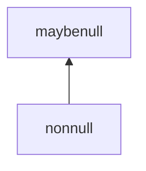

# Design notes: tracking nullness in the type system

Status: implemented through stage 2 (§6); stage 3 declined (§7). The grouping
corrections found after stage 0 shipped are fixed and recorded below, along with
the reading of "grouping column" they settled. The normative rules are spec §5.4
(tracking and refinement), §5.10 (annotations) and §9.3 (boundaries). This note is
the rationale and the alternatives rejected.

[null.md](./null.md) §7 records that nullness stays out of the type system, and
§6 records the one analysis that would have needed it as designed but
deliberately unbuilt. This note is the counter-proposal: carry nullness as a bit
beside the base type, infer it per column, refine it per rule from the body
constraints that imply non-nullness (`X <> null`, but also `X < Y`), and check it
where the existing type annotations are checked. It supersedes null.md §6's
sketch by giving it a surface syntax, a refinement rule, and an answer to the
objection that killed it.

## 1. What this buys, and what it does not

The ledger first, because the motivating analogy does not survive contact with
null.md §1, and a doc that leant on it would be selling a property the language
already has.

**Not what it buys.** Kotlin's `String?`, TypeScript's `strictNullChecks` and
Swift's optionals exist to stop a *dereference* of null from crashing the
program. Datamog has no dereference and cannot crash: every operation is defined
on NULL and returns a value (null.md §2), and there is no reference type, no
unwrap, and no exception. So "modern imperative languages track nullness" is not
by itself an argument for tracking it here. The failure mode those languages
prevent is already impossible.

**What it does buy**, in descending order of what it is worth:

1. **A plan fix with a number attached.** A join between two columns that can
   hold NULL lowers to `IS NOT DISTINCT FROM`, which Postgres cannot hash or
   merge; measured at roughly 5000x on a 50k x 50k join (null.md §6). Knowing a
   column is non-null lets the translator emit a plain `=`. **One non-null side
   suffices**, which is worth more than it sounds: a NULL on the other side is
   false under both operators (`IS NOT DISTINCT FROM` compares it against a
   non-null value; plain `=` yields NULL and the filter drops it), so the two
   agree. Since an EDB column is non-null unless declared `?`, that covers most
   joins against extensional data, not just the ones where both sides are proven.
   This is the one payoff that is worth money rather than tidiness, and it is why
   the analysis was specified in the first place.
2. **Diagnostics for the corner that actually surprises people.** Three of them.
   A filter that evaluates to NULL drops its row silently; `X < 2` together with
   `X >= 2` does not cover a nullable `X`; and negating an ordering keeps the
   NULL row rather than excluding it, so `not (X < 2)` is not `X >= 2`
   (null.md §5, §8). Each is warned about at analysis time, naming the guard
   that fixes it. The third was added after the first two and is provisional:
   the pairing warning deliberately left `!` alone, on the grounds that writing
   it is a deliberate act, and the counter-argument is only that the two
   spellings differing is exactly the trap §8 tells readers to guard against.
   It fires nowhere in the corpus, so its cost if wrong is low.
3. **A contract at module boundaries.** `checkModuleBoundaries` already holds
   `:=` wiring to a predicate's published type
   ([type-lattice.md](./type-lattice.md)). Nullness rides along for free: wiring
   a nullable module output into an input declared non-null becomes an error at
   the boundary rather than a surprise inside the importing module.
4. **A third consumer for refinement annotations.**
   [refinement-annotations.md](./refinement-annotations.md) §4.4 establishes that
   its tier 1 does not *need* this analysis, getting non-nullness from declared
   types, strict comparisons, and explicit guards instead. Those are exactly §4.2
   below. That proposal now queries this analysis rather than rebuilding them.

**What it must never do: change which tuples a program derives.** Nullness is a
diagnostic and lowering fact, never a semantic one. Every rule below either
rejects a program at analysis time or picks between two lowerings that agree on
every input the analysis admits. This is the same invariant type-lattice.md
states for head annotations, and it is what keeps the feature cheap.

## 2. Nullness is a bit beside the type, not an element of the lattice

The obvious design is a `null` type below the primitives. It is already dead, and
the reason is worth restating so this proposal is not read as reopening it:
`p(X), X = null` requires `null` below every primitive, which makes
`string ⊓ integer` inhabited and turns a type conflict into a predicate that
silently carries NULL rows
(null.md §7, [typing-and-safety-constraints.md](./typing-and-safety-constraints.md) §2).
That verdict stands.

Nullness is orthogonal to the base type, so it belongs in a second component:



The type of a column or variable becomes a pair from `T̂ × N`, ordered
componentwise, with meet and join taken componentwise. Write `τ?` for
`(τ, maybenull)` and plain `τ` for `(τ, nonnull)`.

This dodges §7's objection by construction. `string? ⊓ integer?` still meets to
⊥ on the base component, because the base component's lattice is untouched;
nothing was added below the primitives. The nullness bit cannot inhabit a base
conflict, because it is not a member of the base lattice at all.

Two consequences of taking the meet componentwise, both of which are the
behaviour you want:

- A variable in two atoms is **non-null if either column is non-null**
  (`nonnull ⊓ maybenull = nonnull`). Sound because atom matching is null-aware
  (null.md §4): a NULL binding for `X` in `p(X), q(X)` needs a NULL on *both*
  sides, so one non-null column rules it out. This is the same reasoning as the
  base-type meet, where a `value` column merely accepts what the other side
  requires.
- A column across sibling rules is **nullable if any rule can produce a NULL**
  (`nonnull ⊔ maybenull = maybenull`). Also the same direction as the base-type
  join: the column must accommodate every producer.

`value` deserves one clarification, because it is the type where "null" is
ambiguous. Nullness here means SQL NULL only, never the JSON `null` leaf. Those
are not two notions in tension, because spec §2.9 already collapses a JSON
`null` leaf to SQL NULL on read, and null.md §8 makes "there is one NULL, not
two" a design commitment. So a `value` column holding `parse_json("null")` is
maybenull like anything else that can yield SQL NULL.

## 3. Surface syntax

### 3.1 EDB columns: `?` already exists

`ColumnDecl` already carries it (`datamog.langium:46`), and the loader and the
DDL already honour it (`loader.ts:70`, `translator.ts:217`). Stage 0 made the
analyzer read the same bit. An unannotated EDB column remains non-null (`NOT
NULL`, coercion failures raise at load time), while a `?` column enters the
environment as maybenull.

### 3.2 IDB heads: widen the annotation slot

Head type annotations were already per rule and per argument. Stage 1 added the
`?` suffix to the existing grammar slot:

```
Expression ({infer AnnotatedHeadTerm.expr=current}
    ('as' name=Identifier (':' type=PrimitiveType (nullable?='?')?)?
    | ':' type=PrimitiveType (nullable?='?')?))?;
```

```prolog
reachable(X: string, Y: string) :- edge(X, Y).
fee(Id, Total: float?)  :- charge(Id, A, B), Total = A / B.
totals(Dept, sum(Fee): float?) :- fee(Dept, Fee).
```

`liftHeadAnnotations` records `{ type, nullable }` together in
`HeadAtom.argTypes`, rather than using parallel arrays that could drift by
argument position.

### 3.3 Annotations stay optional and stay checked

Everything type-lattice.md says about head annotations applies unchanged, with
nullness as one more component:

- **Guarantee**: the declared nullness must equal or widen the inferred one.
  `?` on a provably non-null column is legal and documents looseness. Omitting
  `?` on a column some rule can fill with NULL is an error.
- **Assume**: `publishedNullness` accompanies `publishedTypes`; consumers and
  module boundaries are checked against it, and a predicate's own body is checked
  against its inferred nullness. The trap type-lattice.md documents has an exact
  nullness analogue: a recursive predicate published as `?` whose own recursive
  step compares itself with `<` would fail to check its own definition if the
  self-reference were held to the published bit.
- **Codegen reads inferred, never published.** So a `?`-annotated but provably
  non-null column still joins with a plain `=`. Sound for the same reason as the
  base-type invariant: checking is stricter than codegen, so a consumer has been
  forced to guard, and a total guard on a value that is never NULL is merely
  redundant. This is the only place nullness reaches codegen at all, which is why
  it is worth stating plainly.

**An unannotated IDB column's nullness is inferred, not required to be
non-null.** The Kotlin reading, where the absence of `?` is a claim that the
analyzer must prove, is declined in §8: it breaks every program that divides,
and the diagnostic it would deliver is the §1 payoff 2 warning, which does not
need to be an error to be useful.

## 4. Inference

Two levels, and keeping them apart is the whole design. Nullness of a *variable*
is a per-rule fact, refinable by the body's constraints. Nullness of a *column*
is a per-predicate fact, a fixed point over the dependency graph. The first reads
the second at body atoms; the second reads the first at the head.

### 4.1 Two bits per operation, not one

An operation needs two independent properties, and conflating them is the easiest
way to get this wrong:

- **Strict**: a NULL argument forces a NULL result. Licenses reasoning
  *backwards*, which is what §4.2 needs: if the result is known non-null then
  every argument was non-null.
- **Total on non-null arguments**: never invents a NULL from non-NULL input.
  Licenses reasoning *forwards*, which is what §4.3 needs: non-null arguments
  give a non-null result.

They are genuinely independent. `/` is strict but partial (`1 / 0`). `=` is total
but not strict (`null = null` is true). `&&` is total but not strict
(`null && false` is false). `as_integer` is strict and partial. `upper` is strict
and total. Integer `+`, `-`, and `*` are strict and partial because a result
outside the safe-integer range becomes NULL.

Both bits belong on `Overload` in `builtins.ts`, not on `Builtin`, because
totality is per signature: `length` on `string` is total while `length` on
`value` is partial for non-collection shapes. The registry is already keyed per
signature, so this fits its existing shape.

### 4.2 Variable nullness within a rule: refinement

Here is where Datamog has it easier than an imperative language, and it is worth
saying because it is what makes the requested feature cheap. There is no control
flow. A rule body is a conjunction, every conjunct holds of every derived tuple,
and there is no program point at which a guard has "not yet" run. So there is no
flow-sensitivity to implement, no dominator tree, and no ordering requirement: a
guard written last in the body refines the atoms written first, and refinement
applies to the head as well, since the head is derived only when the whole body
holds.

Refinement runs over the body in negation normal form. `not` is pushed inward
through `&&` and `||` and onto the comparisons, which is meaning-preserving
because comparison is total (null.md §5) and so `not` over a comparison is exact
complementation.

| body element (asserted true) | refines |
|---|---|
| `X <> null`, `null <> X` | `X` non-null |
| `not (X = null)` | `X` non-null (the same fact, spelled as a SQL programmer would) |
| `e1 < e2`, `e1 > e2` | every variable in a strict position of `e1` and of `e2` |
| `e1 <= e2`, `e1 >= e2` | nothing: both are true when both sides are null |
| `X = e`, `e = X` | `X` non-null if `e` is non-null |
| `X in [lo .. hi]` | `X` non-null |
| positive atom `p(..., X, ...)` | `X` non-null if `p`'s published column is non-null |
| `f1 && f2` | the union of what `f1` and `f2` refine |
| `f1 \|\| f2` | the intersection of what `f1` and `f2` refine |
| negated atom `not p(...)` | nothing: it binds nothing |
| `not (X < 2)` | nothing: this is exactly where the NULL row lives |

The strict-comparison row is the one worth checking against the table in null.md
§5. `5 < null`, `null < 5` and `null < null` are all false, so a true `<` implies
neither side is null; `<=` is true at `null <= null`, so it implies nothing. That
asymmetry is not an accident of the encoding, it is what "null is an isolated
point in the order" means.

A variable occurs in a **strict position** of an expression if the path from the
expression's root to that occurrence passes only through strict operations.
Justification is one step: if the whole operand is non-null and `X` were null,
strictness would have made the operand null. Non-strict operators block the walk,
and must: `X <> null` is non-null whatever `X` is, so nothing under a `<>`
refines. Aggregate arguments block it too.

The disjunction row is worth having rather than returning nothing. Both branches
of `(X <> null) || (X > 5)` imply `X` non-null, so the disjunction does, and set
intersection is the whole implementation.

Worked, with the last one being the case refinement-annotations.md §4.4 needs:

```prolog
q(X) :- p(X), X <> null.                    % X non-null, so q's column is too
q(X) :- p(X), X < 100.                      % same, via the strict comparison
q(X) :- p(Y), Y <> null, X = Y & 1.         % Y non-null, wrapping bitwise op total, so X
q(X) :- p(Y), X = Y / 2.                    % nothing: `/` is partial, X maybenull
q(X) :- p(X), X <= 100.                     % nothing: `<=` admits the NULL row
```

Order independence comes from running it as a fixed point over the conjuncts,
descending from maybenull to nonnull until nothing changes. This is the shape the
codebase already uses twice, in `checkSafety`'s phase 1 and in `translateRule`'s
pass 2, and it terminates for the same reason: finitely many variables over a
two-point lattice, monotone.

### 4.3 Column nullness across rules: the outer fixed point

Per rule, each head argument's nullness is computed from the refined environment
and the forward direction of §4.1: an expression is non-null when every variable
in it is non-null and every operation in it is total on non-null arguments. A
bare `null` head argument is maybenull, and it is the one source that needs no
expression walk.

Aggregates propagate rather than originate, which null.md §6 already got right:
a group exists only because a row exists, so `count(*)` and `count(e)` are always
non-null (an empty count is `0`, not NULL), while `sum`, `avg`, `min`, `max`,
`concat` and `list` are nullable exactly when their argument is, since only an
all-NULL group yields NULL.

Across rules, join. Over the dependency graph, take the least fixed point seeded
with every IDB column at **non-null**, rising to maybenull. Same shape as
`inferTypes`, same termination argument, height two instead of five. Seeding at
non-null is what makes a recursive predicate come out right: `path` is non-null
if its base case is and its recursive step propagates, without the seed having to
guess.

### 4.4 Where it is checked

The checks sit beside the existing base-type checks. `checkHeadAnnotations`
compares the head bit with the rule's own contribution, and
`checkModuleBoundaries` reads `publishedNullness` beside `publishedTypes` across
`:=` wiring. `columnTypesCompatible`, comparison compatibility and atom-argument
compatibility remain base-type-only because a nullable value is admissible
everywhere a non-null one is. That separation keeps existing programs valid.

## 5. The objection from null.md §6, answered

null.md declined this analysis on one ground, and it is a real one: a standing
coupling to the builtin registry, where adding a partial builtin without marking
it as a NULL source would silently under-approximate, leaving the analysis "only
ever as trustworthy as that list".

Two changes retire it.

**Make the declaration required rather than optional.** The two bits in §4.1 are
non-optional fields on `Overload`, so a new builtin that does not declare them
does not compile. The precedent is in `builtins.ts`'s own header: backends
already assert at module load that every registry key has an implementation, "so
a missing implementation fails loud at startup rather than at first invocation".
Nullness behaviour gets the same treatment, one step earlier, in the type
checker.

**Make the unavoidable default the safe one.** Where a default is still needed
(an unresolved overload, a call the checker cannot resolve), it is maybenull.
So the analysis over-approximates by construction: it can only ever fail to
notice that something is non-null, never wrongly claim that it is.

That second point also corrects null.md §6, which calls the failure mode benign
on the grounds that under-approximating means "emitting a plain `=` and getting
SQL's answer". SQL's answer is the wrong answer here: it is precisely the
three-valued join equality that null.md §4 spends a section refusing, so an
under-approximation would silently change which tuples a program derives, not
just which plan it uses. That is the one outcome §1's invariant forbids, which is
why the default has to point the other way.

## 6. Staging, as built

Each stage was useful alone, and the order put the payoff with a number on it
first.

**Stage 0, analysis only.** §4 with no surface syntax and no diagnostics, in
`core/src/nullness.ts`. Its consumer is the translator, which emits a plain `=`
where one side cannot be NULL, at the shared-variable join, the atom-argument
matches and the body-level equality.

Three notes from building it. The body-level equality had to be done at the same
time as the join, not after: a repeated variable and a spelled-out `X = Y` are
the same relation (null.md §4), so lowering one and not the other made the two
spellings emit different operators, which a test caught immediately. And the
`COALESCE` wrappers on `<` and `<=` were left alone. They sit inside `termToSql`,
which has no access to the enclosing body's refinements, and threading it there
would touch thirty call sites to buy nothing measurable: as `translator.ts`
already observed before any of this, an ordering comparison is never a hash or
merge join key. They keep the syntactic literal check.

The third note is the one that got the invariant in §1 wrong for a while, and it is
worth keeping as a warning about how the reasoning fails. `mayBeNull` argued that a
group exists only because a row does, so a non-`count` aggregate merely propagates
its argument's nullness. That holds for a *grouped* aggregate and fails for an
ungrouped one, because SQL emits a single row even over an empty relation, where
`sum` is NULL however non-null the argument column. The column was therefore marked
non-null, a join against it took the plain `=`, and the interpreters and sqlite
disagreed on a four-line program: `tot(sum(V)) :- s(V).` with an empty `s`, joined
against a nullable column holding NULL, kept the row on the interpreters and dropped
it on SQL. An existing test had pinned the wrong answer, which is why it survived
stage 0. The fix is to treat a non-`count` aggregate as nullable exactly when its
rule has no grouping columns, which keeps the optimisation everywhere the original
reasoning does hold.

A follow-up review found the first fix's grouping test did not match the runtime.
It counted every non-aggregate head argument as a grouping column, where both
runtime paths omit a *direct* number, string or boolean literal, so
`tot("all", sum(V)) :- s(V).` over empty `s` was still marked non-null and still
lowered a later nullable join to plain `=`. Fixed by making the grouping decision
one exported definition, `hasGroupingColumns` in `analyzer.ts`, which the
interpreters and this analysis now both call rather than restate. The regression
test uses a literal head argument, which is what the first attempt lacked.

**A second divergence followed from the same root, and it was not a nullness bug.**
A *literal-bound* variable was omitted from `GROUP BY` by the translator, because
its binding emits a bare literal that Postgres would read positionally, while the
interpreters treated it as an ordinary grouping column. The two disagreed on
results, not just on precision:

```prolog
# over empty q: sqlite gave {(5, 0)}, the interpreters gave {}
r(Y, count(*)) :- q(_), Y = 5.
```

Settling it meant choosing a reading, and the spec does not say. Two candidates:

- **A non-aggregate head argument is a grouping column**, making the interpreters
  right and the translator's omission a codegen workaround that leaked into
  semantics. Rejected, because it does not stop at literal-bound variables: a
  *direct* literal is already uniformly not a grouping column on every backend, so
  this reading would have to change that too, and then `q("all", sum(X))` over
  empty input would derive nothing while `q(sum(X))` derives one row. The
  ungrouped-emits-a-row convention is what makes `count(*)` over an empty relation
  `0`, and it should not depend on whether a constant label sits beside it.
- **A constant head argument is not a grouping column**, whether written as a
  literal or bound to one. Chosen. It keeps the two spellings interchangeable,
  which null.md §4 already commits to for exactly this reason, and it leaves the
  direct-literal case alone.

So `isGroupingArg` in `analyzer.ts` is the shared per-argument definition, and
`hasGroupingColumns` is `some` over it. The translator's `GROUP BY` decision, the
interpreters' empty-group emission and this analysis all call it, replacing a
regex over emitted SQL that recognised numbers and strings but not `TRUE`/`FALSE`.
`literalBindings` carries the bound *expression* rather than just the name, because
the interpreters' empty group has no row to read the variable from and has to
evaluate its constant instead.

The regex survives under its other job, deciding that a binding cannot be NULL and
so may take the plain equality. That question is not this one, and conflating them
is what put a grouping rule in a SQL-text matcher to begin with.

Two refinements followed, both from moving the test off the emitted SQL and onto
the AST, and both worth recording because the regex had covered them by accident.

**A literal equality on an already-bound variable is a filter, not a binding.** In
`q(G, count(*)) :- p(G), G = "all".` the atom binds `G` and the equality constrains
it, so `G` is a genuine grouping column ranging over `p`. Reading it as a literal
binding dropped it from `GROUP BY` while leaving it in the `SELECT` list, which is
an error on Postgres and an arbitrary row's value on SQLite: worse than the bug
that prompted the change. `nonLiteralBindings` therefore asks what the body can
ground *without* a literal equality, mirroring the safety analysis over atoms,
ranges and the builtin body atoms, and a literal equality counts as a binding only
for a variable nothing else grounds.

**A chain of literal bindings is constant too.** `A = 1, B = A` makes `B` constant,
and the translator folds it to a bare `1`. Reading only one level left `GROUP BY 1`
in the SQL, which Postgres reads *positionally*: it names whichever select column
that index points at, so a three-column head with `A = 3` grouped by its own
`COUNT(*)` and `A = 9` pointed off the end, both errors. `literalBindings` is
therefore a fixed point, and it records the constant rather than the variable
naming it, so a caller never has to walk the chain and the map does not depend on
its own insertion order. The boundary is unchanged: only bare literals are
dangerous, since `B = A + 1` folds to `(3 + 1)`, which Postgres reads as the
expression it is.

**One wart the decision leaves, deliberately.** "Constant" means a literal, a
negated numeric literal, or a variable bound to one, so `G = 5` makes an argument
constant while `G = 2 + 3` does not: the first derives a row over empty input and
the second derives nothing. Two spellings of the same number behave differently.
This is sound rather than merely tolerable, because `isGroupingArg` is shared, so
both runtimes are imprecise in the same direction and cannot disagree, and the
imprecision is the conservative one: an unrecognised constant is treated as a
grouping column, which suppresses a row rather than inventing one. Folding
constant arithmetic in `isConstantLiteral` would close it, and nothing in the
corpus asks for that, so it stays open with the upgrade path named. Spec §2.7
documents the boundary rather than hiding it.

**Stage 1, annotations.** §3.2 and §3.3. One grammar production, plus
`liftHeadAnnotations`, the `argTypes` shape, `publishedNullness`,
`checkHeadAnnotations` and `checkModuleBoundaries`. The interpreters needed
nothing, as expected: nullness never changes what they evaluate.

**Stage 2, diagnostics.** The two warnings from §1 payoff 2, in
`core/src/nullness-diagnostics.ts`, surfaced by the CLI, the playground worker
and the embed.

The ordering-gap warning has one trap worth recording, because it inverts the
obvious implementation. Its premise is that the operand can be NULL, but a strict
comparison *proves* its operands non-null (§4.2), so reading the refined set
answers "no" for the very comparison being warned about and the warning never
fires. It has to ask what the operand's nullness would be *without* that
conjunct, which is why `refineBody` takes a conjunct to skip.

The sweep this stage was expected to need did not happen: across the 181 `.dl`
files under `examples/`, the walkthrough and the solutions, neither warning
fires. Both require a NULL to actually reach the place in question, and the
corpus does not put one there.

**Stage 3, declined.** Requiring `?` (§7).

## 7. Alternatives rejected

**`null` as a type below the primitives.** Dead already, and not reopened here.
null.md §7, typing-and-safety-constraints.md §2.

**`integer?` and friends as new elements *above* the primitives**, so there is one
lattice of ten elements rather than a product of five and two. This one is not
wrong, and that is worth being precise about: order the new elements the obvious
way (`τ ⊑ τ?`, plus a copy of the base order among the `?` elements) and the
result is *order-isomorphic to the product*. So this is a choice of
representation, not of semantics, and §2's `τ?` notation is exactly this spelling.
Four reasons the pair is the better representation:

1. **A single lattice makes the bit droppable, and the drop is silent.** The
   tempting flattening adds `?` to the four primitives and leaves `value` as the
   top, which is pre-loaded by type-lattice.md's own description of a `value` cell
   as able to hold "a string, a number, an object, `null`", which is true of the
   JSON leaf and not of the bit. Then `integer ⊔ string?` is `value` rather than
   `value?`, and the nullness is laundered at exactly the join that was supposed
   to preserve it. One such column alone changes nothing, since §1's lowering
   needs only one truly non-null side, but two columns widened the same way join
   with a plain `=` and drop the NULL-NULL match that null.md §4 specifies. Two
   sibling rules widening to `value` is what auto-promotion does routinely, so the
   mis-typing arrives in pairs. A separate component cannot lose the bit, because
   the bit has its own `⊔`.
2. **Most relations over types want to ignore nullness, and only the order wants
   to respect it.** Compatibility is deliberately not the order
   (typing-and-safety-constraints.md §2.1); overload resolution matches
   `Overload.params`; `sqlTypeFor` picks storage; `liftToJsonIfNeeded` decides
   lifts; `coerceJsonColumns` and `coerceNumericColumns` key off declared types.
   Every one of those reads the base component and must be blind to the bit. With
   a pair they read one field and are untouched. Flattened, each becomes a place
   that has to strip a suffix, and each is a place to forget to.
3. **The units multiply.** type-lattice.md already documents `undefined` wearing
   two hats, bottom as the join's identity and ⊤ as the meet's, because no element
   can be the unit of both. The product needs `(⊥, nonnull)` to seed the column
   join and `(⊤, maybenull)` as the meet's unit, and each component's unit stays
   separately obvious. Flattened, one representation wears four hats, and `⊥?` and
   `⊤?` are junk: a nullness bit on an uninhabited type denotes nothing.
4. **`PrimitiveType` is relied on far more widely than a lattice diagram shows.**
   It is a five-member string union used throughout the grammar, builtin registry,
   DDL emission, result coercion and loaders. Doubling its members makes every
   exhaustive switch newly wrong,
   and TypeScript reports the switches but not the string comparisons:
   `decl.columns.filter((c) => c.type === "value")` in `loader.ts` would quietly
   stop seeing nullable `value` columns. A second field leaves existing sites
   meaning what they already mean, which is what makes Stage 0 a non-breaking
   change rather than a sweep.

The grammar has in fact already made this choice. `ColumnDecl` spells nullness as
a feature beside the type, not inside it (`(':' type=PrimitiveType)? (nullable?='?')?`),
which is why `a?` is a legal nullable untyped column. §3.2 follows the shape the
parser already has.

**A three-point nullness lattice** with a definitely-null element between the
two, so `X = null` records a positive fact. It buys only emptiness diagnostics,
costs a third element in every meet and join, and nothing in §1 needs it.

**Requiring `?` on every nullable IDB column**, the Kotlin reading. Rejected on
cost: every rule head containing a division, a `to_*`, an `as_*`, or a `value`
accessor would need an annotation, which is most non-trivial programs in
`examples/`, and the walkthrough and case studies would need a sweep. What it
buys over a warning is that the program stops rather than continues, and for a
teaching implementation stopping is the worse trade. Reconsider only if the
Stage 2 warnings turn out to fire mostly on real bugs.

**Nullness of a variable only, skipping the column fixed point.** Cheaper, and
enough for §1 payoffs 2 and 4. But it cannot cross a predicate boundary, so it
cannot answer "is this column non-null" for a join, which is the payoff with the
number attached.

**A separate notion for the JSON `null` leaf.** That is two NULLs, which
null.md §8 refuses and spec §2.9 already collapses.

## 8. Loose ends

- **Proof columns are non-null by construction.** `post-process.ts` fills the
  implicit proof column with an object literal, and the ordinary expression walk
  already classifies object construction as non-null.
- **Parity-stratified predicates need no special case.** The `^` sigil changes
  what an SCC may contain, not how a head expression's nullness is computed, and
  ⊤ is never materialised, so the fixed point in §4.3 is unaffected.
- **`?` on a query or constraint** has nowhere to go and should stay
  unparseable. Both are checked, neither publishes a contract.
- **Integer overflow follows the ordinary partial-operation path.** Arithmetic,
  integer-returning math builtins, and integer `sum` can originate NULL at the
  safe-integer boundary. The fixed-point design needs no special case beyond
  their totality metadata and `mayBeNull` branches.
