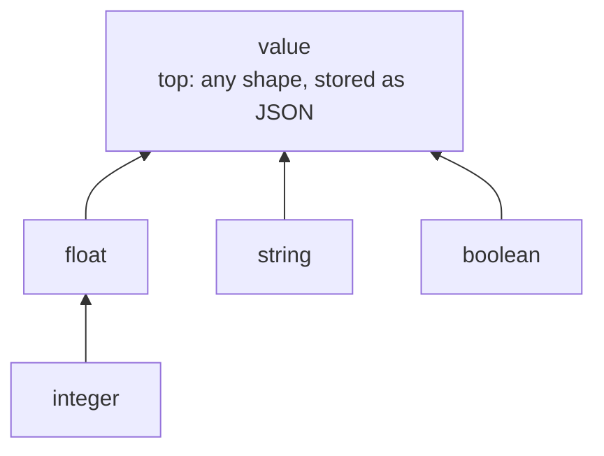

# Design notes: the type lattice and head annotations

Status: implemented. This records *why* the type system is shaped the way it is.
The normative rules live in the spec (§5.2 inference, §5.6 widening, §5.10 head
annotations, §9.3 module boundaries); read those for *what*. This doc only
covers the decisions and the alternatives we rejected, because none of that
survives in a rule list.

## The types form a lattice

There are five column types: `string`, `integer`, `float`, `boolean`, `value`.
They are not a flat set. Ordered by "can stand in for", they form a lattice:



Arrows point from a type to any type it can stand in for.

`value` is the top: every primitive lifts into it (a `value` cell can hold a
string, a number, an object, `null`). `integer < float` (an integer is a
usable float). The bottom is spelled `undefined` in the code: the "no
information yet" seed of the fixed-point, and the identity of the join.

That one `undefined` wears two hats, which is worth knowing before reading
the code. As the join's identity it is the bottom, which is the reading above
and the one this document needs. As `meetTypes`' identity it is the *top*: a
variable nothing constrains meets to whatever its next occurrence says. No
element can be the unit of both operations, so the two readings are genuinely
different elements sharing a representation. See
[typing-and-safety-constraints.md](typing-and-safety-constraints.md) §2 and
§9, which take the meet's view and so place it above `value`.

[typing-and-safety-constraints.md](typing-and-safety-constraints.md)
casts the within-a-rule half of this as a single constraint solve over one
lattice, with safety read off its top element rather than computed by a
separate pass. The behaviour it argued for has since shipped; what is still
only a model there is the *structure*, one solve in place of two passes.

Two operations fall out, and both are used, in opposite directions:

- **join** (least upper bound): the smallest type that accommodates two
  producers. "This column gets an integer from one rule and a float from
  another, so it is a float."
- **meet** (greatest lower bound): the largest type that satisfies two
  requirements at once. "This variable must be a valid argument to both `p` and
  `q`, so it is whatever fits both."

Getting these two the right way round is the whole game.

## Meet within a rule, join across rules

A variable that appears in several body atoms of one rule is a **meet**. In
`r(X) :- p(X), q(X)`, `X` must be a value that is simultaneously in `p`'s column
and `q`'s column. That is an intersection of requirements, so it takes the
greatest lower bound. If `p` is `integer` and `q` is `string`, no value is both,
the meet is bottom, and it is a static error. If `p` is `integer` and `q` is
`value`, the meet is `integer`: the `value` column merely *accepts* integers, so
`X` is still integer-valued, and typing it `value` would be less precise and
would reject a later `X & 1`.

A column combined across several rules of the same predicate is a **join**. Each
rule *produces* rows into the column; the column must accommodate them all, so it
is the least upper bound.

The subtle part is that these two share operand types but disagree on the
answer. `string` and `integer`:

- as a meet (one variable, two atoms) is **bottom** -> error. No single value is
  both a string and an integer.
- as a join (two rules, one column) is **`value`** -> accepted. Different rows
  are strings or integers; `value` holds both as JSON.

An earlier version used one partial "join" for both sites and only got the
within-rule case right by accident (incompatible primitives happened to return
`null`, which happened to be treated as an error). Splitting them into a real
meet and a real join fixed a latent over-widening bug (a variable shared between
an `integer` and a `float` atom used to widen to `float`, which then spuriously
rejected integer-only uses like a subscript) and made "these two rules disagree"
report for the right reason instead of as a side effect.

## Auto-promotion to `value`: widen, do not error

The join is **total**: it never fails. Incompatible primitives across sibling
rules widen to `value` rather than being rejected.

We chose this deliberately over the stricter alternative (reject `string` +
`integer` as a likely mistake). Two reasons:

1. **`value` is a real top, so the lattice is complete.** With a total join the
   least upper bound of any pair exists, which is what makes the fixed-point
   inference clean: every column has a well-defined type, and monotone widening
   up a finite-height lattice always terminates. A partial join is not a lattice
   join; it is an ad-hoc "these must match" check wearing a join's clothes.
2. **`value` is the JSON escape hatch the language already has.** A column whose
   rows are sometimes strings and sometimes integers genuinely *is* a
   heterogeneous JSON column. Widening to `value` describes it accurately, and the
   translator already knows how to lift each primitive branch (`to_jsonb` /
   `json_quote`), so no new machinery is needed.

The cost, which we accepted: a typo that makes one sibling rule return the wrong
primitive no longer errors. It silently produces a `value` column. If that turns
out to bite in practice, the fix is a lint (warn when a *sibling* join lands on
`value` without an explicit `value` annotation), not a return to a partial join.
We did not gate the widening behind an annotation, because that would make an
annotation change what type-checks, which conflicts with the invariant below.

## Recursion: seed at bottom, iterate up

Recursive predicates are typed by the same fixed-point: start every column at
bottom (`undefined`) and join in each rule's contribution until nothing changes.
Termination is guaranteed by the finite lattice height. A useful consequence
falls out for free: a column that never receives a non-recursive contribution
stays at bottom and is reported as "cannot infer type", which is exactly a
recursive predicate missing a base case for that column.

## Head annotations: assume-guarantee, checked not driving

Head annotations (`h(X: integer) :- ...`) are optional, per rule, and per
argument. The design has two halves.

**Guarantee.** Each annotated position is checked against what that rule
actually produces: the declared type must equal or widen the inferred
contribution. You may annotate a column `value` to document that it holds
arbitrary shapes; you may not annotate `integer` a column the rule fills with
strings.

**Assume.** A predicate advertises a *published* type to its consumers: its
inferred type, widened by its annotations. Other predicates and queries that
read it are checked against the published type, not the inferred one. So if `p`
is declared `value` while it currently only produces integers, a consumer that
does arithmetic on `p`'s output is rejected. This is the point of the feature:
you can declare a predicate more general than its current body, and callers are
held to the general contract, so they keep type-checking when the body later
widens.

The split between the two halves is where the care is. A predicate's **own body**
is checked against its **inferred** type (reality); its **consumers** are checked
against its **published** type (the contract). The reason is a trap:

```prolog
p(X: value) :- base(X).       % base: integer, so p really produces integers
p(X) :- p(Y), X = Y + 1.       % recurses and does arithmetic on itself
```

If the recursive self-reference were held to the published type (`value`), then
`Y + 1` would be `value + 1`, which is not defined, and the predicate could not
type-check its own definition. Declaring a recursive predicate more general than
its body would make the body illegal, which defeats the purpose. So the rule is:
a definition is checked against reality, its consumers against its advertised
contract. An external consumer of `p` above still sees `value` and still cannot
do `K + 1`; only `p`'s own recursion sees the integer.

## The invariant: annotations never affect codegen

This is the decision that made the whole feature cheap, so it is worth stating
plainly: **annotations only affect checking. Codegen always uses the inferred
type.** A column declared `value` that a rule fills with integers is still stored
and returned as integers; the annotation is a compile-time contract, never a
storage directive.

Why this matters, concretely: the tempting alternative is to make the *published*
type (the declared, possibly wider one) the column's real type. But then a
`value`-declared recursive predicate would have to store JSON physically, and its
own recursive step would have to **down-cast** JSON back to an integer to do
`Y + 1`, then re-lift the result. That down-cast (`value -> integer`) does not
exist in the translator, which only ever lifts *up* (`liftToJsonIfNeeded`). It
would be new machinery on the hottest path (once per recursive iteration), and it
is exactly what the invariant avoids.

The invariant is sound because the two views never contradict each other.
Checking uses the wider (published) type, so it rejects more; codegen uses the
narrower (inferred) type, which supports every operation the wider one did and
only ever lifts up. A program that type-checks can never fail codegen, and the
contract is honoured observationally: a consumer only ever uses the predicate in
ways the published type allows, and codegen lifts the inferred value up wherever
the published type is expected, so it behaves as the contract everywhere the
contract is relied on, today and after any future widening.

## Module boundaries use the published type too

`:=` module wiring is a boundary between predicates, so it honours the same
contract. `checkModuleBoundaries` compares the **published** type of a wired
predicate (or a module output) against the declared boundary type, not the
inferred type. A predicate declared `value` may not be wired into an `integer`
module input even while it happens to hold integers, and a module output declared
`value` may not be imported under an `integer` declaration. Without this, the
boundary would launder a `value` contract down to `integer` in exactly the cases
where the module does not itself exploit the narrowness, reopening across `:=`
the forward-compatibility hole the within-program contract closes. The check is
unchanged for unannotated predicates, where the published type equals the
inferred one.

## Nullness is not in this lattice

Whether a column can hold NULL is not one of the five types and not a position in
the order. A `?` suffix (`age: integer?`) leaves the inferred base type identical.
[null.md](./null.md) §7 records why a `null` *type* below the primitives does not
work: it would make `string ⊓ integer` inhabited and turn a conflict into a
predicate that silently carries NULL rows.

It is instead a second component beside the base type, which keeps that verdict
intact and reuses this document's machinery wholesale: componentwise meet within
a rule and join across rules, `?` on head annotations under the same
assume-guarantee split, a published bit carrying the contract to consumers and to
`checkModuleBoundaries`, and codegen reading the inferred bit only. The one place
it departs is the invariant above, deliberately: a non-null column is what lets
the translator emit a plain `=` instead of the null-aware form, so unlike a base
type the inferred nullness does reach codegen. Annotations still do not. See
[nullness-tracking.md](./nullness-tracking.md) and spec §5.4.
