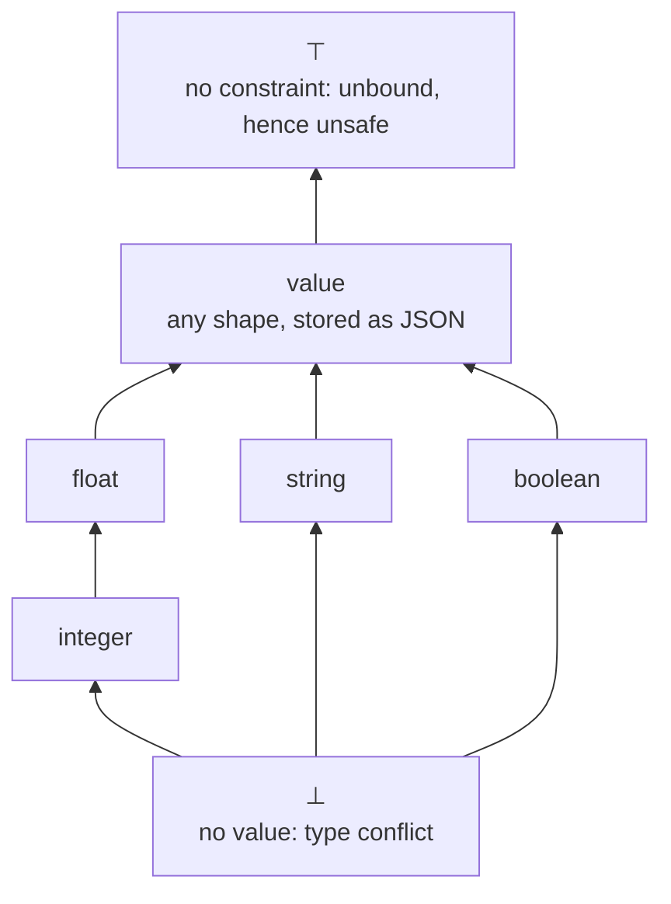

# Design notes: typing and safety as one constraint problem

Status: **model implemented, structure not.** This recasts what `checkSafety`
(`core/src/analyzer.ts`) and `rebuildVarTypes` + `validateTypes`
(`core/src/types.ts`) compute as a single constraint system over a single
lattice, solved once. The *semantics* described here is what the
implementation now does: the one behaviour this document argued for has been
made (§8), and writing it exposed one bug, since fixed. The *structure* is
still two passes rather than one solve, which is why §8 lists what merging
them would buy.

Scope: **one rule body, with Σ given.** Σ assigns a type to every
predicate column. For extensional predicates Σ is declared; for
intensional ones it is itself inferred by a join across sibling rules,
which is a separate fixed point wrapped around everything below. §9 records
what that outer fixed point has to get right without specifying it.

## 1. The idea

A rule body is read as a set of constraints on an environment Γ mapping
each variable of the rule to a type. Every constraint has the shape

```
Γ(x) ⊑ f(Γ)        f monotone
```

so the satisfying environments are closed under joins and include the
least one. There is therefore a unique greatest environment, and that is
the answer: the maximal Γ is the most that can be said about each
variable. Both diagnostics are read off it:

- `Γ(x) = ⊥` (no value can satisfy the constraints) is a **type error**;
- `Γ(x) = ⊤` (no constraint at all) means the variable is **unsafe**.

The second is the load this formulation carries that the implementation
splits across two passes. It works because all type information
originates at binding positions, so "nothing is known about x's type" and
"there is no way to enumerate x" are the same fact. §5 states that
precisely.

Order of quantification explains the two directions that this document
and [type-lattice.md](type-lattice.md) between them describe. Within a
rule a variable is universally quantified over its occurrences, so its
constraints combine by **meet**, and the meet can be empty, which is why a
within-rule conflict is an error. Across rules a column is existentially
quantified, so contributions combine by **join**, and the join is total,
which is why a cross-rule conflict widens instead.

## 2. The lattice



Arrows point from a type to any type that can accommodate it, so `a --> b`
reads `a ⊑ b`.

Call this `T̂`. The five user-visible types are `T = {string, integer,
float, boolean, value}`; `T̂` adds two elements the surface language cannot
name.

**⊥** arises only from a meet of incompatible requirements. Note that it
is genuinely uninhabited, and NULL is not a counterexample: a variable
shared between two atoms is an equijoin, and NULL never joins with NULL.

```prolog
p(1). p(X) :- X = 1 / 0.
q(2). q(X) :- X = 1 / 0.
r(X) :- p(X), q(X).      % empty on native, seminaive and sqlite
```

So there is no type below the primitives inhabited by NULL, and adding a
surface `null` type below them would make `string ⊓ integer` inhabited and
turn a conflict into an always-empty predicate.

**⊤** means "no constraint on the type". It sits *above* `value`, because
`value` is a concrete type (a `value`-typed variable can be compared with
`==`, subscripted, embedded in an array) whereas ⊤ is the absence of
information. It is the identity of the meet, which is what the
implementation's `undefined` is doing at
[types.ts:1152](../../packages/core/src/types.ts#L1152). `value` being the
top of `T` and ⊤ being the top of `T̂` are not in tension: the language
wants a nameable top and the solve wants a unit for the meet, and those
are different things.

`⊓` is the greatest lower bound: `integer ⊓ float = integer`, `τ ⊓ value =
τ`, `τ ⊓ ⊤ = τ`, and two distinct non-numeric primitives meet at ⊥. This
is `meetTypes`, with `null` there standing for ⊥ and `undefined` for ⊤.

**Σ needs no decoration.** An earlier sketch had Σ assign each column a
Skolem below its declared type, to express "some enumerable subset of the
integers" rather than "the integers", and a later one carried a separate
boundedness bit. Neither is needed: a positive atom contributes `Σ(p)ᵢ`
directly, and unboundedness is just ⊤. Σ stays what it is today, a map to
plain types.

### 2.1 Compatibility

Checks (§4) use a compatibility relation `≍` on `T̂`, which is
deliberately *not* the order:

```
τ ≍ σ   iff   τ = ⊤ or σ = ⊤          (unconstrained is vacuously compatible)
           or τ = σ
           or τ, σ both numeric
           or τ = value or σ = value
           and never when either is ⊥
```

This is `joinTypesWithJsonLift ≠ null`
([types.ts:1130](../../packages/core/src/types.ts#L1130)). Two properties
worth naming: it is symmetric, so it is not subtyping, and it accepts
`float` in a position declared `integer`. The directional check does
exist, as `columnTypesCompatible`, but is used only for head annotations
and module boundaries, never for expression positions.

## 3. Expression denotations

`⟦e⟧_Γ ∈ T̂`, total. Where an operator's operand types are inadmissible the
denotation still returns a type (the one the operator would produce, or ⊤
if undetermined); admissibility is reported by the checks, not by the
denotation. Totality is what keeps every `f` in §4 monotone.

Following `inferTermType`
([types.ts:983](../../packages/core/src/types.ts#L983)):

```
⟦x⟧            = Γ(x)
⟦"s"⟧          = string
⟦n⟧            = integer      if written without a fractional part
⟦n⟧            = float        otherwise
⟦true⟧,⟦false⟧ = boolean
⟦null⟧         = ⊤            see below
⟦[e…]⟧, ⟦{…}⟧  = value
```

`⟦null⟧ = ⊤` is the one decision in this document that changed behaviour,
and §8 records what it changed. The reasoning: NULL inhabits every one
of the five types, as in SQL, so a `null` literal genuinely constrains
nothing about the column it flows into. `q(X) :- X = 1 / 0.` yields an
`integer` column holding NULL, and every partial operation in the language
(`/`, `%`, `sqrt`, `ln`, `**`, a reversed slice) can produce one.
Nullability is orthogonal to the lattice (an EDB column declares it with a
`?` suffix, which changes the generated `NOT NULL` and what loaders may
pass but not the base type inference sees), so ⊤ is the right element, and
because ⊤ is the meet's identity no precision is lost where the variable
has another source: `p(X), X = null` keeps `X ↦ Σ(p)₁`, with the equality
acting as an `IS NULL` filter. Where the variable has no other source, the
binding constraint `Γ(x) ⊑ ⊤` is vacuous, so x stays ⊤ and is reported
unsafe. That is Option B, and it is not a special rule: it falls out of
`⟦null⟧` being the meet unit.

There is no single `num` and no single arithmetic operator. Each operator
has its own result type:

```
⟦e₁ + e₂⟧   = string  if either side is string (concatenation), else the
                       strict numeric join of the two
⟦e₁ - e₂⟧, ⟦e₁ * e₂⟧, ⟦e₁ / e₂⟧, ⟦e₁ % e₂⟧  = strict numeric join
⟦e₁ ** e₂⟧  = float                     always, even for integer operands
⟦e₁ & e₂⟧ and the other bitwise/shift ops = integer
⟦e₁ < e₂⟧ and the other comparisons      = boolean
⟦e₁ && e₂⟧, ⟦!e⟧                         = boolean
⟦e[i]⟧, ⟦e[i:j]⟧ = ⊤ if ⟦e⟧ is ⊤, else value if ⟦e⟧ is value, else string
⟦f(e…)⟧     = the result type of f's resolved overload
```

"Strict numeric join" means `integer ⊔ integer = integer`, anything mixing
`integer` and `float` is `float`, and every other pair is inadmissible. It
does not lift to `value`, which is why `5 + V` with `V` a `value` is rejected
rather than silently widened.

Two functions share that description and they are not interchangeable.
`joinTypes` is the strict join, used for range bounds. The *denotation* of an
arithmetic operator is `numericResultType`, which ignores an operand it has no
type for rather than treating the pair as inadmissible, so
`numericResultType(value, integer, "*")` is `integer` where `joinTypes` is ⊥.
Nothing observable differs, because every pair the two disagree on is rejected
by `validateBinaryExprTypes` instead. Inadmissibility is therefore a property
of the check, not of the denotation, which is the same division of labour as
the paragraph below.

**Operators do not propagate ⊤.** An arithmetic operator's result is
determined by whichever operands have types and is ⊤ only if none do, so
`⟦Y + 1⟧ = integer` even when `Γ(Y) = ⊤`
([numericResultType:1088](../../packages/core/src/types.ts#L1088)).
Comparisons, logical and bitwise operators ignore their operands
altogether. §5 shows why this is sound, and it is deliberate: it is what
lets an expression name a type its operands do not, which is how a typed
NULL is written (§8).

## 4. Constraint generation

Each body element contributes a set of **bindings** (constraints on Γ,
entering the solve) and a set of **checks** (predicates on the maximal Γ,
verified afterwards). Write `bare(e)` for "e is a variable". Only bare
positions ever bind; this is the syntactic restriction that makes the
system work, and it is what `equalityBindingCandidates` and the
`arg.$type === "Variable"` tests in the implementation are.

**Positive atom** `p(e₁, …, eₙ)`

```
bind    Γ(x) ⊑ Σ(p)ᵢ                   for each i with eᵢ = x bare
check   ⟦eᵢ⟧ ≍ Σ(p)ᵢ                   for each i with eᵢ not bare
```

A variable repeated across positions gets one binding per position and the
solve meets them. That is `meetTypes` over atom positions, obtained for
free rather than as a rule.

**Negated atom** `not p(e₁, …, eₙ)`

```
check   ⟦eᵢ⟧ ≍ Σ(p)ᵢ                   for every i
```

No bindings, for any position, bare or not. This is the single rule that
makes negation behave: it constrains types but grounds nothing, so a
variable appearing only under `not` keeps ⊤ and is reported unsafe. The
implementation matches:
[types.ts:323](../../packages/core/src/types.ts#L323) type-checks negated
literals without testing `negated`, while
[types.ts:231](../../packages/core/src/types.ts#L231) and
[analyzer.ts:989](../../packages/core/src/analyzer.ts#L989) both skip them
when deriving types and safety.

An anonymous variable under negation is the one apparent exception, and it
is not one. `not p(_)` means `¬∃v. p(v)`, so `_` is quantified *inside* the
negation and bound there. Give each anonymous variable in a negated atom
the binding `Γ(_) ⊑ Σ(p)ᵢ` and it comes out concrete for the right reason.
The implementation reaches the same answer by exempting anonymous
variables from the check
([analyzer.ts:1084](../../packages/core/src/analyzer.ts#L1084)).

**Equality** `e₁ = e₂`

```
bind    Γ(x) ⊑ ⟦e₂⟧                     if e₁ = x bare
bind    Γ(x) ⊑ ⟦e₁⟧                     if e₂ = x bare
check   ⟦e₁⟧ ≍ ⟦e₂⟧
```

Symmetric, and the interesting cases all fall out of the one rule:

- `X = 3` binds X to `integer`.
- `X = Y` gives mutual `⊑`, hence equality, hence ⊤ for both unless
  something else constrains one of them, in which case both descend to it.
- `X = Y + 1` binds X to `⟦Y+1⟧` and generates *nothing* for Y, because
  `Y + 1` is not bare. So arithmetic does not run backwards, and this is
  the case the system has to get right without a special rule.
- `X = null` is vacuous, so X stays ⊤ and is unsafe.
- `X = as_integer(null)` binds X to `integer`: the call's result type is
  `integer` whatever its argument denotes, so it names the type the literal
  does not.

**Range** `e in [lo .. hi]`

```
bind    Γ(x) ⊑ ⟦lo⟧ ⊔ ⟦hi⟧              if e = x bare
check   ⟦lo⟧, ⟦hi⟧, ⟦e⟧ all numeric
check   ⟦lo⟧ = ⟦hi⟧ = integer           if this binding is x's only one
```

An untyped bound makes the whole range vacuous, so `X in [1 .. N]` binds X
only when `N` is bound. The implementation agrees, since the fix described in
§8.

The last check is the one rule here that inspects the constraint *set*
rather than the maximal Γ: a range that is a variable's sole binding must
enumerate integers, since that is all the translator can synthesise,
whereas a range on a variable bound elsewhere is only a filter and may
have float bounds. `isBoundElsewhere`
([types.ts:957](../../packages/core/src/types.ts#L957)) is exactly "does
another binding constraint on x exist", so the condition is syntactic.

**Getting "x's only binding" right is where this went wrong twice.** Read
syntactically, two constructs claim to ground `x` without doing so: a
self-equality, and a second range. Both used to suppress the guard, so a
float-bounded binding range slipped through and the backends diverged, native
returning no rows where sqlite and Postgres threw `Unbound variable 'X'`:

```prolog
q(X) :- X in [1.5 .. 2.5], X = X.          % both now rejected, on every backend
q(X) :- X in [1.5 .. 2.5], X in [1 .. 3].
```

`X = X` cannot ground `X`, because evaluating the other side needs `X` already;
`equalityBindingCandidates` now rejects any candidate whose other side mentions
the variable. Two ranges each deferred to the other, so neither was the binder;
`isBoundElsewhere` now counts only ranges *earlier* in the body, making the
first one the binder, which is the order the translator and planner bind them
in anyway. A later range stays a filter and may keep float bounds, so
`X in [1 .. 3], X in [1.5 .. 2.5]` is still accepted.

The lesson generalises past this rule: "is x bound elsewhere" is a question
about *grounding*, and answering it by pattern-matching on syntax will keep
producing this bug. It is the fifth place body-binding logic was re-derived,
which is the subject of §8.

**Iteration atom** `object_entry(s, k, v)`, `array_element(s, i, v)`

```
bind    Γ(x) ⊑ τⱼ                       for each bound position j with a bare x
check   ⟦s⟧ ≍ value
check   ⟦eⱼ⟧ ≍ τⱼ                       for each non-bare bound position
```

where `τⱼ` is the position's declared type from `BUILTIN_BODY_ATOMS`
(`string`/`value` for `object_entry`, `integer`/`value` for
`array_element`). The bound positions bind unconditionally, even when the
source is ⊤. That looks wrong, since the iteration cannot fire without a
source, and §5 explains why it is nonetheless sound.

**Filter** `e`

```
check   ⟦e⟧ ≍ boolean
```

No bindings. Comparisons reach the body as filters, so `X < 3` grounds
nothing, which is what we want, and needs no rule of its own. The
operator-level admissibility rules (no ordering on booleans, no ordering
on `value`, bitwise on integers only) are checks on subexpressions of `e`.

**Conjunction** `φ₁, φ₂` contributes the union of both sets. Nothing else.
Order-independence is therefore structural rather than something the solve
has to arrange.

**Head** `h(e₁, …, eₙ)`, and a query's projection

```
check   ⟦eᵢ⟧ ⊑ declared type            for each annotated position
```

Safety is not checked here but globally (§6), because a variable must be
bound wherever it occurs, not only where it reaches the head. The head
annotation check is the one place the directional order is used rather
than `≍`: a declared type must equal or widen what the rule produces.

## 5. The solve, and why one lattice suffices

Collect the bindings into, for each variable `x`, the family `{f₁, …, f_k}`
of their right-hand sides, and define

```
F(Γ)(x) = f₁(Γ) ⊓ … ⊓ f_k(Γ)         (empty meet = ⊤)
```

`F : T̂^Vars → T̂^Vars` is monotone, since each `fᵢ` is and `⊓` is. A Γ
satisfies the constraints exactly when `Γ ⊑ F(Γ)`, so the satisfying
environments are the post-fixed points of `F`, whose greatest element is
`gfp F` by Knaster-Tarski. `T̂^Vars` has finite height, so downward
iteration from ⊤ everywhere reaches it in finitely many steps.

That is the whole algorithm: start every variable at ⊤, repeatedly replace
each with the meet of its constraints, stop when nothing changes.

The implementation's two fixed-point loops
([types.ts:261](../../packages/core/src/types.ts#L261) for types,
[analyzer.ts:1035](../../packages/core/src/analyzer.ts#L1035) for safety)
are this one iteration split in two, which is why they have the same shape.
Both descend, matching the greatest fixed point: an absent entry in
`varTypes` is ⊤ and each meet moves down, and absence from `safeVars` is
the unsafe end. What looks like accumulation is descent, because the
informative end of the lattice is the bottom.

### Soundness of the fusion

Reading unsafety off `Γ(x) = ⊤` is only legitimate if a concrete type
implies range restriction. It is not obviously so, because §3 notes that
operators do not propagate ⊤: `⟦Y + 1⟧ = integer` with `Γ(Y) = ⊤`, and an
iteration atom's bound positions have fixed types regardless of the
source. Both would seem to manufacture a concrete type for a variable that
cannot be computed.

> **Proposition.** If `Γ* = gfp F` assigns a concrete type to *every*
> variable of a rule, then every variable is range-restricted.

*Proof sketch.* A variable is concrete only because some binding gave it a
concrete bound. Bindings come from positive atom positions, which are
concrete by Σ and enumerable by scanning the relation; from iteration-atom
bound positions; or from an expression `e`. In the last two cases the value
is computable from the subexpressions, so the only way it can fail to be
enumerable is if some variable occurring in `e` (or in the iteration
source) is itself not enumerable. That variable is a variable of the rule,
so by hypothesis it is concrete, and the argument descends on a strictly
smaller expression. The base cases are literals and Σ-typed positions, both
enumerable. ∎

The hypothesis is over *every* variable of the rule, which is why §6 checks
all of them rather than only those reaching the head. The imprecision is
therefore confined to which variable gets blamed: in `X = Y + 1` with `Y`
unbound, `X` comes out `integer` and only `Y` is reported. That is the
better diagnostic anyway, and it is what the implementation now does, since
`checkSafety` walks the body before the head.

The converse fails in exactly one place, by design: a variable whose only
source is a bare `null` literal is enumerable (its value is NULL) but comes
out ⊤. That is Option B, and §8 records what it costs.

## 6. Reading off diagnostics

At `Γ* = gfp F`:

1. **Unsafety** first: any variable of the rule with `Γ*(x) = ⊤`, except
   anonymous variables occurring only in negated atoms. Where several are ⊤,
   prefer the one whose occurrence is *upstream*: a variable is ⊤ because
   some occurrence failed to constrain it, and the ones downstream of it are
   ⊤ only in consequence. `q(X) :- N = null, X in [1 .. N].` has both `N` and
   `X` at ⊤, and naming `N` points at the fix. The implementation approximates
   this by checking body elements before head arguments, which is enough
   because the head is always downstream of the body.
2. **Uninhabited**: any `x` with `Γ*(x) = ⊥`. See below, because the verdict
   is one thing and the message is another.
3. **Checks**: every check from §4, evaluated at `Γ*`.

The implementation gets this order for free: `analyze` runs `checkSafety`
before `inferTypes` is called at all.

It is worth being precise about how much the order is actually carrying,
because the obvious argument for it is wrong. One might expect a ⊤-typed
variable to trip an admissibility check and turn "Z is unbound" into
"operator `<` requires numeric operands". It does not: every check is written
to tolerate an operand it has no type for, guarding each complaint with
`if (leftType && …)` in `validateBinaryExprTypes` and returning early from
`checkComparableTypes` when either side is undefined, which is the runtime
counterpart of `τ ≍ ⊤` being vacuous in §2.1. So
`s(X) :- s(Y), X = Y + 1, Y < 3.` reports "cannot infer type of column 1",
not an operator error. The order is therefore belt-and-braces rather than
load-carrying: it is the right order because unsafety is the more specific
diagnosis, not because the alternative misreports.

### ⊥ has one verdict and several messages

Collapsing every way of reaching ⊥ into a single verdict is the point: `⊥`
means the variable admits no value, so the rule can never fire, so reject
it. That is deliberate, and it is the same policy that rejects
`p(X) :- X = 1, X = "hello".` even though that rule is perfectly evaluable
and simply yields nothing. A provably empty rule is almost always a mistake.

But ⊥ is reached in at least three ways, and they call for different
messages, because they have different fixes. The implementation already
distinguishes them, by three separate mechanisms that this scheme replaces
with one:

| body | how ⊥ arises | today's message |
| --- | --- | --- |
| `p(X), q(X)`, `p: integer`, `q: string` | meet across atom positions | `Variable 'X' has conflicting types 'integer' and 'string'` |
| `X = 1, X = "hello"` | comparability check at the equality | `Cannot compare 'integer' and 'string' in equality` |
| `s(X) :- s(Y), X = Y + 1.` | `Σ(s)₁` never received a contribution | `Cannot infer type of column 1 of predicate 's'` |

So an implementation should carry the provenance of a ⊥ alongside it, for
diagnostics only and never for the verdict. Reporting "type conflict" for
the third row would misdescribe it: nothing conflicts, the predicate has no
base case, and the fix is to add a rule rather than to change a type.

Note that the third row does **not** mean a recursive-only predicate is
always rejected. Only one whose column type has no non-recursive source is.
Give the column a type from elsewhere and it type-checks, evaluating to the
empty set via the synthesised anchor described in the runtime invariants:

```prolog
b(1).
s(X) :- s(X), b(X).      % accepted; `s` is empty
```

```sql
CREATE RECURSIVE VIEW "s" (col1) AS (
  SELECT CAST(NULL AS INTEGER) AS col1 WHERE 1 = 0
  UNION
SELECT __b0."col1" AS col1 FROM "s" AS __b0, "b" AS __b1 WHERE __b0."col1" = __b1."col1"
);
```

## 7. Worked examples

`Σ(p)₁ = integer`, `Σ(q)₁ = string`, `Σ(r)₁ = value`.

| body | Γ* | verdict |
| --- | --- | --- |
| `p(X)` | `X ↦ integer` | ok |
| `p(X), q(X)` | `X ↦ ⊥` | type conflict |
| `p(X), r(X)` | `X ↦ integer` | ok, and X is integer, not value |
| `p(X), not q(X)` | `X ↦ integer` | check `integer ≍ string` fails |
| `not p(X)` | `X ↦ ⊤` | X unsafe |
| `not p(_)` | `_ ↦ integer` | ok |
| `X = 3` | `X ↦ integer` | ok |
| `X = 1 / 0` | `X ↦ integer` | ok, an integer NULL |
| `X = null` | `X ↦ ⊤` | X unsafe; see §8 |
| `X = as_integer(null)` | `X ↦ integer` | ok, a typed NULL |
| `p(X), X = null` | `X ↦ integer` | ok, the equality is an `IS NULL` filter |
| `X = Y` | `X, Y ↦ ⊤` | both unsafe |
| `p(X), X = Y` | `X, Y ↦ integer` | ok, either written order |
| `X = Y + 1` | `X ↦ integer`, `Y ↦ ⊤` | Y unsafe, X not blamed |
| `p(X), X = Y + 1` | `X ↦ integer`, `Y ↦ ⊤` | Y unsafe |
| `p(X), Y = X + 1` | `X, Y ↦ integer` | ok |
| `X in [1 .. 10]` | `X ↦ integer` | ok |
| `X in [1 .. N]` | `X, N ↦ ⊤` | both unsafe |
| `p(N), X in [1 .. N]` | `N, X ↦ integer` | ok |
| `N = null, X in [1 .. N]` | `N, X ↦ ⊤` | both unsafe; see §8 |
| `p(X), X < Z` | `X ↦ integer`, `Z ↦ ⊤` | Z unsafe, reported before the type check |
| `r(V), array_element(V, I, E)` | `V ↦ value`, `I ↦ integer`, `E ↦ value` | ok |
| `array_element(V, I, E)` | `V ↦ ⊤`, `I ↦ integer`, `E ↦ value` | V unsafe; I and E are concrete but the rule is still rejected (§5) |

The `p(X), X = Y` row against `p(X), Y = X` is the case that distinguishes
this formulation from an asymmetric equality rule: both give the same
answer, as they must.

## 8. Relationship to the implementation

### The behaviour change, since made

`⟦null⟧ = ⊤` as a non-binding denotation makes a bare `null` unable to
ground a variable. One previously legal program is now rejected:

```prolog
q(1).
q(X) :- X = null.       % Unsafe variable 'X' in left-hand side of equality
```

To write a NULL, name its type: `X = as_integer(null)`, and likewise
`as_string`, `as_float`, `as_boolean`, with `parse_json("null")` for a
`value`. Each call's result type is fixed by its signature regardless of what
its argument denotes, so it supplies exactly what the bare literal cannot. No
dedicated ascription syntax is needed. Note that a `null` *head argument* is
unaffected, so `q(1). q(null).` still yields both rows: a head argument
contributes to a column's type rather than grounding a variable, and a
sibling rule can supply the type.

Three messages improved as a side effect. `q(X) :- X = null.`,
`q(X) :- X = null, Y = X + 1, Y = Y.` and
`q(X) :- N = null, Y = N + 1, X = Y.` all reported "Cannot infer type of
column 1 of predicate 'q'", which described a symptom; each now names the
variable that is not grounded.

Spec §2.5 and §5.4 record the rule. §1.5 needed no change: its claim that a
column "acquires a type from another rule that contributes a non-null value"
is about head arguments, which still behave that way.

### The bug this exposed, since fixed

Writing the range rule as `⟦lo⟧ ⊔ ⟦hi⟧` made it clear that an untyped bound
must make the whole range vacuous. The implementation used to type the
variable from whichever bound had a type, which let an untyped bound
through:

```prolog
q(X) :- N = null, X in [1 .. N].
```

`N` is untyped, `X` was typed `integer` from the other bound, the column
inferred, and every static check passed. The native backend then returned no
rows while the sqlite backend threw `Unbound variable 'X'` from the
translator. The binding-equality path never had that hole (`allVarsTyped` at
[types.ts:269](../../packages/core/src/types.ts#L269) declines to type
anything until every variable in the expression is typed), so the same
program written through an equality was already rejected on both backends.

Fixed in `rebuildVarTypes`, which now requires both bounds to be typed, so
the two paths agree. The program is rejected identically on native, sqlite
and Postgres. That change was independent of the `null` rule below, which now
rejects the same program one step earlier, since a bare `null` does not
ground `N`. A literal bound (`X in [1 .. null]`) is what still exercises the
range path, and is what the regression test uses.

### Implementation notes

- **Done, as a syntactic approximation.** `equalityBindingCandidates` in
  `analyzer.ts` no longer offers a candidate whose other side is a bare
  `NullLiteral`. The rule this document states is "the other side denotes ⊤",
  which safety cannot evaluate, since `checkSafety` runs before
  `inferTypes`. The syntactic version grounds strictly more variables than
  the typed one, so it never admits an unsafe program; where they differ the
  program is still rejected, by a cannot-infer-type error instead of an
  unsafety one. When this landed only the safety copy of the helper changed,
  because `types.ts`
  already declines to type a null-bound variable, and the `finiteness.ts` and
  `planner.ts` copies only ever see safety-approved programs.
- The `allVarsTyped` guard on equality bindings must **stay**, despite
  looking redundant once unsafety and untypedness are fused. It is what
  stops a ⊥-seeded self-reference from manufacturing a type during the
  outer Σ fixed point (§9): `s(X) :- s(Y), X = Y + 1.` reports "cannot
  infer type of column 1" today only because the guard declines to type
  `X`. Without it, `numericResultType(undefined, integer)` returns
  `integer` ([types.ts:1137](../../packages/core/src/types.ts#L1088)) and
  the column would silently infer `integer`. Replacing the guard requires
  `⟦·⟧` to be strict in ⊥ while still ignoring ⊤, which is the distinction
  §9 says the single `undefined` cannot make.
- **Merging the two passes is not worth it.** An earlier version of this bullet
  claimed the merge would let safety apply the typed rule instead of the
  syntactic approximation, and treated that as the payoff, having measured the
  gap between the two rules as two programs. That measurement was wrong: it is
  an unbounded family, since a subscript or slice of an untyped object denotes
  ⊤ (`X = null[0]`, `X = null[1:2]`) and so does arithmetic with no typed
  operand at all (`X = -null`, `X = null + null`). Every member is rejected
  either way, so the conclusion survives the correction and the benefit is
  still only a better message on a pathological program. Against that: `analyze()` is today the
  gate that guarantees safety, so moving safety into `inferTypes` changes what
  that function means for the CLI, the editor and `prepareElaborated`; the
  diagnostic ordering in §6 stops being structural and has to be maintained,
  with the failure mode that section warns about; and inference would have to
  tolerate unsafe rules, which it never sees today.

- **What is worth doing is the deduplication underneath.** Body-binding logic
  is re-derived in five places: `checkSafety`, `rebuildVarTypes` (itself called
  four times in `types.ts` and exported to the translator), the translator's
  own Pass 1/2, `planner.ts`'s hand-written mirror, and `finiteness.ts`'s edge
  builder.

  The *helpers* have since been collapsed: `equalityBindingCandidates`,
  `allVarsBound` and `chooseEqualityBinding` each have one definition in
  `analyzer.ts`, parameterised by the caller's notion of "ground", with a thin
  adapter in each consumer. That removed three copies of the first and two
  each of the other two, and with them a live divergence, since neither
  `chooseEqualityBinding` had been built on `equalityBindingCandidates` and so
  neither honoured the `null` rule.

  What remains is the five *loops*: each consumer still drives its own
  fixed point over the body, interleaved with its own emission. Sharing those
  is harder than sharing the helpers, because the iteration order is
  observable in emitted SQL that the translator tests assert, and
  `packages/core/test/diagnostics-snapshot.test.ts` pins verdicts rather than
  SQL text, so it cannot protect that refactor. The prerequisite would be a
  golden file over generated SQL.

### Divergence that remains

`≍` accepts `float` in an `integer` position, so it is laxer than
subtyping. That is the implementation's behaviour, recorded rather than
corrected. It costs a missed diagnostic rather than a wrong answer:
`q(Y) :- Y = 1.5, ints(Y).` with `ints: integer` is accepted and yields
nothing on every backend, where the comparison provably cannot match.

## 9. The outer fixed point over Σ

Σ is given above. For intensional predicates it is not: it is produced by a
join across sibling rules, in an outer fixed point wrapped around the whole
of §5. This section is not a specification of that, but it records what a
specification has to get right, because each of these is a way to get it
wrong.

**Two directions, and they nest.** Σ ascends from ⊥ while Γ descends from ⊤,
so the shape is a greatest fixed point *inside* a least one:

```
Σ₀      = ⊥ everywhere
Γ*(Σ)   = gfp of §5's F, given Σ
Σ'(Γ)   = for each column, ⨆ over the predicate's rules of ⟦head argᵢ⟧
Σ_{k+1} = Σ'(Γ*(Σ_k))
```

This terminates, and it is worth saying why rather than assuming it: raising
a column loosens every constraint of the form `Γ(x) ⊑ Σ(p)ᵢ`, so `Γ*` is
monotone in Σ; reading head contributions out of Γ is monotone in Γ; the
composite is therefore monotone, and `T̂` has finite height. Note the two
seeds are *different elements of the same lattice*, each the identity of the
operation used at its site: ⊤ is the unit of the meet, ⊥ the unit of the
join. There is no second lattice, and no contradiction in "no information"
being spelled ⊤ at one end and ⊥ at the other. Both readings agree that ⊥
is uninhabited: a column no rule contributes to holds no rows, exactly as a
variable with contradictory requirements admits no values.

**Nothing may be reported before the outer fixed point.** At round 0 every
self-reference reads `Σ = ⊥`, so a recursive predicate's own variables come
out ⊥, which §6 would otherwise report as uninhabited. Every diagnostic in
§6 is a statement about the *final* Σ.

**Σ comes in two versions, and one Σ is not enough.** A predicate's own body
is checked against its inferred types; every other reader is checked against
its *published* types, meaning the inferred types widened by head
annotations (`contextForPredicate`). This is not a detail that can be
deferred to a final check, because it changes what local inference *sees*:

```prolog
input predicate base(x: integer).
p(X: value) :- base(X).
p(X) :- p(Y), X = Y + 1, Y < 3.    % own recursion sees integer: fine
k(K) :- p(P), K = P + 1.           % consumer sees value: rejected
```

Today the last rule reports `Operator '+' requires numeric or string
operands; got 'value'`. With a single Σ holding the inferred `integer`, it
would type-check and the annotation would stop being a contract. So checking
annotations at the end covers only the *guarantee* half of
assume-guarantee; the assume half is a substitution that must be in force
while consumers are checked. See [type-lattice.md](type-lattice.md) for why
the split is that way round.

**⊤ and ⊥ need opposite absorbing behaviour from one operator table.** §3
records that operators ignore a ⊤ operand, and §5 proves that sound. The
outer fixed point needs the opposite for ⊥: an operator applied to a
⊥-typed operand must stay ⊥, or "this column received no contribution"
becomes unobservable. `s(X) :- s(Y), X = Y + 1.` reports "cannot infer type
of column 1" only because the equality path declines to type `X` while `Y`
is untyped; treat the untyped operand as ignorable and the column silently
infers `integer`. The implementation cannot express the difference, because
a single `undefined` stands for both, which is why the `allVarsTyped` guard
exists and must stay (§8).

**What a ⊤-typed head argument contributes.** Nothing, today: `q(null).`
reports "cannot infer type of column 1", so a ⊤ contribution is skipped
rather than joined (joining it would give ⊤, since ⊥ ⊔ ⊤ = ⊤, and a
different diagnostic). A cleaner rule is to make a ⊤-denoting head argument
a per-rule error, which names the rule that fails to determine the column
instead of the column that nobody determined.

**A recursive/non-recursive split is an optimisation, not a semantics.** One
global least fixed point from ⊥ handles both, which is what `inferTypesImpl`
does. Special-casing non-recursive predicates to "assume the already-known
argument types" is sound but carries an unstated obligation: those types are
only known if dependencies are processed first, so it requires walking the
SCC condensation in reverse topological order. Tarjan's is already in the
analyzer, so it is available; it buys iteration count and nothing else.

## 10. Out of scope

**Deliberately out of frame.**

- Aggregate calls in heads: grouping, the "all rules agree on aggregate
  positions" rule, and per-aggregate argument admissibility.
- Proof terms and constructor patterns, which `post-process.ts` lowers to
  captures, tag guards and accessors before any of this runs, so they need
  no rules of their own here.
- The `^` sigil and parity stratification, which change what an SCC may
  contain but not how a single body is typed or grounded.
- The finiteness warning (`core/src/finiteness.ts`) is a different
  question. This document is about range restriction within one rule;
  finiteness is about a column growing without bound *across* recursive
  iterations, which every rule in `s(Y) :- s(X), Y = X + 1.` satisfies
  individually.
