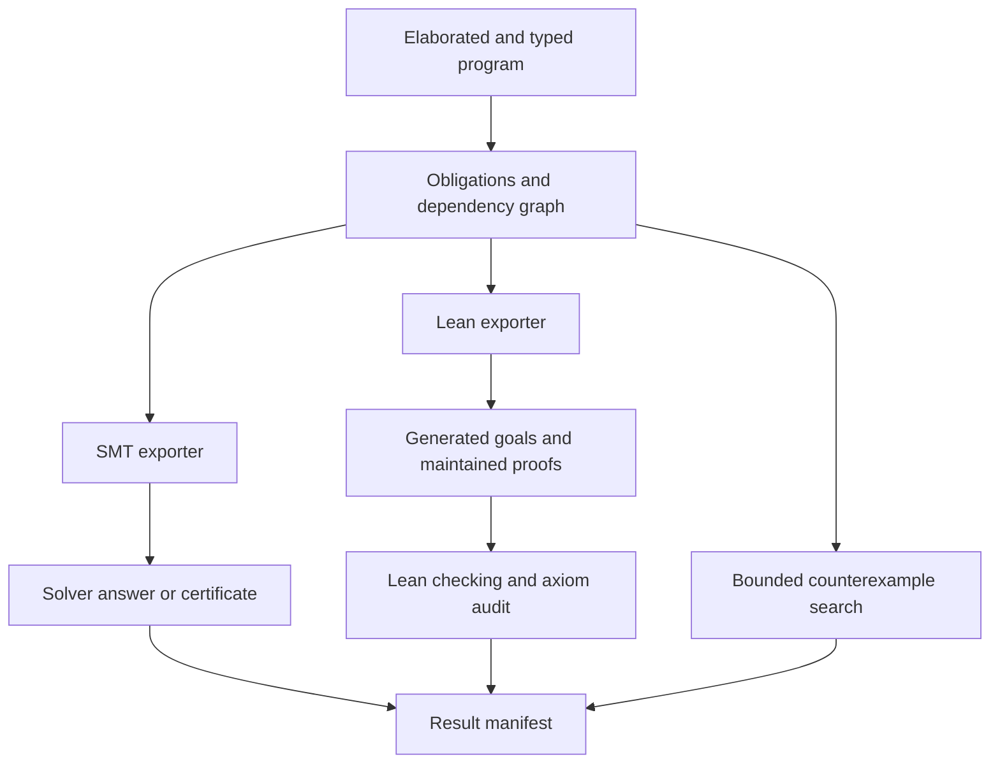

# Richer verification obligations and Lean proofs

Status: **partially implemented; stage 1 typed obligations, provenance, dependencies,
and solver process handling implemented; stage 2 Lean spike implemented; stage 3
manifest identities and fresh result reports started; stage 4 internal uniqueness
and coverage claims plus composable schemas and direct structural projection coverage and soundness (including dynamic indices, multiple outputs, carried integer columns, and integer filters) started**. This extends the future-work discussion in
[refinement annotations](refinement-annotations.md), especially §§7–8. It does
not change current syntax or runtime checks. The integer obligation IR, solver
process hardening, dependency reporting, and optional Lean spike below are
implemented; the broader verification architecture remains proposed.
External-tool references were consulted on 2026-09-24; implementation must pin
and test specific versions rather than rely on the moving documentation links.

## Recommendation

Separate the statement of an obligation from its SMT encoding. Keep automatic
SMT verification as the first option, and add an optional Lean export for claims
that require induction, quantified reasoning, or user-supplied lemmas. Treat
proof search and proof checking as separate operations. Record exactly which
statement, assumptions, semantics version, and verification method a result
covers.

Start with the existing integer fragment and positive recursive relations.
Add relation-level assertions independently of head refinements: properties such
as coverage, uniqueness, and equivalence need their own named goals. Do not
require Lean to run Datamog, and do not remove runtime checks merely because an
external prover succeeded.

The first useful milestone is a small, reproducible Lean project that proves an
existing arithmetic obligation and a recursive relation invariant. It is not a
formal verification of the SQL translator or all Datamog backends.

## What exists today

The current pipeline is visible in:

- [`refinements.ts`](../../packages/parser/src/refinements.ts): retains head
  propositions and synthesizes runtime constraints during post-processing.
- [`obligation-ir.ts`](../../packages/core/src/obligation-ir.ts): typed integer and
  Boolean expression trees and universally quantified local statements.
- [`obligations.ts`](../../packages/core/src/obligations.ts): generates one
  logical obligation per refinement, using type and nullness information.
- [`obligation-smt.ts`](../../packages/core/src/obligation-smt.ts): exports those
  statements to SMT-LIB and selects the required arithmetic logic.
- [`verify.ts`](../../packages/cli/src/verify.ts): invokes an external solver
  separately for each obligation and reports its answer.
- [Specification §5.11](../spec.md#511-head-refinements): the current contract.

The encoder supports integer arithmetic, using `QF_LIA` or `QF_NIA`. It models
safe-integer bounds, truncating division, nullness, and expression definedness.
Unsupported goals, aggregate rules, and parity-recursive components are skipped.
Unsupported body hypotheses are omitted with source text, offsets where available,
and reasons, and range bounds currently contribute no hypotheses. Positive calls
supply their published contracts, rather than their complete relation
definitions; negated relation calls supply no contract hypothesis.

Consequently, a solver model can falsify the abstract obligation without
corresponding to a reachable tuple. Conversely, discharging an obligation does
not prove coverage: an undefined computed head can prevent a tuple from being
produced in the first place. Runtime contracts are disjunctions across sibling
rules, whereas static discharge currently proves each rule's own refinements,
a sufficient but potentially stronger condition. An unrefined sibling makes the
published refinement contract vacuous.

The CLI reports a solver's `unsat` answer, not an independently checked proof
certificate. It does not yet have the dependency manifest, proof cache,
full resource-bounded orchestration, or general Lean integration proposed here.

The first stage now bounds each solver invocation to 30 seconds and 1 MiB of
combined output, retains separate stdout/stderr, and checks the exit status.
Only a single clean stdout verdict is accepted; diagnostics and protocol errors
fail the invocation even if it also prints `unsat`. Countermodels are requested
in a separate invocation only after `sat`; failure to retrieve one does not
erase the original satisfiability result. The internal API accepts structured
arguments, configurable limits, and an abort signal, and kills/reaps the solver
on timeout, cancellation, or output overflow. Process-tree containment, memory
limits and CLI limit configuration remain open.
This is solver-trusted verification, not certificate checking.

Generated obligations now record included and omitted hypothesis provenance and
all defining refinement obligations for successfully assumed contracts. Omission
notes appear in both `--obligations` and `--verify`. Local `unsat` results remain
`conditional` if their dependency closure has a missing or unresolved member.
Complete positive recursive groups discharge jointly by the existing induction
argument; a partial cycle cannot discharge itself. Parity-recursive components
are skipped because they need a different semantic argument. Successful answers
carry separate `solver-trusted` assurance metadata.

These obligation dependency identities are batch-local and preserve elaborated
module predicate identities. The Lean spike now supplements them with the
content identities described below; the batch-local IDs alone are not cache keys.
The minimal logical IR now stores typed integer/Boolean expressions for domain
restrictions, hypotheses, and conclusions; included provenance uses the same
expression trees. Each supported statement explicitly quantifies its variables
and names the `datamog-integer-v1` profile. Unsupported goals have a reason and
no logical statement. Obligation kind and available source spans are retained.

`generateLogicalObligations` builds these statements without generating solver
syntax. `exportSmtObligation` derives declarations, assertions, and the SMT logic
from the IR; `generateObligations` remains the compatibility entry point for the
CLI. Truncating division is an explicit IR operation, lowered only by the SMT
exporter. Its totalized value at zero is zero, while the separate Datamog
definedness condition excludes that case; this does not define division by zero
in Datamog. Safe-integer bounds and nullness likewise remain explicit formulas.

This IR still describes the existing local contract abstraction, not complete
relation definitions. General source/module manifests, proof caching, and general
proof import remain unimplemented; the Lean spike has a scoped content manifest. JSON round trips are tested for
statement preservation, but serialized statements are not proof certificates or
an independently validated import format.

## Implemented Lean spike

The optional [Lean project](../../verification/lean/README.md) pins Lean 4.34.0
without third-party Lean dependencies. `bun run generate:lean` exports the
successor obligation from `08-verify.dl`, a deliberately false local goal, and an
inductive reachability relation generated from a Datamog fixture. Maintained
proofs establish successor safety, reachability preservation under an explicit
edge premise, reachability transitivity, identity uniqueness, and refutations of
the false local goal and universal reachability uniqueness. Generated checker
theorems require the exact expected types and audit their transitive axiom dependencies.

[`obligation-lean.ts`](../../packages/core/src/obligation-lean.ts) exports the
integer/Boolean IR as Lean propositions and a deliberately smaller relational
fragment: one positive, possibly self-recursive relation over non-null integers, with
variable-only body atoms, simple integer comparison guards, and heads containing variables or a variable plus an
integer literal. Computed outputs require a bounded witness equal to the sum.
Other derived calls, mutual recursion, constraints, negation, aggregates, and
other computed terms remain unsupported by relational export.
The semantic library distinguishes null from undefined and defines bounded
integer operations and truth. A separate `Records.lean` library now models
lookup in flat records containing these scalar values. `NestedRecords.lean`
adds a separate recursive record value domain and closed integer-leaf schemas.
`Arrays.lean` models scalar arrays with integer-element schemas and partial indexing.
`NestedArrays.lean` adds recursively nested integer arrays with per-level
nullability and bounded path lookup. Strings as values, floats, and arbitrary
structural refinements remain unsupported.
`Structural.lean` now composes closed records and integer-leaf arrays in a shared
value domain and schema model.

`bun run test:lean` checks reproducibility and rebuilds from project source in a
fresh temporary directory, with the axiom allowlist enforced. Tests reject a
false goal, `sorry`, an extra axiom, a weaker statement, and native computation
axioms. They also compare 164 arithmetic/null cases, 124 flat-record lookup
cases, 32 integer-field acceptance cases, 265 flat-schema acceptance cases,
61 nested-schema cases, 114 integer-array cases, 376 nested-array cases,
137 mixed structural cases, and 766 source-projection cases against native,
SQLite, and configured Postgres execution and check those results by Lean kernel reduction.
Postgres comparisons use a temporary isolated schema, are required in the Lean CI
job and devcontainer, and explicitly report a skip when no test database is
configured elsewhere. Fresh reports record concrete-case coverage separately
from theorem assurance. A separate Lean CI workflow runs this suite; ordinary builds and tests require no Lean installation.
These results concern the exported model, not verified backend implementations.
This spike does not add a Lean mode to `--verify` or certify arbitrary dependency
closures. The registered arithmetic fixture has no contract dependencies.

## Initial statement identities

The Lean generator now emits a [verification plan manifest](../../verification/lean/manifest.json)
with theorem names, exact statements, explicit assumptions, dependency closures,
and SHA-256 content identities. The closure algorithm includes cyclic dependencies
without recursive hashing and rejects missing or duplicate nodes. Digests cover
the semantic profile, checking method, toolchain, lockfile, core/parser source
inventories, exporter/checking scripts, fixtures, and maintained Lean sources,
including the semantics and axiom policy. Context changes conservatively
invalidate all registered entries, even when their local statement is unchanged.

The generated checker records the manifest digest. `generate:lean --check`
recomputes the current plan and generated modules and rejects stale or altered
content before `test:lean` rebuilds proofs from source. A claimed digest is not
accepted in place of comparing the actual manifest. Tests cover goal, assumption,
definition, toolchain, semantics, and policy changes, plus cyclic closures and
forged content carrying an unchanged digest. Maintained proofs remain separate.

This is the start of stage 3 for the fixed Lean project, not a cache or an
external certificate-import protocol. The manifest records intended verification,
not proof success. `test:lean --report` now writes an optional machine-readable fresh-check report
only after the entire suite passes and the manifest is rechecked. Each registered
theorem records its goal digest, axiom dependencies, assurance, and assumptions
from its dependency closure. Goals with remaining input premises are conditional.
An earlier report is removed at the start of a report-producing run, so failure
cannot leave that previous success behind. Reports describe modeled-language
checks; they are not certificates and are never imported to discharge goals.
The fixed-project runner also accepts repeated `--require-goal ID` options.
Every requested ID must be a registered goal with a fresh unconditional result;
unknown IDs, definitions, missing audits, and remaining input premises fail the
run. All registered audits and semantic regressions still run, and reports
record requested IDs. Lean CI requires successor safety, reachability
transitivity, identity uniqueness, and the false claims' refutations. This does not add general dependency discharge or report import.
General module manifests, cached proof reuse, finer invalidation, and arbitrary
Lean/CLI integration remain future work. The selected structural projection workflow
below now provides a scoped standalone-project export and checking path.

## Worked relation laws

The companion project's `reachTransitive` goal states that two composable
reachability derivations imply a derivation between their endpoints, for every
input edge relation over the modeled bounded-integer domain. Its maintained
proof inducts on the second derivation and uses the introduction rules exported
from the Datamog fixture. The exact generated theorem type is audited, registered
with a dependency on `Reach`, and required unconditionally in Lean CI. Its axiom
closure is empty. Unlike `reachPreserves`, it needs no additional input law.

This is a worked relation-level assertion in Lean, not new Datamog syntax or a
general claim exporter. It uses the already supported positive recursive
fragment. A second fixture exports `identity(X, X) :- item(X)` and proves the
two-tuple law `Identity(item, x, y) ∧ Identity(item, x, z) → y = z` by examining
both derivations. The `identityUnique` theorem needs no input assumptions.

The companion `reachUnique_refuted` theorem proves that universal reachability
uniqueness is false: edges from `0` to `1` and `2` yield distinct targets. The
manifest registers the refutation, not the false claim, as a proved goal. Both
new results have exact checker types, axiom audits, and unconditional CI
requirements. Seven concrete relation fixtures replay identity and successor boundary cases
and the branching counterexample on native, SQLite, and configured Postgres; reports
count those separately from expression comparisons.

The `successorCoverage` theorem establishes output existence for every input
integer strictly below `maxSafe`. Its proof constructs the bounded output; head
definedness is not a premise. This upper bound is part of the theorem's stated
input domain, not a claim that arbitrary datasets obey it. The companion
`successorTotal_refuted` theorem shows that removing the bound is false, using
an input containing `maxSafe`. Both are audited and required by Lean CI. The
runtime fixture checks that `maxSafe - 1` produces `maxSafe`, whereas `maxSafe`
produces no successor row, on all configured backends.

An internal `exportLeanUniqueness` API now generalizes the two uniqueness
examples. A named descriptor selects the elaborated predicate, Lean relation
name, and zero-based key/output columns. Two tuples share only the selected key
columns; every non-key column varies independently. Selected output equalities
form the conclusion. Empty keys express global uniqueness; empty outputs,
overlapping or invalid columns, and unsupported relations are rejected.

The API emits the relation, exact claim, checker declaration, and manifest nodes
from one descriptor, with explicit proof/refutation polarity. Both existing
uniqueness examples use it and retain their maintained proofs. Descriptor and
statement changes invalidate content identities. This is internal integer-fragment
support, not Datamog assertion syntax or automatic proof search.

The internal `exportLeanCoverage` API now generates both successor coverage
claims from descriptors. Each descriptor selects an input dependency, maps
output columns to input columns or independent existential witnesses, and lists
explicit integer bounds on input columns. All input columns remain universally
quantified, including those not copied to the output. Bounds restrict the
theorem's domain; the exporter never assumes head definedness or that an entire
dataset satisfies those bounds. Empty bounds express coverage for every admitted
input tuple, and an output with no witnesses expresses direct inclusion.
Invalid mappings, unsafe bounds, and unsupported relations fail before export.
Proof/refutation registration shares the uniqueness API's exact checker and
manifest boundary.

`assembleLeanClaims` now combines these exports without manually dropping
duplicate relation nodes. It shares only matching relation definitions, including
their elaborated predicate identities and input parameter mappings; identical
Lean text alone is insufficient. Duplicate claim/refutation IDs, conflicting
definitions, duplicate checker theorem names, and missing dependencies fail the
batch. The fixed project uses the assembled sources, checkers, and manifest
nodes together. This remains an internal build API, not an external proof-import
validator.

Relational export now accepts positive comparison guards (`<`, `<=`, `>`, `>=`, `=`)
between variables bound by relation atoms and safe integer literals. Guards
become constructor premises, preserving body order, rather than assumptions
added to coverage claims. Equality is supported only when all variables already
occur in positive relation atoms. Nullable operands, arithmetic expressions,
binding equalities, disequality, compound Boolean expressions, and negated filters
remain unsupported.
The guarded successor fixture proves coverage below `maxSafe - 1` and refutes
unrestricted coverage using `maxSafe - 1` itself: its successor would be defined,
but the filter excludes the row. Both results are required in Lean CI, and the
fixture replays the boundary on native, SQLite, and Postgres. Structural values
and the remaining stage 4 families are still open.

The saturating successor fixture uses two sibling rules: increment below
`maxSafe`, otherwise return the input unchanged. `saturatingCoverage` proves
coverage for the entire admitted integer domain with no extra input bounds;
`saturatingUnique` proves that the rules yield only one output per input.
Moving the fallback guard down to `maxSafe - 1` introduces two distinct outputs
at that value. `overlappingUnique_refuted` proves the resulting uniqueness
claim false. All three results have exact generated types, axiom audits, and CI
requirements. The two added runtime fixtures replay the boundary behavior on
native, SQLite, and Postgres. Each fixture replaces its SQL input rows so shared
input predicate names cannot contaminate later comparisons.

The diagonal fixture filters arbitrary integer pairs with `X = Y`.
`diagonalUnique` proves that each retained first column has only one second
column. `diagonalTotal_refuted` exhibits input `(0, 1)`, which has no output
even when the coverage goal allows any second column. Both results are generated
through the claim APIs, audited, and required in Lean CI. The runtime fixture
checks equal pairs at both integer boundaries and unequal pairs in both orders.
This extends only the non-null integer fragment; it does not model null-aware
equality or equality-driven variable binding.

## Initial flat-record lookup laws

The companion project's `Records.lean` models a finite list of string-keyed
entries whose values are null, bounded integers, or Booleans. Lookup returns
`none` for an absent key and `some Value.null` for an explicit null.
Entries retain construction order, with the last duplicate key winning.

Three exact registered goals establish absent-key lookup, last-write lookup,
and the distinction between an absent key and adding a null-valued key.
Their maintained proofs are audited and required by Lean CI. These are generic
library laws, not exported proofs of arbitrary Datamog structural contracts.
The manifest identifies the added `datamog-flat-record-v1` scope alongside
`datamog-integer-v1`; record-law statements carry their own profile.

The integration suite compares 124 cases on native, SQLite, and Postgres and
checks the expected results by Lean kernel reduction. Cases include missing and
null fields, integer boundaries, Booleans, duplicate keys in both orders, dotted
keys, and empty keys. Fresh reports count these separately as `recordCases`.
Nested records, arrays, general structural type membership, and wrong-shape receivers
remain outside this flat model; local and relational exporters still reject
structural claims.

The flat-record library also defines `integerFieldMatches`, which checks one
field with independent optional and nullable flags. Absence is accepted only
when optional; explicit null only when nullable; bounded integers are accepted
and Booleans rejected. This does not enforce closed-record membership.

Three further registered results prove that an accepted required field is
present and an accepted required non-nullable field contains an integer, and
refute total lookup for optional nullable fields using the empty record.
All are audited and required by Lean CI. The 32 concrete cases compare all four
flag combinations against actual structural input loading on native, SQLite,
and Postgres; accepted inputs also have their projected lookup results checked.
Lean reduction checks the same acceptance matrix, and reports record its count
as `fieldCases`. These tests use single-field closed declarations, while the
formal predicate concerns just that field.

The internal `exportLeanRecordSchema` API now translates an elaborated input
column containing a non-null, closed, flat record of integer fields. It preserves
field names and the independent optional/nullable flags, including expanded type
aliases. `integerRecordMatches` checks every declared field and rejects extra
keys. The exporter generates a lookup goal for each required field: presence
for nullable fields, and an integer witness for non-nullable fields. Optional
fields produce no total-lookup goal. Empty schemas accept only empty records in
the modeled domain.

The multi-field fixture has two maintained proofs with exact generated checker
types, axiom audits, and CI requirements. Manifest definitions retain the
elaborated predicate identity, column index, field descriptors, and generated
Lean source. Changed names, flags, fields, or predicate identities invalidate
content identities. String keys are encoded as Unicode scalar data; unpaired
UTF-16 surrogates are rejected.

The runner compares 265 schema cases against structural input loading on native,
SQLite, and Postgres, and checks the exported schema by Lean kernel reduction.
These cover all combinations of missing, null, integer, and Boolean values across
four fields, both integer boundaries, and extra keys. Accepted records also have
their required-field projections checked. Reports count these as `schemaCases`.
This remains a flat integer-field fragment over `FlatRecord`; nullable record
receivers, nested schemas, arrays, other field types, and nominal membership
remain unsupported by this flat exporter. It does not export arbitrary structural refinements or prove
backend correctness.

Three registered generic schema laws now prove field-check preservation,
closedness (every accepted record key is declared), and exact empty-schema
membership. The fixture's required-field proofs reuse the field-check theorem.
All three laws have exact checker types, axiom audits, and unconditional CI
requirements. The schema regression count includes four empty-schema cases:
the empty record is accepted, while an extra integer, Boolean, or null-valued
key is rejected. The empty fixture exports a schema definition without any
required-field goals; it cannot itself satisfy a requested theorem ID.

## Nested integer-record schemas

The internal `exportLeanNestedRecordSchema` API translates non-null input record
columns with recursively nested closed records and integer leaves. Optionality
and nullability are preserved at each field; both records and leaves can carry
those flags. The separate `datamog-nested-record-v1` profile uses recursive record
values containing the existing bounded integers, Booleans, and null. Lookup
returns no value for a missing key or a non-record parent, while a null leaf is
a defined value. Keys remain literal path segments, so a dotted key is not split.

The exporter generates integer-leaf path goals only when every ancestor is
required and non-nullable and the leaf is required. Non-nullable leaves get an
integer witness; nullable leaves get a presence guarantee. Optional or nullable
parents suppress descendant total-lookup goals, but their schemas still constrain
any present non-null record. Membership rejects extra keys at every level.
Empty nested records are supported and generate no leaf guarantees.

A generic theorem proves the required-parent rule by induction on a path through
the schema. The three-level fixture instantiates it for integer and nullable
leaves. Two further theorems refute total child lookup through an optional parent
and a nullable parent, using an accepted record with an absent optional field and
an explicitly null parent. All five results have exact generated checker types,
transitive axiom audits, manifest identities, and unconditional CI requirements.

The runner compares 61 nested cases against input loading and accepted projections
on native, SQLite, and Postgres. Cases cover missing and null parents/leaves,
wrong scalar shapes, extra keys at three depths, and both safe-integer boundaries.
Lean checks membership and five path lookups per case by kernel-checked reduction
and rewriting. Reports count these separately as `nestedSchemaCases`.

This exporter does not support nullable root records, arrays, non-integer leaf
schemas, nominal types, or arbitrary structural refinements. It does not extend
the local SMT or relational exporters, and it does not prove backend correctness.

## Initial integer-array schemas

The internal `exportLeanArraySchema` API translates non-null input columns of
`[integer]` or `[integer?]`. The `datamog-integer-array-v1` profile models lists
of scalar values, validates every element, and preserves explicit null when the
element schema permits it. Empty arrays satisfy both schemas. This first fragment
does not compose arrays with the record exporters or support nullable array roots.

Generated lookup goals quantify over nonnegative indices and explicitly require
an index smaller than the array length. Non-nullable element schemas yield an
integer witness; nullable element schemas yield a present value. Generic laws
prove element membership, absence at negative indices, and absence at or beyond
the length. A refutation using the empty array establishes that schema membership
alone does not imply a value at index zero. All six results are registered with
exact checker types, transitive axiom audits, content identities, and CI requirements.

The runner compares 114 arrays (all lengths zero through two over seven scalar
values, under both element schemas) against native, SQLite, and Postgres loading.
For accepted inputs it checks six dynamic indices, including negative values,
ordinary positions, and both safe-integer extremes. Lean checks acceptance and
all six lookups for every case. Reports count these as `arraySchemaCases`.

These comparisons exposed a Postgres JSONB subscript cast overflow for valid
Datamog indices above the 32-bit range. The dialect now guards the index before
casting, so such indices yield no value. Dedicated regressions cover dynamic
and constant wide indices, including SQL planning. This restores the existing
indexing contract; the Lean theorems still concern the modeled language.

## Nested integer-array schemas

`exportLeanNestedArraySchema` exports non-null input arrays with arbitrary array
nesting and integer leaves, including expanded aliases. The separate
`datamog-nested-array-v1` profile records one element-nullability flag per dimension.
For example, `[[integer?]?]` permits both null inner arrays and null integer leaves.
Ragged and empty arrays are admitted; scalar values at the wrong depth are rejected.

Generated goals quantify over index paths whose length equals the schema depth.
Their `Bounds` premise requires an actual array and an in-range nonnegative index
at every step, using the length of that particular inner array. The generic
`nestedArrayTypedLookup` theorem proves that such paths return an integer, or an
explicit null if the leaf schema permits it. Null intermediate arrays cannot
satisfy the remaining bounds. `nestedArrayTotal_refuted` uses a null inner array
to refute unconditional lookup at `[0, 0]`. The generic theorem, refutation, and
three fixture theorems have exact checker types, axiom audits, manifest identities,
and unconditional CI requirements.

The runner compares 376 cases on native, SQLite, and Postgres, including ragged
arrays, empty and null children, wrong nesting depth, Boolean leaves, and integer
boundaries. Dynamic indices exercise negative, out-of-range, and wide values at
each dimension. Lean checks the same membership and lookup results; fresh reports
record `nestedArraySchemaCases` separately.

These comparisons exposed Postgres treating a JSON scalar as a singleton array
at index zero. Numeric subscripts now require an actual array, preserving the
existing Datamog wrong-shape lookup contract. The SQL guard binds the receiver
once to avoid duplicating nested expressions. A dedicated regression distinguishes
null parents from null array elements.

Nullable root arrays, arrays containing records, arrays inside records, and
non-integer leaf schemas remain unsupported by this exporter. These proofs concern
the modeled language, not backend correctness or general structural refinements.

## Composable record and array schemas

`exportLeanStructuralSchema` adds a shared recursive model for closed records and
arrays with integer leaves, under `datamog-structural-integer-v1`. It accepts
non-null record or array input columns, including expanded aliases, and preserves
optional record fields and nullability at every child position. For example:

```prolog
input predicate people(data: {
  teams: [{members: [{age: integer, score?: integer?}]}]
}).
```

The exporter generates leaf goals with literal field segments and a universally
quantified index for every array step. Required non-nullable containers permit
descendant goals; optional or nullable containers suppress them. Required nullable
integer leaves retain a guarantee of an integer or explicit null. Empty record
schemas and schemas containing only optional paths produce definitions without
inventing total-lookup goals.

`Structural.ArrayBounds` requires each array index to be in range for the actual
array reached at that step. Field steps do not assume presence: they propagate
bounds only if a child exists, leaving schema membership to establish required
fields. The generic `structuralRequiredLookup` proof combines those facts by
induction on a typed mixed path. Thus the bounds do not silently assume the
required-field conclusion or computed-head definedness.

Three generated fixture goals cover records containing arrays of records and an
array root containing records and nested arrays. Three refutations show that
empty arrays, absent optional fields, and null parents prevent unconditional
lookup. These six results and the generic theorem have exact checker types,
transitive axiom audits, manifest identities, and unconditional CI requirements.

The runner compares 137 cases against native, SQLite, and Postgres loading and
mixed-path projection. Cases include missing fields, null at each kind of parent,
nullable array elements, optional nullable leaves, ragged and empty arrays, wrong
shapes, extra keys at multiple depths, and safe-integer boundaries. Lean checks
membership and nonnegative path results; runtime comparisons also exercise
negative and wide dynamic indices independently at every array level. Reports
record `structuralSchemaCases`. Concrete Lean checks run in sequential batches
to limit elaborator memory; all batches must pass before a fresh report is written.
An additional optional-only fixture emits no
lookup theorem and cannot satisfy a requested goal ID by its schema definition.

This remains an internal schema exporter. Nullable roots, non-integer leaf types,
nominal types, and arbitrary refinements remain unsupported. The separate direct-projection exporter below now uses these guarantees for a
small rule fragment. This does not extend the general SMT or integer relational
exporters or prove backend correctness. The earlier scoped
record and array APIs remain available.

## Initial source-derived structural projection obligations

`exportLeanStructuralProjection` now reads a selected elaborated rule and derives
its input schema and lookup path from the AST. The initial fragment is exactly
one rule with one positive unary structural input atom and one unannotated
projected output. Field keys and nonnegative safe-integer indices must be literals.
For example:

```prolog
input predicate items(values: {teams: [{members: [{age: integer, rating: integer?}]}]}).
firstAge(R["teams"][0]["members"][0]["age"]) :- items(R).
```

The exporter generates an inductive output relation whose constructor requires an
input row and a defined lookup result. Its coverage theorem proves existence of
an output from an admitted input row and explicit array bounds. Lookup definedness
is proved in the conclusion's derivation, rather than assumed in the coverage
premises. The result also satisfies the selected integer leaf schema, preserving
null for a nullable leaf. The schema, source predicate/input identities, literal
path, relation definition, and exact goal are registered together in the manifest.

`FirstAge_coverage` and `FirstRating_coverage` instantiate the generic mixed-path
proof for actual Datamog rules. `firstAgeTotal_refuted` shows that dropping the
bounds is false: an input row with an empty `teams` array derives no output.
All three have exact generated checker types, axiom audits, and CI requirements.
The runner replays 766 fixture inputs on native, SQLite, and Postgres and checks
schema membership plus concrete output derivations or non-derivations in Lean.
Reports record `structuralProjectionCases` separately.

Every exported projection now also gets a soundness goal: if every input row
satisfies its declared schema, every derived output satisfies the selected integer
leaf schema. This admission premise covers all input rows, not just one candidate
row. Soundness assumes neither array bounds nor lookup definedness; a derivation
itself supplies the successful lookup. It does not assert output existence.

With `coverage: false`, the internal descriptor requests only soundness and accepts
optional leaves and optional/nullable parent records, arrays, and array elements.
Coverage remains enabled by default; requesting it for such a path throws before
export, rather than silently dropping the requested goal. Missing fields and null
parents yield no output, while a present null leaf is retained only when nullable.
The generic `structuralTypedLookup` theorem proves this property by induction on
a schema-typed path, including paths whose lookup can fail.

The existing two rules and four optional-path rules have exact soundness checkers,
manifest identities, axiom audits, and CI requirements. `ProfileAge_soundness`
proves integer output through an optional nullable `profile`; two refutations use
an absent profile and an explicit null profile to disprove unconditional coverage.
The 51 literal-path replay inputs include 31 optional-path cases with wrong shapes, missing
and null fields, empty arrays, nullable elements, and integer boundaries. These
checks preserve the distinction between no output and an output containing null.

Arithmetic indices, dynamic field keys, general structural lookup filters, joins, sibling rules, derived
dependencies, refinements, constraints, and parity remain unsupported.
Unsupported requests throw before producing an obligation; they do not emit an
empty success. This is an internal API for projection coverage and output typing,
not a general structural `--verify` mode or a proof of translation correctness.

### Dynamic source-projection indices

The projection exporter also accepts a single input atom with one structural
column and additional non-null integer columns, all bound to distinct variables.
The structural column can occur at any position. An array subscript may use an
integer variable from that same row; field keys remain literal strings. For example:

```prolog
input predicate items(values: {rows: [{cells: [{n: integer}]}]}, outer: integer, inner: integer).
picked(R["rows"][I]["cells"][J]["n"]) :- items(R, I, J).
```

The generated input relation preserves column order and quantifies integer columns
as bounded signed `SafeInt` values. Each distinct used index contributes a
nonnegative constructor premise before lookup uses its natural-number value.
This prevents negative indices from becoming zero during Lean conversion.
Unused integer columns remain quantified but do not get sign restrictions;
reusing an index at multiple levels shares its value and sign guard.

Coverage now requires nonnegative used indices plus the existing bounds at each
actual array reached. Soundness still requires only admission and an output
derivation; sign and lookup evidence come from that derivation. Optional paths
remain soundness-only. Computed indices, string index variables, nullable index
columns, and repeated variables in the input atom remain unsupported.

Three fixture rules prove coverage and soundness for independent indices,
nullable leaves, and a reused index. A fourth proves soundness for an optional
nullable leaf. `dynamicTotal_refuted` uses index `-1` on a populated array to
refute unrestricted coverage. All eight results have exact checkers, manifest
identities, axiom audits, and unconditional CI requirements.

The runner adds 104 dynamic-index inputs, bringing source-projection replay to
155 cases on native, SQLite, and Postgres with Lean kernel checks. Cases vary
each index independently through negative values, ordinary positions, values
above the 32-bit range, and both safe-integer extremes. They include ragged and
empty arrays, missing and null leaves, wrong shapes, and a negative unused
column. Reports count the dynamic subset as `dynamicProjectionCases`, within
`structuralProjectionCases`. This extends the modeled projection fragment; it
does not prove backend or translator correctness.

### Multiple projected output columns

A selected rule can now project several integer leaves from the same structural
input column. Each head position retains its own literal/dynamic path and leaf
nullability. For example:

```prolog
input predicate items(values: {left: [{n: integer}], right: [{rating: integer?}]}, outer: integer, inner: integer).
paired(R["left"][I]["n"], R["right"][J]["rating"]) :- items(R, I, J).
```

The generated constructor has one input-row premise and one successful lookup
premise per output, all using that same row. A missing value at any position
withholds the whole tuple; a present null at a nullable leaf remains a value.
Repeated paths remain separate output positions and share lookup semantics.
The internal export result and manifest retain an ordered `projections` list,
so output arity, ordering, paths, and nullability participate in identities.

Coverage takes bounds for every output path and sign conditions for the union
of used indices, then constructs all output witnesses together. It cannot use
outputs from different rows to fill missing positions. Soundness proves the
conjunction of the leaf guarantees for every derived tuple. Any optional path
requires `coverage: false` for the whole claim; unsupported head terms or paths
reject the whole export rather than yielding partial success.

The paired and repeated-output fixtures have coverage and soundness proofs;
an optional second output has a soundness proof. `pairedSameRow` establishes a
shared input witness for both outputs. `pairedFirstBounds_refuted` shows that
bounds on only the first projection are insufficient, and
`optionalPairTotal_refuted` uses an absent optional leaf to refute tuple coverage
with a valid first projection. All eight goals have exact checker types,
manifest identities, axiom audits, and CI requirements.

The runner adds 54 tuple inputs, giving 209 source-projection cases checked on
native, SQLite, and Postgres and by Lean kernel reduction. They cover independent
index bounds, negative and wide indices, repeated output paths, missing leaves,
explicit null, integer boundaries, and rejected shapes. A separate four-row
runtime dataset checks that values from different rows cannot form a tuple and
that partial rows cannot complete one another. Reports record
`tupleProjectionCases` and `tupleProjectionDatasets` separately; the latter is
execution evidence, not an additional universal theorem or Lean reduction case.
The existing `dynamicProjectionCases` count describes the single-output dynamic
fixture. Whole structural values, non-integer carried columns, computed heads, and multiple
structural input columns remain unsupported by this exporter.

### Carried integer input columns

Head positions may now copy non-null integer columns from the same input atom
alongside structural lookups. For example:

```prolog
input predicate items(id: integer, data: {rows: [{n: integer}]}, index: integer).
identified(Id, R["rows"][I]["n"]) :- items(Id, R, I).
```

Each carried position records its input-column identity and contributes a
constructor equality to that bounded integer value. Coverage explicitly includes
those equalities in its conclusion, so it guarantees the requested input's
identifier rather than merely some well-typed identifier. Soundness proves all
output types, and `identifiedSameRow` supplies a shared source-row witness for
the identifier and projected value. Carried indices and repeated carried columns
preserve their head positions and values.

Carrying an integer adds no lookup bounds or sign condition. A negative identifier
is legal; only columns actually used as array indices require nonnegativity.
If any projected value is missing, the entire tuple is withheld, including its
available identifier. Optional lookups remain soundness-only. At least one
structural lookup output is required; whole structural values, nullable or
non-integer carried columns, and computed carried expressions remain unsupported.

Two fixtures prove coverage and soundness with identifiers, nullable projected
leaves, and repeated carried indices. An optional projection has soundness only.
The shared-row theorem and an empty-array coverage refutation bring this addition
to seven audited, registered goals required by CI. Copying a column does not
establish that it is a unique key; that needs a separately stated input law.

The runner adds 89 carried-column cases, bringing kernel-checked source-projection
replay to 298 on native, SQLite, and Postgres. Cases include both integer boundaries,
negative identifiers, repeated columns, missing and null leaves, and failed
negative or wide indices. A separate five-row runtime dataset checks association
with the original identifier, including duplicate identifiers with different
outputs and rows whose projections fail. Reports record `carriedProjectionCases`
and `carriedProjectionDatasets`, keeping execution-only datasets separate from
kernel-reduced cases and universal theorem assurance.

### Integer filters on structural input rows

The projection exporter now accepts positive comparisons (`<`, `<=`, `>`, `>=`,
`=`, `<>`, and its alias `!=`) between non-null integer columns of its input atom and safe integer literals.
Filters may occur before or after that atom; equality requires both operands to
be already bound by the atom. Filter order is retained among the generated
constructor premises. Structural lookup operands, nullable operands, arithmetic,
binding equalities, negation, and compound Boolean filters remain
unsupported.

For example, the new fixture carries a key and projects an array element only
when the key is nonnegative and the index is below a supplied limit:

```prolog
filtered(U, R["rows"][I]["n"]) :- U >= 0, items(R, I, J, U), I < J.
```

Coverage explicitly requires both source filters, index nonnegativity, and actual
array bounds. It proves lookup definedness and output existence within that
stated domain; it does not claim every input row satisfies the filters. Soundness
requires no additional filter assumptions because every derivation already
contains their evidence. The ordered filter formulas are included in relation
manifest identities.

`Filtered_coverage`, `Filtered_soundness`, and `filteredTotal_refuted` have exact
checker types, transitive axiom audits, and unconditional CI requirements. The
refutation uses a populated array with index zero and limit zero: the lookup is
defined and in bounds, but the strict comparison prevents every output.

The runner adds 96 cases across native, SQLite, and Postgres, with matching Lean
kernel checks of concrete derivations or non-derivations. These exercise true and
false filters independently, negative and wide indices, empty arrays, and keys
at both integer boundaries. Reports record `filteredProjectionCases` within the
394 total `structuralProjectionCases`.

### Excluding integer keys

Projection comparisons also support integer disequality, written `<>` or `!=`.
Both spellings generate the same Lean `≠` premise and manifest statement. The
operands remain non-null integer inputs or safe integer literals; this does not
extend the exporter to Datamog's null-aware or structural equality semantics.

The `excluded-projection.dl` fixture uses `U != J` to exclude the input row's
blocked key while carrying `U` alongside an array projection. `Excluded_coverage`
proves output existence when the keys differ and the lookup is in bounds.
`Excluded_soundness` proves output typing for every derivation.
`excludedTotal_refuted` uses equal keys and a populated array to show that array
bounds alone cannot guarantee an output. All three exact goals are audited,
registered in the manifest, and required by Lean CI.

The 144 additional cases compare equal and unequal keys at both safe-integer
boundaries and zero, including both source spellings, negative and wide indices,
and empty arrays. Native, SQLite, and Postgres results are checked against Lean
concrete derivations or non-derivations. Reports record `excludedProjectionCases`
within the 538 total `structuralProjectionCases`.

### Filters on projected integer values

The exporter supports comparisons of `as_integer(path)` with a safe
integer literal, where `path` exactly matches a projected non-null integer leaf.
Comparisons are grouped by selected output, with independent witnesses for
distinct outputs.
All supported scalar comparison operators are available. The path can include
literal keys and literal or input-variable array indices. For example:

```prolog
positive(U, R["rows"][I]["n"]) :-
  items(R, I, J, U), as_integer(R["rows"][I]["n"]) > 0.
```

The explicit `as_integer` is required by existing Datamog typing: structural
lookups have storage type `value`, which has no ordering. The exported schema
ensures the selected leaf contains a bounded integer, so successful lookup also
makes the conversion defined. This extension changes no runtime or type rules.

The constructor requires a lookup result and evidence that its integer value
satisfies the comparison. Both soundness and coverage conclusions retain this
value property alongside output typing. For the fixture, soundness proves that
the projected integer is strictly positive for every produced tuple.

Coverage assumes the comparison universally for any integer returned at the
selected path. That premise is vacuously true when lookup fails; it does not
assert definedness. Schema membership, required-path guarantees, index signs,
and actual array bounds independently establish a lookup witness. The proof
then applies the comparison premise to that witness and constructs the output.

`Positive_coverage`, `Positive_soundness`, and `positiveTotal_refuted` have exact
checker types, manifest identities, axiom audits, and CI requirements. The
refutation uses an in-bounds zero value, whose lookup succeeds but whose
positivity filter rejects the row. The 28 additional cases compare positive,
zero, negative, boundary, and absent values on native, SQLite, and Postgres and
check concrete derivations or non-derivations in Lean. Reports record
`positiveProjectionCases` within 566 total `structuralProjectionCases`.

Nullable leaves, comparisons on unprojected paths, variable comparison limits,
reversed operands, arithmetic, and compound filters
remain unsupported by this fragment. Existing scalar-input filters can coexist
with the lookup comparison. Soundness-only export retains the existing support
for paths through optional or nullable parents; coverage still rejects those paths.

### Conjunctions of lookup comparisons

Comma-separated lookup comparisons can now constrain the same projected integer
with several literals. The exporter retains their order and combines them into
one existential value property with a shared integer witness. It does not drop
duplicate or contradictory comparisons. Each comparison contributes its own
universal coverage premise, while schema membership and bounds continue to
establish definedness separately.

The `ranged-projection.dl` fixture requires
`as_integer(R["rows"][I]["n"]) > 0` and
`as_integer(R["rows"][I]["n"]) <= 10`. `Ranged_soundness` proves both bounds
on every produced projected value; `Ranged_coverage` proves existence within
that domain. `rangedUpper_refuted` retains the lower-bound premise and uses the
value 11 to show that dropping the upper-bound premise makes coverage false.
All three goals have exact checker types, axiom audits, manifest identities, and
CI requirements.

The 56 new cases cover both safe-integer extremes, -1, 0, 1, 10, 11, empty arrays,
and negative, out-of-range, and wide indices. Lean checks the same derivations
or non-derivations as native, SQLite, and Postgres. Reports record
`rangedProjectionCases` within 622 total `structuralProjectionCases`.

The initial extension supported several comparisons on one output path, alongside
scalar-input filters. The next extension below adds distinct output paths. Variable
limits, nullable leaves, and general Boolean expressions remain unsupported.

### Comparisons on distinct projected fields

Lookup comparisons can now select different projected non-null integer leaves
in the same rule. The exporter groups comparisons by selected output in order of
first occurrence, retaining comparison order within each group. Each group has
its own integer witness; conditions on one field cannot constrain another
field's value accidentally. The lookup-comparison coverage premises retain their
source order.

The `both-positive-projection.dl` fixture projects independently indexed `left`
and `right` array fields and requires both selected integers to be positive.
`BothPositive_coverage` constructs both lookup results from the same admitted
input row, its two array bounds, and the two comparison premises.
`BothPositive_soundness` proves positivity and integer typing for both outputs.
`bothPositiveSecond_refuted` retains both array bounds and the first field's
positivity premise, then uses values 1 and 0 to refute coverage without the second
field's condition. All three exact goals have manifest identities, transitive
axiom audits, and CI requirements.

The runner adds 72 cases covering independent successful and failed comparisons,
integer boundaries, empty arrays, malformed records, and independently varied
negative, ordinary, out-of-range, and wide indices. Native, SQLite, and Postgres
results are checked against Lean derivations or non-derivations. Reports record
`bothPositiveProjectionCases` within 694 total `structuralProjectionCases`.
The concrete checker now handles a list of output properties, preserving the
earlier positivity and bounded-range cases through the same checking path.

This initially supported separate comparisons against integer literals on different
fields. The extension below adds direct field-to-field comparisons. Variable
limits, nullable leaves, and general Boolean expressions remain unsupported.

### Direct comparisons between projected fields

The exporter also accepts comparisons between two `as_integer(path)` expressions,
provided both paths select projected non-null integer leaves. The generated
property records each operand's output identity and a bounded integer witness
for each, then relates their values with the source comparison operator. This
supports `<`, `<=`, `>`, `>=`, `=`, `<>`, and `!=`, and can coexist with literal
comparisons and scalar-input filters.

Coverage quantifies over any pair of successful integer lookups and requires the
source comparison for that pair. This premise does not assert either lookup's
existence. Schema membership, sign conditions, and both paths' array bounds
supply the witnesses independently. Lookup-comparison coverage premises retain
source order even when pair and literal comparisons are interleaved. Operand
identities, operators, and premise ordering contribute to manifest identities.

The `ordered-projection.dl` fixture selects one integer from each of two arrays
and requires the left value to be at most the right value. `Ordered_soundness`
proves the ordering and output typing for every tuple; `Ordered_coverage`
constructs the output within the comparison's stated domain.
`orderedTotal_refuted` uses left value 1 and right value 0 to disprove coverage
from array bounds alone. All three have exact checker types, axiom audits,
manifest identities, and CI requirements.

The 72 added cases cover ordered, equal, and reversed values, safe-integer
boundaries, invalid shapes, empty arrays, and independent indices. Lean checks
concrete derivations or non-derivations against native, SQLite, and Postgres.
Reports record `orderedProjectionCases` within 766 total
`structuralProjectionCases`. Comparisons with unprojected paths, nullable leaves,
scalar-variable limits, arithmetic, and general Boolean expressions remain
unsupported.

## Initial user-selected Lean projects

`bun run lean:project export PLAN.json OUTPUT` now exports selected structural
projection coverage/soundness goals from a standalone source file. The JSON plan
contains a relative source path and explicit predicate/Lean-ID descriptors, with
optional soundness-only selection. Unsupported requests and duplicate identities
fail before writing project files. The output must be empty or an owned generated
project. Regeneration preserves the maintained `Datamog/Proofs.lean` file.

`bun run lean:project check PLAN.json OUTPUT` verifies actual project contents
against a freshly recomputed manifest and builds a source-only snapshot in a new
temporary directory. Generated exact checker types and the existing axiom policy
are enforced. A final source/project recheck precedes atomic publication of a
fresh report; old reports are removed at checking start. Repeated `--require-goal`
options gate named goals, while all selected goals still compile and are audited.
By default all selected goals are required. Reports are never imported as proofs.

The manifest identifies source, selection, parser/core inventories, runner,
lockfile, pinned Lean configuration, support semantics, audit policy, and maintained
proof content. Pre-existing `.olean` files, local build caches, alternate build
scripts, and prior reports cannot substitute for the fresh build. The checked-in
worked example has required-field coverage/soundness and optional nullable-field
soundness. Unit tests check reproducibility, proof preservation, stale contents,
invalid selections, and output ownership. The separate optional integration suite
checks fresh success, rejection of `sorry`, weaker statements, and extra axioms,
and source mutation during compilation. Lean CI runs both project workflows.

This is the first user-selected path beyond the fixed fixture project. It initially covered the structural projection fragment; the extension below adds
integer uniqueness and coverage. It requires standalone sources
without module/data bindings, and supports one maintained proof file. It does
not yet expose every internal exporter, perform proof search, cache
proofs, import certificates, or prove runtime backend correctness. It runs no
backend differential cases for arbitrary selected programs. Locally authored Lean
source and repository tooling remain trusted; this is not a sandbox for untrusted
Lean projects. See [the workflow guide](../../verification/lean/PROJECTS.md).

### Selected integer uniqueness and coverage

The standalone project plan now also accepts a `claims` array selecting the
existing integer uniqueness and coverage exporters. It may be combined with
structural `projections`. Each claim has an explicit kind, descriptor, and optional
`prove`/`refute` polarity. Selection validation rejects unknown fields and malformed
bounds or column arrays before export; the existing exporters enforce semantic
fragment and column-range restrictions.

Integer claims use `assembleLeanClaims` to share only identical relation
definitions, including predicate identity and input wiring. Cross-family identity
collisions fail manifest construction. Relation definitions depend explicitly on
the integer semantics node, and mixed plans identify both semantic profiles.
Generated proof-file comments retain exact types, including negation for
refutations. A false claim remains a definition; only its `ID_refuted` theorem
can satisfy a required-goal gate.

The `selected-integer` worked project proves identity uniqueness, successor
coverage below `maxSafe`, and the failure of unrestricted successor coverage.
Both coverage claims share a single exported `Successor` definition. The optional
project integration suite builds these maintained proofs from source and checks
all three exact goals. Ordinary tests cover mixed selections, duplicate identities,
refutation signatures, malformed descriptors, and rejection of a false claim's
statement ID as a required goal.

This exposes the existing integer relation fragment through the selected-project
workflow; it does not expand relation semantics, add Datamog assertion syntax,
automate proof search, or introduce proof import or caching.

## Selected local head-refinement obligations

The standalone project workflow now accepts `kind: "local"` claims selecting a
predicate, one-based rule, and one-based refinement index. It exports the existing
typed integer obligation directly, retaining source and hypothesis provenance in
the content manifest. Missing and unsupported statements fail before writing files.
Contract dependencies now require explicit prove selections for every defining
obligation, including sibling rules and transitive prerequisites. Batch-local IDs
are mapped to the selected names in manifest edges. Missing proofs, refutations
used as prerequisites, duplicate obligation selections, and recursive cycles
fail export. Recursive dependency discharge remains unsupported in this workflow.

The selected-local fixture proves successor safety and refutes a false local
claim, with exact checker types, axiom audits, fresh reports, and optional Lean CI
checks. Refutations register only the negative theorem as a goal. These statements
use the local contract abstraction: head definedness is a premise, omitted body
hypotheses remain documented, and an abstract refutation need not identify a
reachable tuple. This adds neither coverage nor general structural refinement
support. See [the selection guide](../../verification/lean/PROJECTS.md).

The selected-dependencies fixture checks a three-predicate acyclic contract chain.
Even a gate requesting only its final goal freshly builds and audits every
prerequisite. An integration regression replaces the first proof with `sorry`
and confirms the final gate fails and removes the previous report. This certifies
the exported local statements; contract composition and the source translation
remain trusted, with no new induction theorem or backend correctness claim.

## Source-derived recursive contract invariants

Selected projects now accept `kind: "invariant"` with a predicate, relation name,
and goal ID. The generated inductive relation preserves the positive integer
rules, including bounded computed heads. The exact theorem states that every
finite derivation satisfies the published head contract: conjunction within a
rule and disjunction across sibling rules. Refinements are never assumed by
constructors. A maintained derivation-induction proof supplies the acceptance
boundary; local dependency cycles remain rejected.

The selected-recursive fixture proves positivity of guarded seeds and their
recursive successors. Its fresh-check regression removes the seed guard and
requires proof failure with no surviving success report. The fragment supports
self-recursion and simple comparisons on non-null integer head columns. Every
rule must be refined; nullable contracts, arithmetic contracts, other derived
calls, mutual recursion, explicit constraints, negation, aggregates, and parity
are rejected. Synthetic runtime refinement checks are excluded from the relation
model because the theorem concerns tuples before those checks. The relation,
source contract, exporter, and maintained proof are content-bound and audited.
This is an explicit induction boundary for the supported relation fragment, not
arbitrary SCC discharge, termination, or backend verification.

## Initial mutually recursive invariant family

Selected projects now support `kind: "mutual-invariant"` with a joint goal ID
and an ordered list of predicate names. The first fragment is unary non-null
integers, variable atoms, variable or variable-plus-integer-literal heads, and
simple comparison guards and refinements.
The selection must contain one complete strongly connected component; other
derived dependencies are rejected. Each source predicate receives a distinct tag
in a single inductive family, and every defining rule contributes a constructor.
The joint theorem conjoins each member's published contract, preserving sibling
disjunctions and per-rule conjunctions. Contracts are conclusions, never premises
of the family constructors.

The selected-mutual fixture proves a joint positivity invariant by induction on
that family. A negative regression adds an unsafe base rule to its second member
and requires checking to fail with no surviving report. Exact goal checking,
transitive axiom audits, source identities, and fresh builds apply to the entire
family. This begins mutual invariant support without accepting arbitrary local
proof cycles. Other computed heads, nullable values, negation, parity,
and explicit constraints remain unsupported in this fragment. The result concerns
finite derivations, not termination or backend correctness.

The mutual family now supports variable-plus-safe-integer-literal heads using an
explicit bounded witness and equality premise. The selected-mutual-successor
fixture proves distinct lower bounds for the two members by joint induction.
Changing its increment from one to zero fails the maintained proof and leaves no
success report. Auxiliary Lean boundary examples check witness existence at
`maxSafe - 1` and its impossibility at `maxSafe`; these are separate from registered
goal counts and do not claim runtime differential coverage. Other arithmetic,
variable addends, and nested computations remain unsupported.

The mutual family also now supports multiple integer columns when all members
and inputs share one positive arity. Each column is a separate family argument;
each computed head column receives its own bounded witness. The selected-mutual-tuples
fixture proves preservation of `Y > X` while incrementing both columns in a
cross-member step. Swapping the computed output columns fails fresh checking.
The manifest binds tuple order and all defining equations. The mixed-arity
extension below follows this initial same-arity fragment; neither changes local
cycle discharge nor adds backend correctness claims.

Mutual members and input relations now also support differing positive arities.
The tagged family uses the maximum member arity, padding each shorter member with
canonical bounded zero values. Constructor conclusions, recursive premises, and
contract applications use the same padding. Contracts quantify only over real
source columns; input relations keep their own arities without padding. Manifest
metadata includes ordered member arities, family width, padding policy, and input
arities. The selected-mutual-mixed fixture checks joint induction and a separate
canonical-padding lemma, while a changed computed step must fail checking.
Ordinary tests also cover multiple padding slots and inputs wider than the family.
Nullable values remain unsupported; zero-column derived members are covered below.

Zero-column derived members are now accepted as well. Their contract goals have
no phantom output quantifiers; wholly nullary components use a `Nat → Prop`
family, while mixed components use canonical zero for all slots of a nullary
member. The selected-mutual-flags fixture checks a flag/tuple component and proves
emptiness of an all-nullary cycle without base rules by derivation induction.
A negative regression adds a base fact and requires proof failure with no surviving
report. This preserves least-relation semantics rather than accepting circular
contract assumptions. Input declarations still require columns in current syntax.

Mutual computed heads now also support subtraction of a safe integer literal
from a bound variable. Each output still requires a `SafeInt` witness, with the
subtraction recorded exactly in its defining equation. The selected-mutual-descent
fixture proves nonnegativity under a strict positive decrement guard; weakening
that guard to admit zero fails checking and leaves no previous success report.
Auxiliary Lean checks establish predecessor existence just above the minimum safe
integer and impossibility at the minimum. Variable subtrahends, fractional
literals, and nested expressions remain unsupported. No termination or backend
correctness result is added.

Mutual invariant descriptors now accept explicit proof/refutation polarity.
A refutation registers `ID_refuted : ¬ Generated.ID` as the goal and keeps the
original claim as a definition. Its manifest closure includes the exact joint
statement and all generated member rules. The selected-mutual-refutation fixture
constructs a violating recursive derivation; repairing its computed step makes
the counterexample proof fail. Required-goal gates reject the original false
claim ID, and polarity changes invalidate content identities. Refuting the joint
contract needs one failing member and does not assert that every member is unsafe.
These remain modeled-language proofs rather than backend counterexample traces.

Single-relation `invariant` selections now use the same proof/refutation polarity
boundary as mutual invariants. The selected-recursive-refutation fixture builds a
contract-satisfying base tuple followed by a violating recursive step. Only the
negative theorem is registered as a proved goal, and repairing the step rejects
the maintained counterexample. Proof-name collisions, positive-ID goal requests,
and polarity changes are covered by export and freshness regressions. This does
not broaden the single-relation exporter or discharge local contract cycles.

The shared invariant-contract translator now accepts explicit `&&` and `||`
junctions over supported integer comparisons. It preserves the full Boolean tree,
then conjoins multiple refinements per rule and disjoins sibling contracts. All
accepted leaves are total over non-null integers; null/undefined Boolean behavior,
arithmetic comparison operands and compound body filters remain outside
this extension; logical negation is added below. Unsupported leaves reject the entire export.

The selected-boolean-contracts fixture proves a disjunctive bounded-interval
contract for both self-recursive and mutual definitions. Allowing a step past the
upper bound fails the maintained proofs and removes the earlier report. Tests
also cover grouping, changed connective identities, and unsupported leaves.

Invariant contracts now also admit expression-level `!` over the supported total
integer/Boolean fragment. The translator recursively validates the operand before
emitting Lean negation, preserving nested and double negations. Nullable columns,
partial arithmetic leaves, and negated body calls remain unsupported. This does
not conflate logical negation with negation-as-failure.

The selected-negated-contracts fixture proves `!(X < 0 || X > 3)` for self and
mutual recursion. Tightening the contract while retaining a rule that reaches three
fails fresh checking and removes the previous report. Ordinary regressions cover
negation nesting, content invalidation, and rejection of nullable/partial leaves.

## Self-contained selected-project result evidence

Fresh selected-project reports now include the exact source and selection text,
their content digests, and the complete checked verification plan under
`datamog-selected-evidence-v1`. The embedded plan records exact statements,
definitions, assumptions, dependency closures, semantic profile, and artifact
identities. Results retain their goal and manifest digests; refutations retain
the distinction between the original statement definition and its negative goal.
The report returned by the checking API is identical to the atomically written
JSON report.

The existing fresh-build and final content-recheck boundaries still control
publication. Embedded evidence is for inspection, not certificate import or
standalone replay: maintained proof and toolchain files are still required for a
new check. Regressions verify snapshot hashes, complete goal dependencies, saved
report equality, and proof/refutation roles. The fixed-project report format is
unchanged.

## Read-only goal inspection

`lean:project inspect PLAN.json OUTPUT` now emits the current source-derived
verification plan before proof authoring, without invoking Lean or writing files.
The JSON includes exact goal statements and checker declarations, relation
definitions, assumptions, dependencies and closures, and source/selection
snapshots. It is explicitly labeled `inspection-only` and carries no proof-success
statuses. Existing proofs contribute to the planned identity, but stale generated
files and old reports are neither accepted as evidence nor modified.

Tests run the command with an empty PATH to establish that Lean is unnecessary,
verify that a missing output directory stays absent, and ensure existing proof,
manifest, generated, and report files remain unchanged. Refutation previews retain
the exact negative theorem type. Export and fresh checking remain separate steps.

## Selected invariants across positive dependency graphs

The selected-project `program-invariant` claim now follows positive derived calls
from one or more selected predicates. All reachable definitions, including
unrefined helpers and multiple recursive components, become one tagged inductive
family. Selected predicates supply the goal contracts; upstream contracts are
never introduced as assumptions. This reuses the supported non-null integer
mutual fragment and preserves all sibling rules and bounded computed outputs.

Manifest entries record the selected roots, component membership, derived-call
edges, and per-predicate constructor definitions. The complete rule closure is
included in goal identities and fresh reports. The maintained pipeline fixture
proves positivity from a guarded input through two helpers, a mutually recursive
component, and the selected output. Removing the upstream guard or adding an
unsafe sibling invalidates the identity and causes its proof to fail.

This is source-definition composition within one generated project. Separate
proof import, module interfaces, negation, aggregates, structural relation
columns, and general expression translation remain open. Existing single-relation
and single-component selections retain their narrower boundaries.

## Selected uniqueness across positive dependency graphs

`program-uniqueness` reuses the complete source-derived family for a two-tuple
relation law. A descriptor selects a predicate and zero-based key/output columns.
Only key columns are shared; every other tuple column varies independently.
Selected outputs must agree, and empty keys express global uniqueness. Invalid,
duplicate, or overlapping columns and empty outputs are rejected. Mixed-arity
padding remains fixed rather than adding quantified data columns.

Head refinements are unnecessary. The worked fixture propagates identity pairs
through mutually recursive predicates and proves downstream uniqueness by
induction on the generated family. Adding an upstream sibling that produces a
second output makes the maintained proof fail. Statements, complete rule closures,
proof/refutation polarity, and exact checker types use the same fresh-check
boundary as composed invariants. Modular proof import remains future work.

## Selected coverage across positive dependency graphs

`program-coverage` now reuses the complete positive family to prove output
existence from a reachable declared input dependency. Descriptors map output
columns to input columns or independent existential bounded-integer witnesses,
and may restrict input columns with explicit integer bounds. Every input column
remains universally quantified. Empty bounds request all admitted input tuples;
a witness-free mapping expresses direct inclusion, including nullary outputs.

Generated premises contain only the input row and declared bounds. Filters and
computed-head definedness remain constructor premises to establish in the proof,
including those in upstream helpers. Other input relations are quantified without
assuming that any needed matching rows exist. Unsupported descriptors fail before
export, and proof/refutation polarity uses exact checker types and full rule closures.

The worked fixture constructs a bounded successor from nonnegative input through
mutual recursion. Its companion refutation uses a negative input excluded by an
upstream guard. Fresh checks reject the maintained coverage proof when that guard
is strengthened to exclude zero or the domain is widened to admit an overflowing
successor. These are modeled-language results within the existing integer fragment;
module proof import and backend correctness remain outside this workflow.

## Selected equivalence across positive dependency graphs

`program-equivalence` selects two distinct derived predicates of equal arity and
exports the union of their positive dependency graphs in one tagged family.
The theorem quantifies all input relations and the complete output tuple, with
an exact biconditional between membership in the two selected predicates.
Shared inputs have one parameter; distinct inputs remain independent. Nullary
predicates and mixed-arity helpers preserve the existing canonical-padding model.
No head refinements or assumed upstream contracts are required.

The worked fixture proves equivalence of two recursive paths from the same input
and refutes equivalence to a filtered path. Fresh tests separately restrict either
side and reject the maintained proof, testing both inclusion directions. Exact
checker types, proof/refutation registration, and the complete rule manifest use
the existing fresh-check boundary. This establishes equality of modeled relations
within the supported integer fragment, not correctness of backend translations
or general modular equivalence.

## Selected emptiness of named violation relations

`program-emptiness` now quantifies all input relations and selected output columns
and proves that an output derivation implies `False`. It uses the complete
positive dependency family, including all sibling rules, without assuming input
laws or upstream contracts. Nullary predicates have no tuple quantifiers;
refutation polarity registers the negation of universal emptiness.

The worked fixture proves a named violation relation empty using positivity
preserved through recursion, proves a nullary cycle without a base empty, and
refutes emptiness of a reachable positive relation. Fresh regressions weaken an
upstream guard and introduce an unsafe violation sibling; both invalidate the
maintained emptiness proof. Exact checker types, complete rule identities, and
fresh result reports retain the existing trust boundary.

This handles ordinary derived violation predicates in the supported integer
fragment. The separate constraint selection below now handles explicit `!-`
statements; special error declarations remain open. Ordinary emptiness selections
retain their explicit-constraint restriction. Runtime checks are unchanged.

## Selected explicit constraint obligations

The selected-project `constraint` descriptor now identifies an explicit `!-`
statement by one-based source order, excluding ordinary queries and synthesized
refinement checks. Its body becomes a generated nullary violation relation, and
its positive dependency closure is exported through the existing family model.
The exact theorem states that no violation derivation exists for arbitrary typed
input relations. Neither the selected constraint nor other checks are hypotheses.

Manifest provenance includes the selection, exact source text, offsets and
line/column, alongside the complete rule closure and source snapshot identity.
Invalid indices, unsupported bodies, and generated predicate-name collisions
fail before export. Refutation polarity negates the exact constraint theorem.

The fixture proves a constraint over positive values propagated through recursion
and refutes `!- seed(X).` using a nonempty input. Fresh regressions alter the
upstream guard and selected constraint comparison, and reject the unchanged
proof in both cases. This exercises the boundary that constraints are goals,
not premises assumed to hold. Special error declarations and automatic constraint
integration with other claim kinds remain future work. Runtime enforcement is
unchanged; these proofs concern the supported modeled integer fragment.

## Which harder claims should be expressible?

The following formulas are mathematical specifications, **not proposed parser
syntax**. `P`, `Q`, and `Input` denote relations in a specified program model.

| Kind | Example | What is needed beyond today's encoder |
|---|---|---|
| Richer local property | A produced array is sorted; a required JSON field is non-null | Structural values, lookup/absence, length and element semantics, quantifiers |
| Recursive invariant | Every derived path preserves an input relation's ordering | Definitions of recursive predicates and induction, possibly auxiliary invariants |
| Relation law | `P(x,y) ∧ P(x,z) → y = z` | Multiple tuples in one goal; a named relation-level assertion |
| Coverage | `Input(x) → ∃ y, Output(x,y)` | Existence, head definedness, and an explicitly identified input domain |
| Equivalence | `P(x) ↔ Spec(x)` | Separate soundness and completeness arguments |
| Aggregate property | Every group's count is bounded by its source population | Finite grouping, duplicate semantics, empty groups, and arithmetic bounds |
| Module law | Every implementation satisfying input laws preserves an output law | Explicit assumptions, instantiation obligations, and module identities |
| Termination | Evaluation reaches a fixed point for all admitted inputs | A separate finiteness or well-foundedness argument |

Existing `!-` constraints and `error predicate` definitions are useful first
sources of named goals: prove that their violation relation is empty for every
admitted input. This extends verification coverage without first inventing a
quantifier syntax. A constraint about arbitrary input rows may still need an
explicit input law; it must not simultaneously be assumed and reported proved.

A typical exported theorem has the following mathematical shape:

```text
∀ input, Admitted(input) → InputLaws(input) →
  ∀ tuple, Derives(program, input, predicate, tuple) → Contract(tuple)
```

`Admitted` records the declared input types and supported semantic profile;
`InputLaws` lists additional premises. Relation laws replace the final implication
with the requested formula over the generated relations. Coverage reverses the
direction of the requirement: an input tuple must imply an output derivation.

Universal verification quantifies over all legal input relations satisfying the
stated assumptions. Checking one loaded dataset is a different result. A finite
search over small datasets or a bounded number of recursive rounds is useful
for finding bugs, but cannot silently become an unbounded theorem.

A coverage theorem may be possible even when the domain is an input relation:
`output(X) :- input(X)` preserves every admitted input tuple. Being about input
data does not inherently make a property unprovable. What remains conditional
is any unstated property of that data. For example, successor coverage needs an
upper bound that prevents `X + 1` from overflowing.

## Preserve Datamog's meaning before extending the solver

### Truth, null, and undefinedness

Use a semantic value domain with a distinguished null value, and a separate
partial-expression result. In Lean a possible representation is `Option Value`:
`none` means undefined and `some Value.null` means a defined null. Define
`Holds(e, env)` to mean evaluation yields the Boolean value true. False, null,
and undefined all fail this test.

A positive Boolean body condition requires `Holds`. Negation-as-failure over a
condition means `¬ Holds`; logical `!` is an expression operation with its own
partiality rules. Do not encode both as the same Boolean negation. Likewise,
null-aware equality and partial orderings need separate semantic definitions.

For a local contract, definedness of computed head expressions is a premise:
the rule must actually produce a tuple. Definedness of the claimed proposition
is part of the conclusion. A coverage goal must prove the existence of the
output and therefore cannot assume away failing head evaluation.

Represent integers as mathematical integers with the safe-integer bound, and
model each partial operation explicitly. Lean's unbounded `Int`, its division
conventions, or arbitrary-precision arithmetic cannot replace those operations
without a correspondence lemma. Defer floats until rounding, overflow, and the
backend-specific behavior documented in [Postgres alignment](postgres-alignment.md)
have a precise supported profile. Replacing floats with mathematical reals would
prove a different program.

### Structural and nominal types

Give structural contracts a membership interpretation. `value` excludes null
at its declared position; `value?` includes it. An opaque value may contain null
children. Field absence, explicit null, closed records, and optional fields must
remain distinct. Unsupported shapes must remain unsupported rather than be
translated to unconstrained assumptions that strengthen a goal.

Datamog's constructor evidence is observable data. Preserve predicate-qualified
constructor identities and payloads. A JSON object resembling a proof term is
not evidence of nominal membership. An erased Lean proof that a tuple belongs
to a relation is distinct from Datamog's stored derivation evidence: the latter
needs a data representation if a goal observes or compares it.

### Recursion, negation, and aggregates

For positive recursion, translate each predicate into an inductive relation;
mutually recursive predicates form one inductive family. Each rule contributes
an introduction rule. This models finite derivations and supports induction
without assuming that evaluation terminates. Proving all derivable tuples safe
does not prove there are finitely many of them.

For ordinary stratified negation, define lower strata first. A negative call is
nonmembership in the **complete** lower-stratum relation, not merely absence
from a set of observed derivations. Soundness of a partial evaluator alone is
insufficient for that use; an execution-level result needs completeness too.

Parity-stratified recursion does not fit this direct inductive translation.
Its alternating fixed-point semantics needs a separate formal model and
correctness argument. Initially report such goals as unsupported. Do not repair
the translation by assuming the completeness of an opposing relation.

Aggregates need a finite model of the tuples that participate in each group,
including projection/deduplication, empty-group behavior, null/undefined
handling, ordering where observable, and overflow. They are not ordinary
Horn-rule constructors. Begin with a library theorem for one supported aggregate
(e.g. `count`) and prove its translation correct before expanding coverage.

## A shared obligation representation

Introduce a typed logical intermediate representation between the elaborated
program and the individual prover exporters. Keep frontend source locations and
module identities attached. Initially this is an internal API, not a new public
language or a wholesale rewrite of runtime evaluation.

Each obligation should carry:

- A stable identifier, source span, kind, and human-readable statement.
- Quantified variables, domain restrictions, hypotheses, and conclusion.
- Referenced relation definitions or explicitly abstracted contracts.
- Required semantic features and the supported backend/profile scope.
- Dependencies on other obligations and explicit assumptions about input data.
- A distinction between an exact statement and a sound approximation, including
  every dropped hypothesis and why dropping it is valid in that position.
- A content digest covering the canonical statement, definitions, assumptions,
  translation version, and semantics library version.

Do not use rule numbers alone as proof identities. Source-level names help users
find a proof, while content digests determine whether the proof is still valid.
Changing an imported definition, numeric semantics, or a published contract must
invalidate dependent results even if the local text is unchanged.



Retain the current fast contract abstraction for SMT. Add full relation
translation only when the goal needs it. Quantifying over arbitrary relations
with sufficient interface laws can preserve modularity; a predicate mention
does not automatically require inlining its entire implementation.

For cyclic contract dependencies, verify every defining rule in the recursive
component and assemble an induction theorem. Individual successful goals remain
conditional until the whole dependency closure is discharged. A mutual cycle of
asserted contracts is not, by itself, a proof. Cross-module assumptions become
obligations at the importing boundary; external data assumptions remain explicit
premises until validated for that dataset.

## What Lean export would look like

There are two useful exports. A local obligation becomes a theorem about the
semantic expression model, suitable for rewriting and arithmetic tactics. A
relational obligation uses the generated inductive definitions and can be proved
by induction and reusable lemmas. Lean's kernel checks the elaborator's proof
terms; tactic execution alone is not the acceptance criterion.
[Lean elaboration reference](https://lean-lang.org/doc/reference/latest/Elaboration-and-Compilation/)

For example, these are ordinary Datamog rules:

```prolog
input predicate edge(source: integer, target: integer).
reach(X, Y) :- edge(X, Y).
reach(X, Z) :- reach(X, Y), edge(Y, Z).
```

The following illustrative Lean sketch abstracts vertices into a type `α`.
An actual export would instantiate it with the modeled Datamog column domain.
This sketch was checked with Lean 4.34.0 when adding Lean to the devcontainer;
`#print axioms reach_preserves` reports no axiom dependencies.

```lean
inductive Reach {α : Type} (edge : α → α → Prop) : α → α → Prop where
  | direct {a b} : edge a b → Reach edge a b
  | step {a b c} : Reach edge a b → edge b c → Reach edge a c

theorem reach_preserves {α : Type} (edge : α → α → Prop) (P : α → Prop)
    (preserves : ∀ a b, edge a b → P a → P b)
    {a b : α} (h : Reach edge a b) : P a → P b := by
  induction h with
  | direct hab => exact preserves _ _ hab
  | step _ hbc ih => exact fun ha => preserves _ _ hbc (ih ha)
```

`preserves` is a visible premise about the input edges. This proves a reusable
conditional theorem, not that an arbitrary loaded graph satisfies that premise.
To claim it for a concrete graph, check the premise or provide a separate proof.
The inductive constructors describe exactly how reachable pairs are derived;
merely postulating that `Reach` satisfies its rules would not give the same
least-relation semantics or its induction principle.

Keep generated definitions and expected theorem types in a generated module;
keep user proofs in separate maintained files. Regeneration must not overwrite
proof scripts. A final generated checker module must apply the submitted proof
to the exact expected type and record its dependencies. A user can freely prove
other lemmas, but a same-named theorem about a weaker statement cannot discharge
the registered obligation.

Use `Prop` for logical claims, including `∀` and `∃`. Existential propositions
are proof-irrelevant in Lean; they do not require storing the witness in Datamog.
If the program needs to return the witness, it must be represented as ordinary
data or constructor evidence instead. This revises the existential-erasure
argument in the earlier tier-two discussion.
[Lean propositions reference](https://lean-lang.org/doc/reference/latest/The-Type-System/Propositions/)

Initially allow richer claims in the external Lean project over generated
relations. Later add named Datamog assertions for common forms, with finite,
range-restricted quantifiers where runtime checking is desired. Arbitrary Lean
`Prop` need not be decidable: a proof-only claim must be labeled as such, and
must not be advertised as a runtime contract when no executable checker exists.
Choosing the Datamog syntax is a separate milestone, informed by worked proofs.

## Alternatives and where they fit

| Approach | Strength | Limitation / cost | Proposed role |
|---|---|---|---|
| Extend direct SMT translation | Smallest change; arithmetic, datatypes and selected array/string theories | Quantifiers and nonlinear reasoning can return unknown; theory semantics must match Datamog | Default automatic route, feature by feature |
| Constrained Horn clauses (CHCs) | Can discover invariants for recursive relations | Does not automatically cover negation, aggregates, arbitrary completeness claims, or parity semantics | Experiment for positive recursive safety goals |
| Direct Lean export | Induction, quantified laws, reusable domain lemmas, explicit proof terms | Requires a semantics library, maintained proofs, and a Lean toolchain | Recommended optional route for difficult obligations |
| Why3 intermediary | Existing prover drivers, transformations, interactive sessions and replay | Adds another language/translation boundary and deployment toolchain | Prototype if managing many prover backends becomes a real requirement |
| Isabelle/HOL or Rocq export | Alternative proof-assistant ecosystems for relational semantics | Another semantics library and proof workflow to maintain | Keep IR extensible; implement one assistant first |
| SMT proof certificates | Automatic search with a separate checking step | Proof-rule/theory coverage and semantic translation remain obligations | Optional stronger assurance for the SMT route |
| Runtime checks and bounded search | Concrete failures, easy feedback, no user proof scripts | A passing dataset or finite bound is not a universal theorem | Retain as complements, not substitutes |

Z3's fixed-point interface supports CHCs, and its IC3-style engine uses SPACER.
That makes it worth testing on recursive safety examples before requiring users
to write all auxiliary invariants themselves. Solver polarity and answers are
adapter-specific: a Horn satisfiability result must not be interpreted using
the existing local `unsat` protocol without accounting for the query encoding.
[Z3 fixed-point guide](https://microsoft.github.io/z3guide/docs/fixedpoints/intro/)

Why3 is particularly relevant for preserving proof attempts and replaying
sessions after goals change. It would supply orchestration, not the missing
Datamog semantics. Compare a small prototype against direct Lean export before
adopting it; do not assume Why3 supplies a supported Lean driver.
[Why3 sessions](https://why3.org/doc/starting.html)

Current cvc5 documentation lists CPC, Alethe, and LFSC proof output (DOT is for
visualization). A checker for one of these formats is a possible certificate
route; this is distinct from generating Datamog theorem statements in Lean.
[cvc5 proof production](https://cvc5.github.io/docs/latest/proofs/proofs.html)
The Lean-based Logos checker is another candidate for CPC, but its own
correctness scope and `incomplete` result need evaluation on our actual fragment.
Running a compiled checker written in Lean is not automatically the same trust
claim as kernel-checking each submitted Datamog theorem. Pin versions, inspect
assumptions, and benchmark accepted proofs before choosing this integration.
[Logos documentation](https://github.com/cvc5/logos)

Automation, including an AI proof assistant, may suggest lemmas or proof scripts.
It should have the same status as a human author: acceptance depends on checking
the submitted proof of the registered statement, not on who produced it.

## Checking, trust, and developer workflow

A Lean success has two boundaries. The kernel checks the formal theorem. The
Datamog-to-Lean translation determines whether that theorem is the intended
Datamog claim. Initially the parser, elaborator, type analysis used for premises,
exporter, and semantic definitions remain trusted. Differential tests reduce
mistakes but do not prove that translation correct. A later deep embedding can
represent the elaborated AST as data and prove a generic verification-condition
generator sound, reducing reliance on per-program generated definitions.

Even that would not certify the SQL translator, database, or native evaluator.
Reports must distinguish a theorem about the modeled language from a theorem
about an implementation's actual execution. Backend correctness would need its
own refinement proof or separately identified trust assumption.

Check the transitive axiom dependencies of every accepted Lean theorem. Reject
`sorryAx`, user-added axioms, and unapproved computation axioms. Publish a small
allowlist for the standard logical axioms the project accepts (for example
`propext`, `Classical.choice`, and `Quot.sound`), pinned to the toolchain.
`lake build` succeeding, or a textual search for `sorry`, is insufficient.
Lean explicitly distinguishes ordinary kernel reasoning from axioms introduced
by native computation; do not silently widen the trust policy to make a tactic
work. [Lean axiom reference](https://lean-lang.org/doc/reference/latest/Axioms/)

A proposed workflow, with commands and artifact schemas to be designed later:

1. Generate obligations and a manifest without running a prover. Show unsupported
   constructs and all external assumptions before spending solver time.
2. Try the selected automatic backends within explicit time, memory, and output
   limits. Keep command arguments structured, retain separate stdout/stderr,
   check exit status, and cancel child processes on timeout or interruption.
3. Export unresolved supported goals to a pinned Lean/Lake project. Users add
   lemmas and proofs in maintained files; generated goals stay reproducible.
4. Rebuild/check proofs and their axiom closure in CI. Require an exact match to
   the generated theorem types and dependency hashes. Recheck untrusted artifacts
   from source or proof terms rather than trusting an arbitrary compiled import.
5. Assemble the dependency graph's results. Cache only with the complete content,
   toolchain, assumption, and trust-policy key. A certificate must be checked
   against the actual obligation, not just a matching filename or claimed hash.
6. Continue ordinary runtime checking. Conditional theorems can justify results
   for a dataset only after their input assumptions have been established there.

Proof scripts and prover plugins can execute code during elaboration/search.
Run them as repository build tools with explicit trust and resource boundaries;
a small proof kernel does not sandbox the proof-producing process.

Store proof status and assurance separately. Suggested statuses are `proved`,
`conditional`, `counterexample`, `unknown`, `unsupported`, `timeout`, and `error`.
A successful result records whether it is solver-trusted, certificate-checked,
or Lean-kernel-checked. Bounded and dataset checks record their scopes separately.
Only a complete requested dependency closure succeeds in a universal-verification
CI mode; zero generated goals must not masquerade as verification of a requested
unsupported assertion.

Distinguish a countermodel of an abstraction from a replayed Datamog violation.
Where feasible, translate the former into an input fixture and rerun the program.
Failure to realize it is evidence that the abstraction needs refinement, not
permission to label the claim proved. A conditional theorem is a useful result,
but its remaining input premises must stay visible at every importing boundary.

## Delivery plan and acceptance criteria

| Stage | Changes | Exit criteria |
|---|---|---|
| 1. Make current results explicit | Refactor `core/src/obligations.ts` around a minimal typed obligation IR; retain SMT output; add hypothesis provenance and dependency tracking. Harden `cli/src/verify.ts` process/result handling. | Existing integer regressions retain their verdicts; omitted hypotheses are reported; partial or cyclic discharge cannot yield a complete success. |
| 2. Build the semantics library and Lean spike | Add an optional Lean package for bounded integers, null/undefined, truth, and positive derivations; export local goals and one recursive example. | Check an existing arithmetic theorem and the reachability invariant in pinned Lean CI with the axiom policy enforced. Include a false goal that remains unproved. |
| 3. Establish the statement/checking boundary | Generate theorem types, maintained proof slots, final checker modules, manifests, and cache keys. | Changed goals/imports invalidate proofs; `sorry`, extra axioms, a weaker theorem, and a stale certificate cannot discharge a goal. Ordinary Datamog builds require no Lean installation. |
| 4. Add useful claim families | Introduce named relation-level claims, starting with uniqueness and coverage; add finite quantifiers, structural lookup, and ordinary stratified negation incrementally. | Prove a nontrivial coverage theorem with explicit bounds and reject the overflowing variant; distinguish absent fields from null; prove a two-tuple uniqueness law. Runtime-capable claims agree with execution. |
| 5. Increase automation and semantics coverage | Benchmark CHCs and richer SMT; prototype one certificate route; add a proved finite-group aggregate model. | Measure solved goals, search/checking time, artifact size, and maintenance effort. Unsupported theories and incomplete certificates remain visible failures to discharge. |
| 6. Reduce translation trust | Deeply embed the supported core and prove translation/obligation-generation soundness; consider implementation correspondence separately. | State and check the soundness theorem for the precise supported fragment, with remaining frontend and backend assumptions listed. |

The first two stages should be small enough to evaluate the approach before
committing to a new assertion grammar or multi-prover infrastructure. Start from
[`08-verify.dl`](../invariants/code/08-verify.dl), a recursive reachability
example, and one currently skipped structural claim. Keep the proposed body type
guards separate: [that design](body-type-guards.md) concerns filtering/refinement
of runtime values, not supplying proofs of arbitrary propositions.

Validation must include null and missing-field cases, zero divisors, negative
division/modulo, safe-integer boundaries, vacuous contracts, mutually recursive
contracts, renamed module instances, and unreachable abstract countermodels.
For each newly supported feature, compare the semantic model with native and
SQL execution on small exhaustive or generated inputs. Include aggregate empty
groups and negation over completed relations when those features arrive. These
are translation regression tests; the universal proof claims still require the
formal arguments described above.

## Decisions to revisit after the spike

- Whether richer assertions should primarily live in Datamog or in a Lean
  companion file. Favor Datamog for executable domain laws; allow Lean for
  arbitrary mathematical specifications and helper lemmas.
- Whether direct Lean proofs or a checked SMT-certificate route offers the better
  maintenance/performance tradeoff for automatic goals. They may coexist.
- Whether Why3's session management saves enough work to justify another toolchain.
- Which claims deserve a backend-specific floating-point model, rather than a
  portable integer/structural profile.
- Whether termination and parity semantics have enough concrete use cases to
  justify their separate formal developments.

The design commits to exact statements, explicit assumptions, and independently
identified verification methods. It does not promise automatic discharge of
arbitrary quantified, recursive, or nonlinear obligations.
