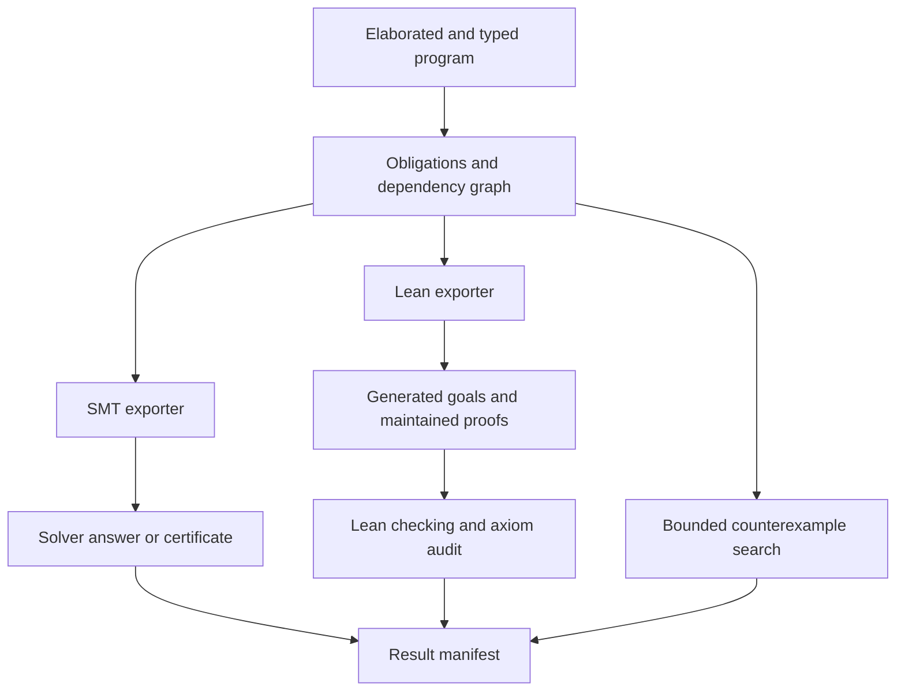

# Richer verification obligations and Lean proofs

Status: **partially implemented; stage 1 typed obligations, provenance, dependencies,
and solver process handling implemented; stage 2 Lean spike implemented; stage 3 manifest identities started**. This extends the future-work discussion in
[refinement annotations](refinement-annotations.md), especially §§7–8. It does
not change current syntax or runtime checks. The integer obligation IR, solver
process hardening, dependency reporting, and optional Lean spike below are
implemented; the broader verification architecture remains proposed.
External-tool references were consulted on 2026-09-24; implementation must pin
and test specific versions rather than rely on the moving documentation links.

## Recommendation

Separate the statement of an obligation from its SMT encoding. Keep automatic
SMT verification as the first option, and add an optional Lean export for claims
that require induction, quantified reasoning, or user-supplied lemmas. Treat
proof search and proof checking as separate operations. Record exactly which
statement, assumptions, semantics version, and verification method a result
covers.

Start with the existing integer fragment and positive recursive relations.
Add relation-level assertions independently of head refinements: properties such
as coverage, uniqueness, and equivalence need their own named goals. Do not
require Lean to run Datamog, and do not remove runtime checks merely because an
external prover succeeded.

The first useful milestone is a small, reproducible Lean project that proves an
existing arithmetic obligation and a recursive relation invariant. It is not a
formal verification of the SQL translator or all Datamog backends.

## What exists today

The current pipeline is visible in:

- [`refinements.ts`](../../packages/parser/src/refinements.ts): retains head
  propositions and synthesizes runtime constraints during post-processing.
- [`obligation-ir.ts`](../../packages/core/src/obligation-ir.ts): typed integer and
  Boolean expression trees and universally quantified local statements.
- [`obligations.ts`](../../packages/core/src/obligations.ts): generates one
  logical obligation per refinement, using type and nullness information.
- [`obligation-smt.ts`](../../packages/core/src/obligation-smt.ts): exports those
  statements to SMT-LIB and selects the required arithmetic logic.
- [`verify.ts`](../../packages/cli/src/verify.ts): invokes an external solver
  separately for each obligation and reports its answer.
- [Specification §5.11](../spec.md#511-head-refinements): the current contract.

The encoder supports integer arithmetic, using `QF_LIA` or `QF_NIA`. It models
safe-integer bounds, truncating division, nullness, and expression definedness.
Unsupported goals, aggregate rules, and parity-recursive components are skipped.
Unsupported body hypotheses are omitted with source text, offsets where available,
and reasons, and range bounds currently contribute no hypotheses. Positive calls
supply their published contracts, rather than their complete relation
definitions; negated relation calls supply no contract hypothesis.

Consequently, a solver model can falsify the abstract obligation without
corresponding to a reachable tuple. Conversely, discharging an obligation does
not prove coverage: an undefined computed head can prevent a tuple from being
produced in the first place. Runtime contracts are disjunctions across sibling
rules, whereas static discharge currently proves each rule's own refinements,
a sufficient but potentially stronger condition. An unrefined sibling makes the
published refinement contract vacuous.

The CLI reports a solver's `unsat` answer, not an independently checked proof
certificate. It does not yet have the dependency manifest, proof cache,
full resource-bounded orchestration, or general Lean integration proposed here.

The first stage now bounds each solver invocation to 30 seconds and 1 MiB of
combined output, retains separate stdout/stderr, and checks the exit status.
Only a single clean stdout verdict is accepted; diagnostics and protocol errors
fail the invocation even if it also prints `unsat`. Countermodels are requested
in a separate invocation only after `sat`; failure to retrieve one does not
erase the original satisfiability result. The internal API accepts structured
arguments, configurable limits, and an abort signal, and kills/reaps the solver
on timeout, cancellation, or output overflow. Process-tree containment, memory
limits and CLI limit configuration remain open.
This is solver-trusted verification, not certificate checking.

Generated obligations now record included and omitted hypothesis provenance and
all defining refinement obligations for successfully assumed contracts. Omission
notes appear in both `--obligations` and `--verify`. Local `unsat` results remain
`conditional` if their dependency closure has a missing or unresolved member.
Complete positive recursive groups discharge jointly by the existing induction
argument; a partial cycle cannot discharge itself. Parity-recursive components
are skipped because they need a different semantic argument. Successful answers
carry separate `solver-trusted` assurance metadata.

These obligation dependency identities are batch-local and preserve elaborated
module predicate identities. The Lean spike now supplements them with the
content identities described below; the batch-local IDs alone are not cache keys.
The minimal logical IR now stores typed integer/Boolean expressions for domain
restrictions, hypotheses, and conclusions; included provenance uses the same
expression trees. Each supported statement explicitly quantifies its variables
and names the `datamog-integer-v1` profile. Unsupported goals have a reason and
no logical statement. Obligation kind and available source spans are retained.

`generateLogicalObligations` builds these statements without generating solver
syntax. `exportSmtObligation` derives declarations, assertions, and the SMT logic
from the IR; `generateObligations` remains the compatibility entry point for the
CLI. Truncating division is an explicit IR operation, lowered only by the SMT
exporter. Its totalized value at zero is zero, while the separate Datamog
definedness condition excludes that case; this does not define division by zero
in Datamog. Safe-integer bounds and nullness likewise remain explicit formulas.

This IR still describes the existing local contract abstraction, not complete
relation definitions. General source/module manifests, proof caching, and general
proof import remain unimplemented; the Lean spike has a scoped content manifest. JSON round trips are tested for
statement preservation, but serialized statements are not proof certificates or
an independently validated import format.

## Implemented Lean spike

The optional [Lean project](../../verification/lean/README.md) pins Lean 4.34.0
without third-party Lean dependencies. `bun run generate:lean` exports the
successor obligation from `08-verify.dl`, a deliberately false local goal, and an
inductive reachability relation generated from a Datamog fixture. Maintained
proofs establish successor safety, reachability preservation under an explicit
edge premise, and the negation of the false goal. Generated checker theorems
require the exact expected types and audit their transitive axiom dependencies.

[`obligation-lean.ts`](../../packages/core/src/obligation-lean.ts) exports the
integer/Boolean IR as Lean propositions and a deliberately smaller relational
fragment: one positive, possibly self-recursive relation with variable-only atoms
over non-null integers. Other derived calls, mutual recursion, constraints,
negation, aggregates, and computed terms remain unsupported by relational export.
The semantic library distinguishes null from undefined and defines bounded
integer operations and truth. It does not cover floats or structural values.

`bun run test:lean` checks reproducibility and rebuilds from project source in a
fresh temporary directory, with the axiom allowlist enforced. Tests reject a
false goal, `sorry`, an extra axiom, a weaker statement, and native computation
axioms. They also compare 164 concrete semantic cases against native and SQLite
execution and check those results by Lean kernel reduction. A separate Lean CI
workflow runs this suite; ordinary builds and tests require no Lean installation.
These results concern the exported model, not verified backend implementations.
This spike does not add a Lean mode to `--verify` or certify arbitrary dependency
closures. The registered arithmetic fixture has no contract dependencies.

## Initial statement identities

The Lean generator now emits a [verification plan manifest](../../verification/lean/manifest.json)
with theorem names, exact statements, explicit assumptions, dependency closures,
and SHA-256 content identities. The closure algorithm includes cyclic dependencies
without recursive hashing and rejects missing or duplicate nodes. Digests cover
the semantic profile, checking method, toolchain, lockfile, core/parser source
inventories, exporter/checking scripts, fixtures, and maintained Lean sources,
including the semantics and axiom policy. Context changes conservatively
invalidate all registered entries, even when their local statement is unchanged.

The generated checker records the manifest digest. `generate:lean --check`
recomputes the current plan and generated modules and rejects stale or altered
content before `test:lean` rebuilds proofs from source. A claimed digest is not
accepted in place of comparing the actual manifest. Tests cover goal, assumption,
definition, toolchain, semantics, and policy changes, plus cyclic closures and
forged content carrying an unchanged digest. Maintained proofs remain separate.

This is the start of stage 3 for the fixed Lean project, not a cache or an
external certificate-import protocol. The manifest records intended verification,
not proof success. General module manifests, persisted checked results, finer
invalidation, and arbitrary Lean/CLI integration remain future work.

## Which harder claims should be expressible?

The following formulas are mathematical specifications, **not proposed parser
syntax**. `P`, `Q`, and `Input` denote relations in a specified program model.

| Kind | Example | What is needed beyond today's encoder |
|---|---|---|
| Richer local property | A produced array is sorted; a required JSON field is non-null | Structural values, lookup/absence, length and element semantics, quantifiers |
| Recursive invariant | Every derived path preserves an input relation's ordering | Definitions of recursive predicates and induction, possibly auxiliary invariants |
| Relation law | `P(x,y) ∧ P(x,z) → y = z` | Multiple tuples in one goal; a named relation-level assertion |
| Coverage | `Input(x) → ∃ y, Output(x,y)` | Existence, head definedness, and an explicitly identified input domain |
| Equivalence | `P(x) ↔ Spec(x)` | Separate soundness and completeness arguments |
| Aggregate property | Every group's count is bounded by its source population | Finite grouping, duplicate semantics, empty groups, and arithmetic bounds |
| Module law | Every implementation satisfying input laws preserves an output law | Explicit assumptions, instantiation obligations, and module identities |
| Termination | Evaluation reaches a fixed point for all admitted inputs | A separate finiteness or well-foundedness argument |

Existing `!-` constraints and `error predicate` definitions are useful first
sources of named goals: prove that their violation relation is empty for every
admitted input. This extends verification coverage without first inventing a
quantifier syntax. A constraint about arbitrary input rows may still need an
explicit input law; it must not simultaneously be assumed and reported proved.

A typical exported theorem has the following mathematical shape:

```text
∀ input, Admitted(input) → InputLaws(input) →
  ∀ tuple, Derives(program, input, predicate, tuple) → Contract(tuple)
```

`Admitted` records the declared input types and supported semantic profile;
`InputLaws` lists additional premises. Relation laws replace the final implication
with the requested formula over the generated relations. Coverage reverses the
direction of the requirement: an input tuple must imply an output derivation.

Universal verification quantifies over all legal input relations satisfying the
stated assumptions. Checking one loaded dataset is a different result. A finite
search over small datasets or a bounded number of recursive rounds is useful
for finding bugs, but cannot silently become an unbounded theorem.

A coverage theorem may be possible even when the domain is an input relation:
`output(X) :- input(X)` preserves every admitted input tuple. Being about input
data does not inherently make a property unprovable. What remains conditional
is any unstated property of that data. For example, successor coverage needs an
upper bound that prevents `X + 1` from overflowing.

## Preserve Datamog's meaning before extending the solver

### Truth, null, and undefinedness

Use a semantic value domain with a distinguished null value, and a separate
partial-expression result. In Lean a possible representation is `Option Value`:
`none` means undefined and `some Value.null` means a defined null. Define
`Holds(e, env)` to mean evaluation yields the Boolean value true. False, null,
and undefined all fail this test.

A positive Boolean body condition requires `Holds`. Negation-as-failure over a
condition means `¬ Holds`; logical `!` is an expression operation with its own
partiality rules. Do not encode both as the same Boolean negation. Likewise,
null-aware equality and partial orderings need separate semantic definitions.

For a local contract, definedness of computed head expressions is a premise:
the rule must actually produce a tuple. Definedness of the claimed proposition
is part of the conclusion. A coverage goal must prove the existence of the
output and therefore cannot assume away failing head evaluation.

Represent integers as mathematical integers with the safe-integer bound, and
model each partial operation explicitly. Lean's unbounded `Int`, its division
conventions, or arbitrary-precision arithmetic cannot replace those operations
without a correspondence lemma. Defer floats until rounding, overflow, and the
backend-specific behavior documented in [Postgres alignment](postgres-alignment.md)
have a precise supported profile. Replacing floats with mathematical reals would
prove a different program.

### Structural and nominal types

Give structural contracts a membership interpretation. `value` excludes null
at its declared position; `value?` includes it. An opaque value may contain null
children. Field absence, explicit null, closed records, and optional fields must
remain distinct. Unsupported shapes must remain unsupported rather than be
translated to unconstrained assumptions that strengthen a goal.

Datamog's constructor evidence is observable data. Preserve predicate-qualified
constructor identities and payloads. A JSON object resembling a proof term is
not evidence of nominal membership. An erased Lean proof that a tuple belongs
to a relation is distinct from Datamog's stored derivation evidence: the latter
needs a data representation if a goal observes or compares it.

### Recursion, negation, and aggregates

For positive recursion, translate each predicate into an inductive relation;
mutually recursive predicates form one inductive family. Each rule contributes
an introduction rule. This models finite derivations and supports induction
without assuming that evaluation terminates. Proving all derivable tuples safe
does not prove there are finitely many of them.

For ordinary stratified negation, define lower strata first. A negative call is
nonmembership in the **complete** lower-stratum relation, not merely absence
from a set of observed derivations. Soundness of a partial evaluator alone is
insufficient for that use; an execution-level result needs completeness too.

Parity-stratified recursion does not fit this direct inductive translation.
Its alternating fixed-point semantics needs a separate formal model and
correctness argument. Initially report such goals as unsupported. Do not repair
the translation by assuming the completeness of an opposing relation.

Aggregates need a finite model of the tuples that participate in each group,
including projection/deduplication, empty-group behavior, null/undefined
handling, ordering where observable, and overflow. They are not ordinary
Horn-rule constructors. Begin with a library theorem for one supported aggregate
(e.g. `count`) and prove its translation correct before expanding coverage.

## A shared obligation representation

Introduce a typed logical intermediate representation between the elaborated
program and the individual prover exporters. Keep frontend source locations and
module identities attached. Initially this is an internal API, not a new public
language or a wholesale rewrite of runtime evaluation.

Each obligation should carry:

- A stable identifier, source span, kind, and human-readable statement.
- Quantified variables, domain restrictions, hypotheses, and conclusion.
- Referenced relation definitions or explicitly abstracted contracts.
- Required semantic features and the supported backend/profile scope.
- Dependencies on other obligations and explicit assumptions about input data.
- A distinction between an exact statement and a sound approximation, including
  every dropped hypothesis and why dropping it is valid in that position.
- A content digest covering the canonical statement, definitions, assumptions,
  translation version, and semantics library version.

Do not use rule numbers alone as proof identities. Source-level names help users
find a proof, while content digests determine whether the proof is still valid.
Changing an imported definition, numeric semantics, or a published contract must
invalidate dependent results even if the local text is unchanged.



Retain the current fast contract abstraction for SMT. Add full relation
translation only when the goal needs it. Quantifying over arbitrary relations
with sufficient interface laws can preserve modularity; a predicate mention
does not automatically require inlining its entire implementation.

For cyclic contract dependencies, verify every defining rule in the recursive
component and assemble an induction theorem. Individual successful goals remain
conditional until the whole dependency closure is discharged. A mutual cycle of
asserted contracts is not, by itself, a proof. Cross-module assumptions become
obligations at the importing boundary; external data assumptions remain explicit
premises until validated for that dataset.

## What Lean export would look like

There are two useful exports. A local obligation becomes a theorem about the
semantic expression model, suitable for rewriting and arithmetic tactics. A
relational obligation uses the generated inductive definitions and can be proved
by induction and reusable lemmas. Lean's kernel checks the elaborator's proof
terms; tactic execution alone is not the acceptance criterion.
[Lean elaboration reference](https://lean-lang.org/doc/reference/latest/Elaboration-and-Compilation/)

For example, these are ordinary Datamog rules:

```prolog
input predicate edge(source: integer, target: integer).
reach(X, Y) :- edge(X, Y).
reach(X, Z) :- reach(X, Y), edge(Y, Z).
```

The following illustrative Lean sketch abstracts vertices into a type `α`.
An actual export would instantiate it with the modeled Datamog column domain.
This sketch was checked with Lean 4.34.0 when adding Lean to the devcontainer;
`#print axioms reach_preserves` reports no axiom dependencies.

```lean
inductive Reach {α : Type} (edge : α → α → Prop) : α → α → Prop where
  | direct {a b} : edge a b → Reach edge a b
  | step {a b c} : Reach edge a b → edge b c → Reach edge a c

theorem reach_preserves {α : Type} (edge : α → α → Prop) (P : α → Prop)
    (preserves : ∀ a b, edge a b → P a → P b)
    {a b : α} (h : Reach edge a b) : P a → P b := by
  induction h with
  | direct hab => exact preserves _ _ hab
  | step _ hbc ih => exact fun ha => preserves _ _ hbc (ih ha)
```

`preserves` is a visible premise about the input edges. This proves a reusable
conditional theorem, not that an arbitrary loaded graph satisfies that premise.
To claim it for a concrete graph, check the premise or provide a separate proof.
The inductive constructors describe exactly how reachable pairs are derived;
merely postulating that `Reach` satisfies its rules would not give the same
least-relation semantics or its induction principle.

Keep generated definitions and expected theorem types in a generated module;
keep user proofs in separate maintained files. Regeneration must not overwrite
proof scripts. A final generated checker module must apply the submitted proof
to the exact expected type and record its dependencies. A user can freely prove
other lemmas, but a same-named theorem about a weaker statement cannot discharge
the registered obligation.

Use `Prop` for logical claims, including `∀` and `∃`. Existential propositions
are proof-irrelevant in Lean; they do not require storing the witness in Datamog.
If the program needs to return the witness, it must be represented as ordinary
data or constructor evidence instead. This revises the existential-erasure
argument in the earlier tier-two discussion.
[Lean propositions reference](https://lean-lang.org/doc/reference/latest/The-Type-System/Propositions/)

Initially allow richer claims in the external Lean project over generated
relations. Later add named Datamog assertions for common forms, with finite,
range-restricted quantifiers where runtime checking is desired. Arbitrary Lean
`Prop` need not be decidable: a proof-only claim must be labeled as such, and
must not be advertised as a runtime contract when no executable checker exists.
Choosing the Datamog syntax is a separate milestone, informed by worked proofs.

## Alternatives and where they fit

| Approach | Strength | Limitation / cost | Proposed role |
|---|---|---|---|
| Extend direct SMT translation | Smallest change; arithmetic, datatypes and selected array/string theories | Quantifiers and nonlinear reasoning can return unknown; theory semantics must match Datamog | Default automatic route, feature by feature |
| Constrained Horn clauses (CHCs) | Can discover invariants for recursive relations | Does not automatically cover negation, aggregates, arbitrary completeness claims, or parity semantics | Experiment for positive recursive safety goals |
| Direct Lean export | Induction, quantified laws, reusable domain lemmas, explicit proof terms | Requires a semantics library, maintained proofs, and a Lean toolchain | Recommended optional route for difficult obligations |
| Why3 intermediary | Existing prover drivers, transformations, interactive sessions and replay | Adds another language/translation boundary and deployment toolchain | Prototype if managing many prover backends becomes a real requirement |
| Isabelle/HOL or Rocq export | Alternative proof-assistant ecosystems for relational semantics | Another semantics library and proof workflow to maintain | Keep IR extensible; implement one assistant first |
| SMT proof certificates | Automatic search with a separate checking step | Proof-rule/theory coverage and semantic translation remain obligations | Optional stronger assurance for the SMT route |
| Runtime checks and bounded search | Concrete failures, easy feedback, no user proof scripts | A passing dataset or finite bound is not a universal theorem | Retain as complements, not substitutes |

Z3's fixed-point interface supports CHCs, and its IC3-style engine uses SPACER.
That makes it worth testing on recursive safety examples before requiring users
to write all auxiliary invariants themselves. Solver polarity and answers are
adapter-specific: a Horn satisfiability result must not be interpreted using
the existing local `unsat` protocol without accounting for the query encoding.
[Z3 fixed-point guide](https://microsoft.github.io/z3guide/docs/fixedpoints/intro/)

Why3 is particularly relevant for preserving proof attempts and replaying
sessions after goals change. It would supply orchestration, not the missing
Datamog semantics. Compare a small prototype against direct Lean export before
adopting it; do not assume Why3 supplies a supported Lean driver.
[Why3 sessions](https://why3.org/doc/starting.html)

Current cvc5 documentation lists CPC, Alethe, and LFSC proof output (DOT is for
visualization). A checker for one of these formats is a possible certificate
route; this is distinct from generating Datamog theorem statements in Lean.
[cvc5 proof production](https://cvc5.github.io/docs/latest/proofs/proofs.html)
The Lean-based Logos checker is another candidate for CPC, but its own
correctness scope and `incomplete` result need evaluation on our actual fragment.
Running a compiled checker written in Lean is not automatically the same trust
claim as kernel-checking each submitted Datamog theorem. Pin versions, inspect
assumptions, and benchmark accepted proofs before choosing this integration.
[Logos documentation](https://github.com/cvc5/logos)

Automation, including an AI proof assistant, may suggest lemmas or proof scripts.
It should have the same status as a human author: acceptance depends on checking
the submitted proof of the registered statement, not on who produced it.

## Checking, trust, and developer workflow

A Lean success has two boundaries. The kernel checks the formal theorem. The
Datamog-to-Lean translation determines whether that theorem is the intended
Datamog claim. Initially the parser, elaborator, type analysis used for premises,
exporter, and semantic definitions remain trusted. Differential tests reduce
mistakes but do not prove that translation correct. A later deep embedding can
represent the elaborated AST as data and prove a generic verification-condition
generator sound, reducing reliance on per-program generated definitions.

Even that would not certify the SQL translator, database, or native evaluator.
Reports must distinguish a theorem about the modeled language from a theorem
about an implementation's actual execution. Backend correctness would need its
own refinement proof or separately identified trust assumption.

Check the transitive axiom dependencies of every accepted Lean theorem. Reject
`sorryAx`, user-added axioms, and unapproved computation axioms. Publish a small
allowlist for the standard logical axioms the project accepts (for example
`propext`, `Classical.choice`, and `Quot.sound`), pinned to the toolchain.
`lake build` succeeding, or a textual search for `sorry`, is insufficient.
Lean explicitly distinguishes ordinary kernel reasoning from axioms introduced
by native computation; do not silently widen the trust policy to make a tactic
work. [Lean axiom reference](https://lean-lang.org/doc/reference/latest/Axioms/)

A proposed workflow, with commands and artifact schemas to be designed later:

1. Generate obligations and a manifest without running a prover. Show unsupported
   constructs and all external assumptions before spending solver time.
2. Try the selected automatic backends within explicit time, memory, and output
   limits. Keep command arguments structured, retain separate stdout/stderr,
   check exit status, and cancel child processes on timeout or interruption.
3. Export unresolved supported goals to a pinned Lean/Lake project. Users add
   lemmas and proofs in maintained files; generated goals stay reproducible.
4. Rebuild/check proofs and their axiom closure in CI. Require an exact match to
   the generated theorem types and dependency hashes. Recheck untrusted artifacts
   from source or proof terms rather than trusting an arbitrary compiled import.
5. Assemble the dependency graph's results. Cache only with the complete content,
   toolchain, assumption, and trust-policy key. A certificate must be checked
   against the actual obligation, not just a matching filename or claimed hash.
6. Continue ordinary runtime checking. Conditional theorems can justify results
   for a dataset only after their input assumptions have been established there.

Proof scripts and prover plugins can execute code during elaboration/search.
Run them as repository build tools with explicit trust and resource boundaries;
a small proof kernel does not sandbox the proof-producing process.

Store proof status and assurance separately. Suggested statuses are `proved`,
`conditional`, `counterexample`, `unknown`, `unsupported`, `timeout`, and `error`.
A successful result records whether it is solver-trusted, certificate-checked,
or Lean-kernel-checked. Bounded and dataset checks record their scopes separately.
Only a complete requested dependency closure succeeds in a universal-verification
CI mode; zero generated goals must not masquerade as verification of a requested
unsupported assertion.

Distinguish a countermodel of an abstraction from a replayed Datamog violation.
Where feasible, translate the former into an input fixture and rerun the program.
Failure to realize it is evidence that the abstraction needs refinement, not
permission to label the claim proved. A conditional theorem is a useful result,
but its remaining input premises must stay visible at every importing boundary.

## Delivery plan and acceptance criteria

| Stage | Changes | Exit criteria |
|---|---|---|
| 1. Make current results explicit | Refactor `core/src/obligations.ts` around a minimal typed obligation IR; retain SMT output; add hypothesis provenance and dependency tracking. Harden `cli/src/verify.ts` process/result handling. | Existing integer regressions retain their verdicts; omitted hypotheses are reported; partial or cyclic discharge cannot yield a complete success. |
| 2. Build the semantics library and Lean spike | Add an optional Lean package for bounded integers, null/undefined, truth, and positive derivations; export local goals and one recursive example. | Check an existing arithmetic theorem and the reachability invariant in pinned Lean CI with the axiom policy enforced. Include a false goal that remains unproved. |
| 3. Establish the statement/checking boundary | Generate theorem types, maintained proof slots, final checker modules, manifests, and cache keys. | Changed goals/imports invalidate proofs; `sorry`, extra axioms, a weaker theorem, and a stale certificate cannot discharge a goal. Ordinary Datamog builds require no Lean installation. |
| 4. Add useful claim families | Introduce named relation-level claims, starting with uniqueness and coverage; add finite quantifiers, structural lookup, and ordinary stratified negation incrementally. | Prove a nontrivial coverage theorem with explicit bounds and reject the overflowing variant; distinguish absent fields from null; prove a two-tuple uniqueness law. Runtime-capable claims agree with execution. |
| 5. Increase automation and semantics coverage | Benchmark CHCs and richer SMT; prototype one certificate route; add a proved finite-group aggregate model. | Measure solved goals, search/checking time, artifact size, and maintenance effort. Unsupported theories and incomplete certificates remain visible failures to discharge. |
| 6. Reduce translation trust | Deeply embed the supported core and prove translation/obligation-generation soundness; consider implementation correspondence separately. | State and check the soundness theorem for the precise supported fragment, with remaining frontend and backend assumptions listed. |

The first two stages should be small enough to evaluate the approach before
committing to a new assertion grammar or multi-prover infrastructure. Start from
[`08-verify.dl`](../invariants/code/08-verify.dl), a recursive reachability
example, and one currently skipped structural claim. Keep the proposed body type
guards separate: [that design](body-type-guards.md) concerns filtering/refinement
of runtime values, not supplying proofs of arbitrary propositions.

Validation must include null and missing-field cases, zero divisors, negative
division/modulo, safe-integer boundaries, vacuous contracts, mutually recursive
contracts, renamed module instances, and unreachable abstract countermodels.
For each newly supported feature, compare the semantic model with native and
SQL execution on small exhaustive or generated inputs. Include aggregate empty
groups and negation over completed relations when those features arrive. These
are translation regression tests; the universal proof claims still require the
formal arguments described above.

## Decisions to revisit after the spike

- Whether richer assertions should primarily live in Datamog or in a Lean
  companion file. Favor Datamog for executable domain laws; allow Lean for
  arbitrary mathematical specifications and helper lemmas.
- Whether direct Lean proofs or a checked SMT-certificate route offers the better
  maintenance/performance tradeoff for automatic goals. They may coexist.
- Whether Why3's session management saves enough work to justify another toolchain.
- Which claims deserve a backend-specific floating-point model, rather than a
  portable integer/structural profile.
- Whether termination and parity semantics have enough concrete use cases to
  justify their separate formal developments.

The design commits to exact statements, explicit assumptions, and independently
identified verification methods. It does not promise automatic discharge of
arbitrary quantified, recursive, or nonlinear obligations.
